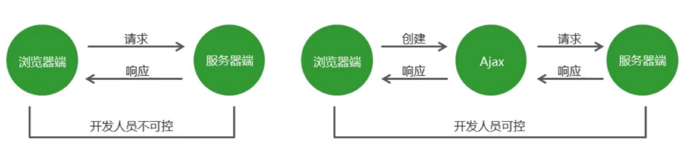
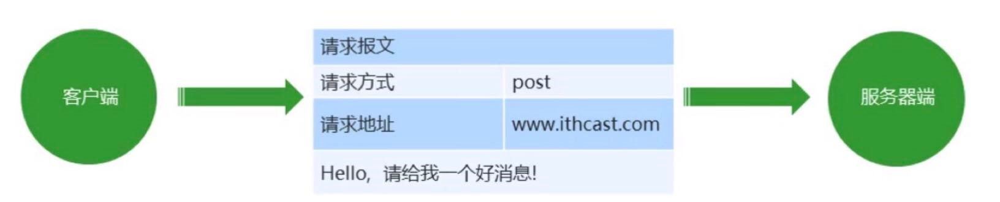
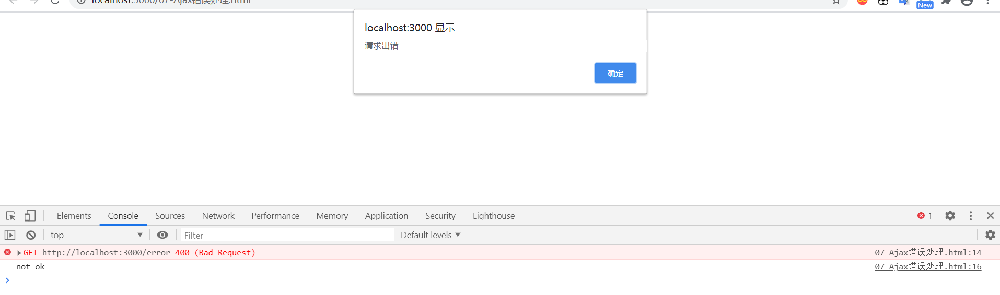
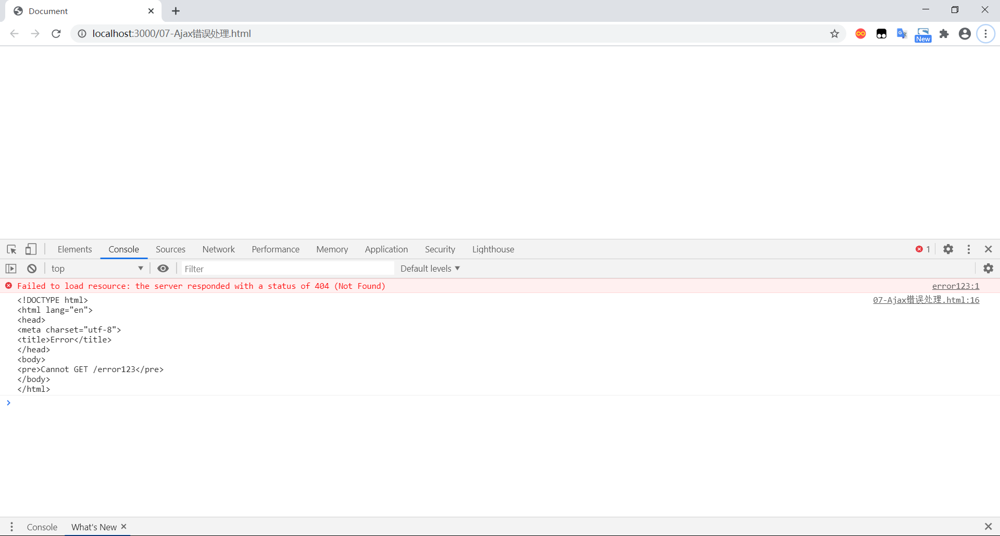
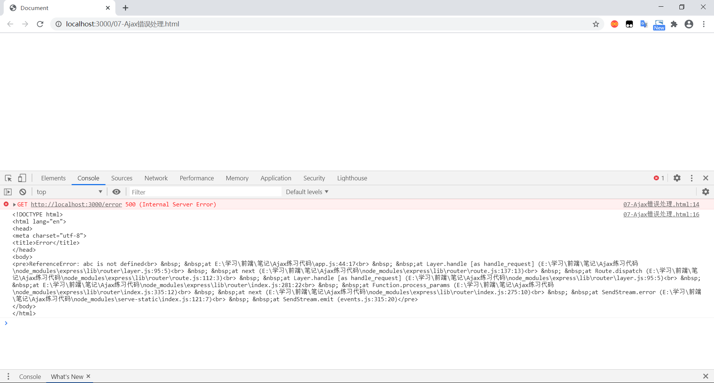
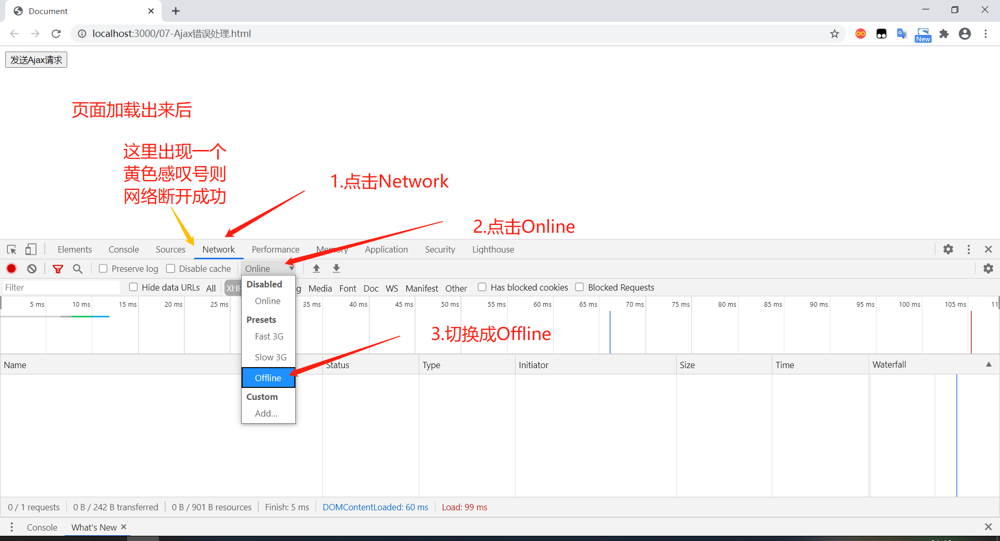
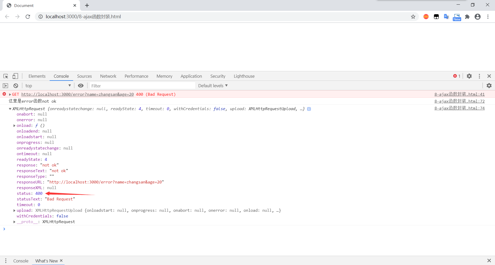

[TOC]


### 一、ajax基础

#### 1.ajax概述

+ 中文音译：阿贾克斯
+ 它是浏览器提供的一套方法，可以实现页面无刷新更新数据，提高用户浏览网站应用的体验。

#### 2.ajax的应用场景

1. 页面上拉加载更多数据
2. 列表数据无刷新分页（文档上下页只有内容变化）
3. 表单项离开焦点数据验证（注册页面）
4. 搜索框提示文字下拉列表（百度搜索的提示）

#### 3.ajax的运行环境

+ ajax技术需要运行在网站环境中才能生效，当前课程会使用Node创建的服务器作为网站服务器

  ```js
  // 引入express框架
  const express = require('express');
  // 路径处理模块
  const path = require('path');
  // 创建web服务器
  const app = express();
  
  // 静态资源访问服务功能
  app.use(express.static(path.join(__dirname, 'public')));
  
  // 监听端口
  app.listen(3000);
  // 控制台输出提示
  console.log('服务器启动成功');
  ```


### 二、Ajax运行原理及实现

#### 1.Ajax运行原理

> Ajax相当于浏览器发送请求与接受响应的代理人，以实现不影响用户浏览页面的情况下，局部更新页面数据，从而提高用户体验。



#### 2.Ajax的实现步骤

1. 创建Ajax对象

   + 创建这个构造函数的实例就是创建ajax对象

   `var xhr = new XMLHttpRequest();`

2. 告诉Ajax请求地址以及请求方式

   `xhr.open('get','http://www.example.com');`

3. 发送请求

   `xhr.send();`

4. 获取服务器端给与客户端的响应数据

   + `xhr.responseText`是服务器端返回给客户端的数据（服务端响应给客户端的响应数据）
   + `ajax`接收完服务端的响应之后会触发`onload`事件

   ```js
   xhr.onload = function(){
   	console.log(xhr.responseText);
   }
   ```

+ 具体实现的一个例子：

  1. 先去`cmd`执行`nodemon app.js`启动服务器

  2. 写`js`文件（01-Ajax入门.html），创建ajax

     ```js
     // 1.创建Ajax对象
     var xhr = new XMLHttpRequest();
     // 2.告诉Ajax对象要向哪里发送请求，以什么方式发送请求
     // 1）请求方式 2）请求地址
     xhr.open('get', 'http://localhost:3000/first');
     // 3.发送请求
     xhr.send();
     // 4.获取服务器端响应到客户端的数据
     xhr.onload = function() {
             console.log(xhr.responseText);
         }
         // http://localhost:3000/01-Ajax入门.html
     ```

  3. app.js创建路由

     + app.get创建路由，第一个参数是路由的请求地址，第二个函数参数是路由请求处理函数

     + req：请求对象（客户端发送请求给服务端？），res：响应对象（服务端响应给客户端？）

     ```js
     // 引入express框架
     const express = require('express');
     // 路径处理模块
     const path = require('path');
     // 创建web服务器
     const app = express();
     
     // 静态资源访问服务功能
     app.use(express.static(path.join(__dirname, 'public')));
     
     app.get('/first', (req, res) => {
         res.send('Hello Ajax');
     });
     
     // 监听端口
     app.listen(3000);
     // 控制台输出提示
     console.log('服务器启动成功');
     ```

  4. 在浏览器中输入http://localhost:3000/01-Ajax入门.html

#### 3.服务端响应的数据格式

+ 在真实的项目中，服务端**大多数情况下会以JSON对象作为响应数据的格式**。当客户端拿到响应数据时，要将JSON数据和HTML字符串进行拼接，然后将拼接的结果展示在页面中。

+ 在http请求与响应的过程中，无论是请求参数还是响应内容，如果是对象类型，最终都会被转换为对象字符串进行传输。

+ `JSON.parse()`：将json字符串转换为json对象

+ 例子：

  + 服务端添加的代码：

    ```js
    // 02.html
    app.get('/responseData', (req, res) => {
        // 发送的内容是JSON对象，发送到客户端后变成json字符串
        res.send({ "name": "zs" });
    });
    ```

  + 客户端添加的代码：

    ```js
    var xhr = new XMLHttpRequest();
    xhr.open('get', 'http://localhost:3000/responseData');
    xhr.send();
    xhr.onload = function() {
            var responseText = JSON.parse(xhr.responseText);
            console.log(responseText);	//json对象
            var str = '<h2>' + responseText.name + '</h2>';
            console.log(responseText.name);
            document.body.innerHTML = str;
        }
        // http://localhost:3000/02-处理服务器端返回的JSON数据.html
    ```

#### 4.请求参数传递

传统网站表单提交

```html
<form method="get" action="http://www.excample.com">
	<input type="text" name="username">
	<input type="password" name="password">
</form>
<!-- http://www.example.com?username=zhangsan&password=123456 -->
```

##### Get请求方式

+ Get请求方式

  `xhr.open('get','http://www.excample.com?name=zhangsan&age=20');`

  + 03-传递get请求参数.html

    ```html
    <p><input type="text" id="username"></p>
    <p><input type="text" id="age"></p>
    <p><input type="button" value="提交" id="btn"></p>
    <script>
        var btn = document.querySelector('#btn');
        var username = document.querySelector('#username');
        var age = document.querySelector('#age');
        btn.onclick = function() {
                var xhr = new XMLHttpRequest();
                var nameValue = username.value;
                var ageValue = age.value;
                // 拼接请求参数
                var params = 'username=' + nameValue + '&age=' + ageValue;
                xhr.open('get', 'http://localhost:3000/get?' + params);
                xhr.send();
                xhr.onload = function() {
                    console.log(xhr.responseText);
                    console.log(typeof xhr.responseText);
    
                }
    
            }
            // http://localhost:3000    /03-传递get请求参数.html
    </script>
    ```

  + app.js添加的路由：

    ```js
    // 03 html
    app.get('/get', (req, res) => {
        res.send(req.query);
    })
    ```

  + 执行结果

    + 接收到的是json字符串

    

##### POST请求方式

+ POST请求方式

  ```js
  xhr.setRequestHeader('Content-Type','application/x-www-form-urlencoded')
  xhr.send('name=zhangsan$age=20')
  ```

  + 请求报文

    > 在HTTP请求和响应的过程中传递的数据块就叫报文，包括要传送的数据和一些附加信息，这些数据和信息要遵守规定好的格式

    

  + 04-传递post请求参数.html:

    ```html
    <body>
        <p><input type="text" id="username"></p>
        <p><input type="text" id="age"></p>
        <p><input type="button" value="提交" id="btn"></p>
        <script>
            var btn = document.querySelector('#btn');
            var username = document.querySelector('#username');
            var age = document.querySelector('#age');
            btn.onclick = function() {
                    var xhr = new XMLHttpRequest();
                    var nameValue = username.value;
                    var ageValue = age.value;
                    // 拼接请求参数
                    var params = 'username=' + nameValue + '&age=' + ageValue;
                    // 配置ajax对象
                    xhr.open('post', 'http://localhost:3000/post');
                    // 设置请求参数格式的类型（post请求必须要设置）
                    xhr.setRequestHeader('Content-Type', 'application/x-www-form-urlencoded');
                    // post请求的send要添加参数
                    xhr.send(params);
                    xhr.onload = function() {
                        console.log(xhr.responseText);
    
                    }
                }
                // http://localhost:3000/04-传递post请求参数.html
        </script>
    </body>
    ```

  + app.js代码：

    ```js
    //路径处理模块
    const bodyParser = require('body-parser'); //post请求 需要添加的
    
    app.use(bodyParser.urlencoded({ extended: true })); //post请求  需要添加的
    
    // 04 html
    app.post('/post', (req, res) => {
        res.send(req.body);//和添加的新模块对应
    })
    ```

#### 5.请求参数的格式

1. application/x-www-form-urlencoded

   `name=zhangsan&age=20&sex=男`

2. application/json

   `{name: 'zhangsan',age:'20',sex:'男'}`

+ 在请求头中指定Content-Type属性的值是application/json，告诉服务器端当前请求参数的格式是json

  `JSON.stringify()`：将json对象转换为json字符串

+ 注意：**get请求是不能提交json对象数据格式的，传统网站的表单提交也是不支持json对象数据格式的**

  + 05-向服务器端传递JSON格式的请求参数.html

    ```html
    <body>
        <script>
            var xhr = new XMLHttpRequest();
            xhr.open('post', 'http://localhost:3000/json');
            // 通过请求头告诉服务器端：客户端向服务器端传递的请求参数的格式是什么
            xhr.setRequestHeader('Content-Type', 'application/json');
            // JSON.stringify()是将json对象转换为json字符串的方法，大概是send的参数需要字符串格式吧
            xhr.send(JSON.stringify({
                name: 'xiagor',
                age: 20
            }));
            xhr.onload = function() {
                    console.log(xhr.responseText);
    
                }
                // http://localhost:3000/05-向服务器端传递JSON格式的请求参数.html
        </script>
    </body>
    ```

  + app.js代码：

    ```js
    app.use(bodyParser.json());	//新添加这个，参考请求参数传递的POST请求
    
    // 05 html
    app.post('/json', (req, res) => {
        res.send(req.body)
    })
    ```

#### 6.获取服务器端的响应

+ Ajax状态码

  > 在创建ajax对象，配置ajax对象，发送请求，以及接收完服务器端响应数据，这个过程中的每一个步骤都会对应一个数值，这个数值就是ajax状态码。

  + 0：请求未初始化（还没有调用open()）
  + 1：请求已经简历，但是还没有发送（还没有调用send()）
  + 2：请求已经发送
  + 3：请求正在处理中，通常响应中已经有部分数据可以用了
  + 4：响应已经完成，可以获取并使用服务器的响应了

  `xhr.readyState  // 获取Ajax状态码`

+ `onreadystatechange`事件

  + 当Ajax状态码发生变化时将自动触发该事件

+ 06-获取服务器响应的另一种方式.html

  ```html
  <body>
      <script>
          var xhr = new XMLHttpRequest();
          // 0 已经创建了ajax对象，但是还没有对ajax对象进行配置
          console.log(xhr.readyState);
          xhr.open('get', 'http://localhost:3000/readystate');
          // 1 已经对ajax对象进行配置，但是还没有发送请求
          console.log(xhr.readyState);
  
  
          // onreadystatechange：当ajax状态码发生变化时将自动触发该事件
          xhr.onreadystatechange = function() {
              // 2 请求已经发送了
              // 3 已经接收到服务器端的部分数据
              // 4 服务器端的响应数据已经接收完成
              console.log(xhr.readyState);
              // 对ajax状态码进行判断 如果状态码的值为4就代表数据已经接收完成了
              if (xhr.readyState == 4) {
                  console.log(xhr.responseText);
  
              }
          }
          xhr.send();
  
          // http://localhost:3000/06-获取服务器响应的另一种方式.html
      </script>
  </body>
  ```

+ app.js代码

  ```js
  // 06 html
  app.get('/readystate', (req, res) => {
      res.send('hello');
  });
  ```

##### 两种获取服务器响应方式的区别

|        区别描述        | onload事件 | onreadystatechange事件 |
| :--------------------: | :--------: | :--------------------: |
|    是否兼容IE低版本    |   不兼容   |          兼容          |
| 是否需要判断Ajax状态码 |   不需要   |          需要          |
|       被调用次数       |    一次    |          多次          |

**推荐使用onload事件，减少被调用次数提高性能**

#### 7.Ajax错误处理

1. 网络通畅，服务器端能接收到请求，服务器端返回的结果不是预期结果

   + 可以判断服务器端返回的状态码，分别进行处理，`xhr.status`获取http状态码

   + 07-Ajax错误处理.html     （http状态码为400）

     ```html
     <body>
         <script>
             var xhr = new XMLHttpRequest();
             xhr.open('get', 'http://localhost:3000/error');
             xhr.send();
             xhr.onload = function() {
                 console.log(xhr.responseText);
                 if (xhr.status == 400) {
                     alert('请求出错');
                 }
             }
     
             // http://localhost:3000/07-Ajax错误处理.html
         </script>
     </body>
     ```

   + app.js代码

     ```js
     // 07 html
     app.get('/error', (req, res) => {
         res.status(400).send('not ok');
     });
     ```

   + 执行结果：

     

     

2. 网络通畅，服务器没有接收到请求，返回404状态码

   + 检查请求地址是否错误

   + 07-Ajax错误处理.html     （http状态码为404）

     ```html
     <body>
         <script>
             var xhr = new XMLHttpRequest();
             xhr.open('get', 'http://localhost:3000/error123');	//app.js没有这个地址
             xhr.send();
             xhr.onload = function() {
                 console.log(xhr.responseText);
                 if (xhr.status == 400) {
                     alert('请求出错');
                 }
             }
     
             // http://localhost:3000/07-Ajax错误处理.html
         </script>
     </body>
     ```

   + 执行结果：

     

     

3. 网络通畅，服务器能接收到请求，服务端返回500状态码

   + 服务器端错误，找后端程序员进行沟通

   + 07-Ajax错误处理.html  （http状态码为500）

     代码与1相同

   + app.js

     ```js
     // 07 html
     app.get('/error', (req, res) => {
         console.log(abc);	//加一个不存在的变量
         res.status(400).send('not ok');
     });
     ```

   + 运行结果：

     

     

4. 网络中断，请求无法发送到服务器端

   + 会触发xhr对象下面的onerror事件，在onerror事件处理函数中对错误进行处理

   + 07-Ajax错误处理.html     （网络中断）

     ```html
     <body>
         <button>发送Ajax请求</button>
         <script>
             var btn = document.querySelector('button');
             btn.onclick = function() {
                 var xhr = new XMLHttpRequest();
                 xhr.open('get', 'http://localhost:3000/error');
                 xhr.send();
                 xhr.onload = function() {
                     console.log(xhr.responseText);
                     if (xhr.status == 400) {
                         alert('请求出错');
                     }
                 }
                 xhr.onerror = function() {
                     alert('网络中断，无法发送Ajax请求')
                 }
             }
     
             // http://localhost:3000/07-Ajax错误处理.html
         </script>
     </body>
     ```

   + app.js代码

     代码与1相同

   + 执行结果

     

     


#### 8.低版本IE浏览器的缓存问题

+ 问题：

  在低版本的IE浏览器中，Ajax请求有严重的缓存问题，即在请求地址不发生变化的情况下，只有第一次请求会真正发送到服务器端，后续的请求都会从浏览器的缓存中获取结果。即使服务器端的数据更新了，客户端依然拿到的是缓存中的旧数据。

+ 解决方案：

  在请求地址的后面加请求参数，保证每一次请求中的请求参数的值不相同

  ```js
  xhr.open('get','http://www.example.com?t=' + Math.random());
  ```

+ 本节视频：http://b23.tv/xuH8G7


### 三、Ajax异步编程

#### 1.同步异步概述

+ 同步
  + 一个人同一时间只能做一件事情，只有一件事情做完，才能做另外一件事情。
  + 落实到代码中，就是上一行代码执行完成后，才能执行下一行代码，即代码逐行执行。
+ 异步
  + 一个人一件事情做了一半，转而去做其他事情，当其他事情做完以后，再回过头来继续做之前未完成的事情。
  + 落实到代码上，就是异步代码虽然需要花费时间去执行，但程序不会等待异步代码执行完成后再继续执行后续代码，而是直接执行后续代码，当后续代码执行完成后再回头看异步代码是否返回结果，如果已有返回结果，再调用事先准备好的回调函数处理异步代码执行的结果。
+ Ajax请求属于异步代码

#### 2.Ajax封装

+ 问题：发送一次请求代码过多，发送多次请求代码冗余且重复。
+ 解决方案：将请求代码封装到函数中，发请求时调用函数即可。

```js
ajax({
	type:'get',
	url:'http://www.example.com',
	success:function(data){
		console.log(data);
	}
})
```

1. **最基础封装的js代码：**（8-ajax函数封装.html）

   ```html
   <body>
       <script>
           function ajax(options) {
               // 创建ajax对象
               var xhr = new XMLHttpRequest();
               // 配置ajax对象
               xhr.open(options.type, options.url);
               // 发送请求
               xhr.send();
               // 监听xhr对象下面的onload事件
               // 当xhr对象接收完响应数据后触发
               xhr.onload = function() {
                   options.success(xhr.responseText);
               }
           }
   
           ajax({
               // 请求方式
               type: 'get',
               // 请求地址
               url: 'http://localhost:3000/first',
               success: function(data) {
                   console.log('这里是success函数' + data);
   
               }
           })
   
           // http://localhost:3000/8-ajax函数封装.html
       </script>
   </body>
   ```

2. **请求方式不同，客户端给服务端传递的请求参数的位置也不同**

   1. 请求参数位置的问题
      + 将请求参数传递到ajax函数内部，在函数内部根据**请求方式**的不同将请求参数放置在不同的位置
      + get放在请求地址的后面
      + post放在send方法中
   2. 请求参数格式的问题
      + `application/x-www-form-urlencoded`
        + 参数名称=参数值&参数名称=参数值
        + `name=zhangsan&age=20`
      + `application/json`
        + `{name: 'zhangsan',age: 20}`
   3. 传递对象数据类型对于函数的调用者更加友好
   4. 在函数内部**对象数据类型转换为字符串数据类型**更加方便（字符串转换成对象比较麻烦）

   ```html
   <body>
       <script>
           function ajax(options) {
               // 创建ajax对象
               var xhr = new XMLHttpRequest();
               // 拼接请求参数的变量
               var params = '';
               for (var attr in options.data) {
                   params += attr + '=' + options.data[attr] + '&';
               }
               // 将参数最后面的&截取掉
               params = params.substr(0, params.length - 1);
               // 判断请求方式
               if (options.type == 'get') {
                   options.url = options.url + '?' + params;
               }
   
               // 配置ajax对象
               xhr.open(options.type, options.url);
   
               // 发送请求
               if (options.type == 'post') {
                   xhr.setRequestHeader('Content-Type', 'application/x-www-form-urlencoded');
                   xhr.send(params);
               } else {
                   xhr.send();
               }
               // 监听xhr对象下面的onload事件
               // 当xhr对象接收完响应数据后触发
               xhr.onload = function() {
                   options.success(xhr.responseText);
               }
           }
   
           ajax({
               // 请求方式
               type: 'post',
               // 请求地址
               url: 'http://localhost:3000/post',
               data: {
                   name: 'zhangsan',
                   age: 20,
               },
               success: function(data) {
                   console.log('这里是success函数' + data);
   
               }
           })
   
           // http://localhost:3000/8-ajax函数封装.html
       </script>
   </body>
   ```

3. **请求方式为post时，请求参数格式的不同，send()里面的参数也不同**

   + `application/json`
   + `application/x-www-form-unlencoded`

   ```html
   <body>
       <script>
           function ajax(options) {
               // 创建ajax对象
               var xhr = new XMLHttpRequest();
               // 拼接请求参数的变量
               var params = '';
               for (var attr in options.data) {
                   params += attr + '=' + options.data[attr] + '&';
               }
               // 将参数最后面的&截取掉
               params = params.substr(0, params.length - 1);
               // 判断请求方式
               if (options.type == 'get') {
                   options.url = options.url + '?' + params;
               }
   
               // 配置ajax对象
               xhr.open(options.type, options.url);
   
               // 发送请求
               if (options.type == 'post') {
                   var ContentType = options.header['Content-Type'];
                   xhr.setRequestHeader('Content-Type', ContentType);
                   if (ContentType == 'application/json') {
                       xhr.send(JSON.stringify(options.data));
                   } else {
                       xhr.send(params);
                   }
   
               } else {
                   xhr.send();
               }
               // 监听xhr对象下面的onload事件
               // 当xhr对象接收完响应数据后触发
               xhr.onload = function() {
                   options.success(xhr.responseText);
               }
           }
   
           ajax({
               // 请求方式
               type: 'post',
               // 请求地址
               url: 'http://localhost:3000/post',
               data: {
                   name: 'zhangsan',
                   age: 20,
               },
               header: {
                   'Content-Type': 'application/json',
               },
               success: function(data) {
                   console.log('这里是success函数' + data);
   
               }
           })
   
           // http://localhost:3000/8-ajax函数封装.html
       </script>
   </body>
   ```

4. 判断http状态码是否为200（正常）

   ```html
   <body>
       <script>
           function ajax(options) {
               // 创建ajax对象
               var xhr = new XMLHttpRequest();
               // 拼接请求参数的变量
               var params = '';
               for (var attr in options.data) {
                   params += attr + '=' + options.data[attr] + '&';
               }
               // 将参数最后面的&截取掉
               params = params.substr(0, params.length - 1);
               // 判断请求方式
               if (options.type == 'get') {
                   options.url = options.url + '?' + params;
               }
   
               // 配置ajax对象
               xhr.open(options.type, options.url);
   
               // 发送请求
               if (options.type == 'post') {
                   var ContentType = options.header['Content-Type'];
                   xhr.setRequestHeader('Content-Type', ContentType);
                   if (ContentType == 'application/json') {
                       xhr.send(JSON.stringify(options.data));
                   } else {
                       xhr.send(params);
                   }
   
               } else {
                   xhr.send();
               }
               // 监听xhr对象下面的onload事件
               // 当xhr对象接收完响应数据后触发
               xhr.onload = function() {
                   if (xhr.status == 200) {
                       options.success(xhr.responseText);
                   } else {
                       options.error(xhr.responseText, xhr);
                   }
   
               }
           }
   
           ajax({
               // 请求方式
               type: 'get',
               // 请求地址
               url: 'http://localhost:3000/error',
               data: {
                   name: 'zhangsan',
                   age: 20,
               },
               header: {
                   'Content-Type': 'application/json',
               },
               success: function(data) {
                   console.log('这里是success函数' + data);
   
               },
               error: function(data, xhr) {
                   console.log('这里是error函数' + data);
                   // 输出响应对象，可以查看更多信息，比如http状态码
                   console.log(xhr);
               }
   
           })
   
           // http://localhost:3000/8-ajax函数封装.html
       </script>
   </body>
   ```

   

5. **对服务器返回的数据进行处理**

   + 一般返回都是json字符串，在封装函数对返回的数据进行处理，若是普通字符串则不变，若是json字符串则处理成json对象

   ```html
   <body>
       <script>
           function ajax(options) {
               // 创建ajax对象
               var xhr = new XMLHttpRequest();
               // 拼接请求参数的变量
               var params = '';
               for (var attr in options.data) {
                   params += attr + '=' + options.data[attr] + '&';
               }
               // 将参数最后面的&截取掉
               params = params.substr(0, params.length - 1);
               // 判断请求方式
               if (options.type == 'get') {
                   options.url = options.url + '?' + params;
               }
   
               // 配置ajax对象
               xhr.open(options.type, options.url);
   
               // 发送请求
               if (options.type == 'post') {
                   // 这是用户希望向服务器端传递的请求参数的类型
                   var ContentType = options.header['Content-Type'];
                   xhr.setRequestHeader('Content-Type', ContentType);
                   if (ContentType == 'application/json') {
                       xhr.send(JSON.stringify(options.data));
                   } else {
                       xhr.send(params);
                   }
   
               } else {
                   xhr.send();
               }
               // 监听xhr对象下面的onload事件
               // 当xhr对象接收完响应数据后触发
               xhr.onload = function() {
                   // 这是服务器端响应到客户端的响应数据，获取响应头中的数据
                   // 普通字符串：text/html   json类型：application/json
                   // 与上面客户端发送给服务端设置的请求参数类型的Content-Type不一样
                   var ContentType = xhr.getResponseHeader('Content-Type');
                   var responseText = xhr.responseText;
   
                   if (ContentType.includes('application/json')) {
                       responseText = JSON.parse(responseText);
                   }
   
                   if (xhr.status == 200) {
                       options.success(responseText);
                   } else {
                       options.error(responseText, xhr);
                   }
   
               }
           }
   
           ajax({
               // 请求方式
               type: 'get',
               // 请求地址
               url: 'http://localhost:3000/responseData',
               data: {
                   name: 'zhangsan',
                   age: 20,
               },
               header: {
                   'Content-Type': 'application/json',
               },
               success: function(data) {
                   console.log('这里是success函数');
                   console.log(data);
   
               },
               error: function(data, xhr) {
                   console.log('这里是error函数' + data);
                   // 输出响应对象，可以查看更多信息，比如http状态码
                   console.log(xhr);
               }
   
           })
   
           // http://localhost:3000/8-ajax函数封装.html
       </script>
   </body>
   ```

6. 写一个默认对象带有默认参数

   ```html
   <body>
       <script>
           function ajax(options) {
               // 存储的是默认值
               var defaults = {
                   type: 'get',
                   url: '',
                   data: {},
                   header: {
                       'Content-Type': 'application/x-www-form-urlencoded'
                   },
                   success: function() {},
                   error: function() {},
               };
               // 创建ajax对象
               var xhr = new XMLHttpRequest();
               // 拼接请求参数的变量
               var params = '';
               for (var attr in options.data) {
                   params += attr + '=' + options.data[attr] + '&';
               }
               // 将参数最后面的&截取掉
               params = params.substr(0, params.length - 1);
               // 判断请求方式
               if (options.type == 'get') {
                   options.url = options.url + '?' + params;
               }
   
               // 配置ajax对象
               xhr.open(options.type, options.url);
   
               // 发送请求
               if (options.type == 'post') {
                   // 这是用户希望向服务器端传递的请求参数的类型
                   var ContentType = options.header['Content-Type'];
                   xhr.setRequestHeader('Content-Type', ContentType);
                   if (ContentType == 'application/json') {
                       xhr.send(JSON.stringify(options.data));
                   } else {
                       xhr.send(params);
                   }
   
               } else {
                   xhr.send();
               }
               // 监听xhr对象下面的onload事件
               // 当xhr对象接收完响应数据后触发
               xhr.onload = function() {
                   // 这是服务器端响应到客户端的响应数据，获取响应头中的数据
                   // 普通字符串：text/html   json类型：application/json
                   // 与上面客户端发送给服务端设置的请求参数类型的Content-Type不一样
                   var ContentType = xhr.getResponseHeader('Content-Type');
                   var responseText = xhr.responseText;
   
                   if (ContentType.includes('application/json')) {
                       responseText = JSON.parse(responseText);
                   }
   
                   if (xhr.status == 200) {
                       options.success(responseText);
                   } else {
                       options.error(responseText, xhr);
                   }
   
               }
           }
   
           ajax({
               // 请求方式
               type: 'get',
               // 请求地址
               url: 'http://localhost:3000/responseData',
               data: {
                   name: 'zhangsan',
                   age: 20,
               },
               header: {
                   'Content-Type': 'application/json',
               },
               success: function(data) {
                   console.log('这里是success函数');
                   console.log(data);
   
               },
               error: function(data, xhr) {
                   console.log('这里是error函数' + data);
                   // 输出响应对象，可以查看更多信息，比如http状态码
                   console.log(xhr);
               }
   
           })
   
           // http://localhost:3000/8-ajax函数封装.html
       </script>
   </body>
   ```

   

