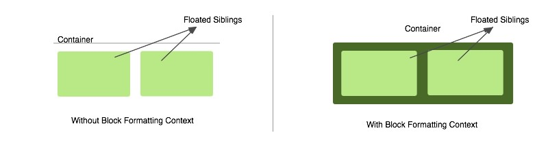
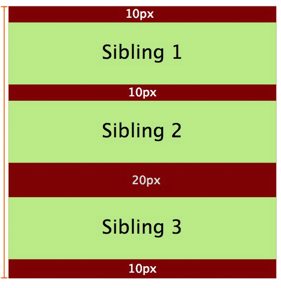
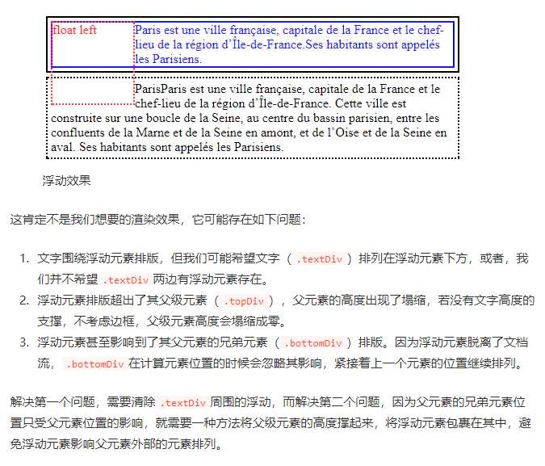
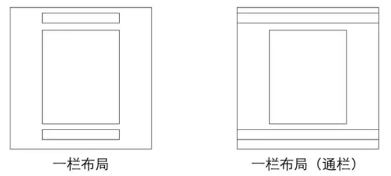
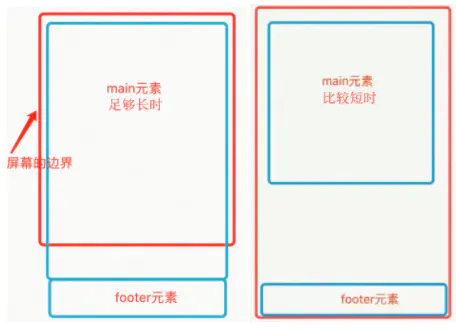

## 目录

<!-- TOC -->

- [目录](#%E7%9B%AE%E5%BD%95)
- [CSS标准盒子模型和IE怪异盒子模型](#css%E6%A0%87%E5%87%86%E7%9B%92%E5%AD%90%E6%A8%A1%E5%9E%8B%E5%92%8Cie%E6%80%AA%E5%BC%82%E7%9B%92%E5%AD%90%E6%A8%A1%E5%9E%8B)
- [CSS居中问题](#css%E5%B1%85%E4%B8%AD%E9%97%AE%E9%A2%98)
    - [宽高固定的块级元素](#%E5%AE%BD%E9%AB%98%E5%9B%BA%E5%AE%9A%E7%9A%84%E5%9D%97%E7%BA%A7%E5%85%83%E7%B4%A0)
    - [宽高不固定的块级元素](#%E5%AE%BD%E9%AB%98%E4%B8%8D%E5%9B%BA%E5%AE%9A%E7%9A%84%E5%9D%97%E7%BA%A7%E5%85%83%E7%B4%A0)
    - [行内和行内块元素](#%E8%A1%8C%E5%86%85%E5%92%8C%E8%A1%8C%E5%86%85%E5%9D%97%E5%85%83%E7%B4%A0)
- [外边距叠加](#%E5%A4%96%E8%BE%B9%E8%B7%9D%E5%8F%A0%E5%8A%A0)
    - [定义](#%E5%AE%9A%E4%B9%89)
    - [条件和三个demo](#%E6%9D%A1%E4%BB%B6%E5%92%8C%E4%B8%89%E4%B8%AAdemo)
- [CSS3新特性](#css3%E6%96%B0%E7%89%B9%E6%80%A7)
    - [CSS3 选择器](#css3-%E9%80%89%E6%8B%A9%E5%99%A8)
    - [CSS3 边框（Borders）](#css3-%E8%BE%B9%E6%A1%86borders)
    - [CSS3 背景](#css3-%E8%83%8C%E6%99%AF)
    - [CSS3 渐变](#css3-%E6%B8%90%E5%8F%98)
    - [CSS3 文本效果](#css3-%E6%96%87%E6%9C%AC%E6%95%88%E6%9E%9C)
    - [CSS3 转换和变形](#css3-%E8%BD%AC%E6%8D%A2%E5%92%8C%E5%8F%98%E5%BD%A2)
    - [CSS3 过渡](#css3-%E8%BF%87%E6%B8%A1)
    - [CSS3 动画](#css3-%E5%8A%A8%E7%94%BB)
    - [CSS3 盒模型](#css3-%E7%9B%92%E6%A8%A1%E5%9E%8B)
    - [CSS3 伸缩布局盒模型（flex）](#css3-%E4%BC%B8%E7%BC%A9%E5%B8%83%E5%B1%80%E7%9B%92%E6%A8%A1%E5%9E%8Bflex)
    - [CSS3多媒体查询](#css3%E5%A4%9A%E5%AA%92%E4%BD%93%E6%9F%A5%E8%AF%A2)
- [CSS布局的三种机制](#css%E5%B8%83%E5%B1%80%E7%9A%84%E4%B8%89%E7%A7%8D%E6%9C%BA%E5%88%B6)
    - [普通流（标准流）](#%E6%99%AE%E9%80%9A%E6%B5%81%E6%A0%87%E5%87%86%E6%B5%81)
    - [浮动float](#%E6%B5%AE%E5%8A%A8float)
        - [清除浮动](#%E6%B8%85%E9%99%A4%E6%B5%AE%E5%8A%A8)
    - [定位（position）](#%E5%AE%9A%E4%BD%8Dposition)
        - [边偏移移](#%E8%BE%B9%E5%81%8F%E7%A7%BB%E7%A7%BB)
        - [定位模式（position）](#%E5%AE%9A%E4%BD%8D%E6%A8%A1%E5%BC%8Fposition)
        - [堆叠顺序（z-index）](#%E5%A0%86%E5%8F%A0%E9%A1%BA%E5%BA%8Fz-index)
        - [定位改变display属性](#%E5%AE%9A%E4%BD%8D%E6%94%B9%E5%8F%98display%E5%B1%9E%E6%80%A7)
- [元素显示和隐藏](#%E5%85%83%E7%B4%A0%E6%98%BE%E7%A4%BA%E5%92%8C%E9%9A%90%E8%97%8F)
    - [display显示](#display%E6%98%BE%E7%A4%BA)
    - [visibility显示](#visibility%E6%98%BE%E7%A4%BA)
    - [overflow溢出](#overflow%E6%BA%A2%E5%87%BA)
- [用户界面样式](#%E7%94%A8%E6%88%B7%E7%95%8C%E9%9D%A2%E6%A0%B7%E5%BC%8F)
    - [鼠标样式](#%E9%BC%A0%E6%A0%87%E6%A0%B7%E5%BC%8F)
    - [轮廓线outline](#%E8%BD%AE%E5%BB%93%E7%BA%BFoutline)
    - [放置拖拽文本域resize](#%E6%94%BE%E7%BD%AE%E6%8B%96%E6%8B%BD%E6%96%87%E6%9C%AC%E5%9F%9Fresize)
    - [溢出的文字省略号显示](#%E6%BA%A2%E5%87%BA%E7%9A%84%E6%96%87%E5%AD%97%E7%9C%81%E7%95%A5%E5%8F%B7%E6%98%BE%E7%A4%BA)
        - [white-space](#white-space)
        - [text-overflow文字溢出](#text-overflow%E6%96%87%E5%AD%97%E6%BA%A2%E5%87%BA)
        - [总结三部曲](#%E6%80%BB%E7%BB%93%E4%B8%89%E9%83%A8%E6%9B%B2)
- [CSS三角形](#css%E4%B8%89%E8%A7%92%E5%BD%A2)
- [伪类和伪元素](#%E4%BC%AA%E7%B1%BB%E5%92%8C%E4%BC%AA%E5%85%83%E7%B4%A0)
    - [伪类](#%E4%BC%AA%E7%B1%BB)
    - [伪元素](#%E4%BC%AA%E5%85%83%E7%B4%A0)
- [Flex弹性布局](#flex%E5%BC%B9%E6%80%A7%E5%B8%83%E5%B1%80)
    - [容器的属性](#%E5%AE%B9%E5%99%A8%E7%9A%84%E5%B1%9E%E6%80%A7)
    - [项目的属性](#%E9%A1%B9%E7%9B%AE%E7%9A%84%E5%B1%9E%E6%80%A7)
- [px、em和rem的区别](#pxem%E5%92%8Crem%E7%9A%84%E5%8C%BA%E5%88%AB)
- [元素设置为透明的几种方法](#%E5%85%83%E7%B4%A0%E8%AE%BE%E7%BD%AE%E4%B8%BA%E9%80%8F%E6%98%8E%E7%9A%84%E5%87%A0%E7%A7%8D%E6%96%B9%E6%B3%95)
- [BFC](#bfc)
    - [BFC 的特性](#bfc-%E7%9A%84%E7%89%B9%E6%80%A7)
    - [触发BFC的条件](#%E8%A7%A6%E5%8F%91bfc%E7%9A%84%E6%9D%A1%E4%BB%B6)
    - [BFC的作用](#bfc%E7%9A%84%E4%BD%9C%E7%94%A8)
- [清除浮动](#%E6%B8%85%E9%99%A4%E6%B5%AE%E5%8A%A8)
    - [为什么要清除浮动](#%E4%B8%BA%E4%BB%80%E4%B9%88%E8%A6%81%E6%B8%85%E9%99%A4%E6%B5%AE%E5%8A%A8)
    - [清除浮动的几种方法](#%E6%B8%85%E9%99%A4%E6%B5%AE%E5%8A%A8%E7%9A%84%E5%87%A0%E7%A7%8D%E6%96%B9%E6%B3%95)
        - [利用 clear 属性样式](#%E5%88%A9%E7%94%A8-clear-%E5%B1%9E%E6%80%A7%E6%A0%B7%E5%BC%8F)
        - [父元素结束标签之前添加清除浮动的空div](#%E7%88%B6%E5%85%83%E7%B4%A0%E7%BB%93%E6%9D%9F%E6%A0%87%E7%AD%BE%E4%B9%8B%E5%89%8D%E6%B7%BB%E5%8A%A0%E6%B8%85%E9%99%A4%E6%B5%AE%E5%8A%A8%E7%9A%84%E7%A9%BAdiv)
        - [添加伪元素 :after](#%E6%B7%BB%E5%8A%A0%E4%BC%AA%E5%85%83%E7%B4%A0-after)
        - [父元素创建新的 BFC](#%E7%88%B6%E5%85%83%E7%B4%A0%E5%88%9B%E5%BB%BA%E6%96%B0%E7%9A%84-bfc)
- [常见的几种CSS布局](#%E5%B8%B8%E8%A7%81%E7%9A%84%E5%87%A0%E7%A7%8Dcss%E5%B8%83%E5%B1%80)
    - [单列布局](#%E5%8D%95%E5%88%97%E5%B8%83%E5%B1%80)
        - [代码实现](#%E4%BB%A3%E7%A0%81%E5%AE%9E%E7%8E%B0)
    - [两栏自适应布局](#%E4%B8%A4%E6%A0%8F%E8%87%AA%E9%80%82%E5%BA%94%E5%B8%83%E5%B1%80)
        - [左浮动 + 右margin-left](#%E5%B7%A6%E6%B5%AE%E5%8A%A8--%E5%8F%B3margin-left)
        - [flex布局 + flex属性](#flex%E5%B8%83%E5%B1%80--flex%E5%B1%9E%E6%80%A7)
        - [父相左子绝 + 右margin-left](#%E7%88%B6%E7%9B%B8%E5%B7%A6%E5%AD%90%E7%BB%9D--%E5%8F%B3margin-left)
        - [父相右子绝 + 右left](#%E7%88%B6%E7%9B%B8%E5%8F%B3%E5%AD%90%E7%BB%9D--%E5%8F%B3left)
    - [上下固定中间自适应](#%E4%B8%8A%E4%B8%8B%E5%9B%BA%E5%AE%9A%E4%B8%AD%E9%97%B4%E8%87%AA%E9%80%82%E5%BA%94)
        - [flex 布局](#flex-%E5%B8%83%E5%B1%80)
        - [grid 布局](#grid-%E5%B8%83%E5%B1%80)
        - [table 布局](#table-%E5%B8%83%E5%B1%80)
    - [三栏布局](#%E4%B8%89%E6%A0%8F%E5%B8%83%E5%B1%80)
        - [圣杯布局](#%E5%9C%A3%E6%9D%AF%E5%B8%83%E5%B1%80)
        - [双飞翼布局](#%E5%8F%8C%E9%A3%9E%E7%BF%BC%E5%B8%83%E5%B1%80)
        - [两种布局的对比](#%E4%B8%A4%E7%A7%8D%E5%B8%83%E5%B1%80%E7%9A%84%E5%AF%B9%E6%AF%94)
    - [等高布局](#%E7%AD%89%E9%AB%98%E5%B8%83%E5%B1%80)
        - [正 padding + 负 margin](#%E6%AD%A3-padding--%E8%B4%9F-margin)
    - [粘连布局](#%E7%B2%98%E8%BF%9E%E5%B8%83%E5%B1%80)
        - [特点](#%E7%89%B9%E7%82%B9)
        - [实现步骤](#%E5%AE%9E%E7%8E%B0%E6%AD%A5%E9%AA%A4)
        - [样式代码实现](#%E6%A0%B7%E5%BC%8F%E4%BB%A3%E7%A0%81%E5%AE%9E%E7%8E%B0)

<!-- /TOC -->


## CSS标准盒子模型和IE怪异盒子模型

+ 标准模式下：
  + width是content的宽度
  + 一个块的宽度是width+padding+border+margin
+ 怪异模式下：
  + width包含了content、padding、border的宽度
  + 一个块的宽度是width+margin


## CSS居中问题

### 宽高固定的块级元素

1. `margin: 0 auto`实现元素的水平居中
2. 利用绝对定位，设置四个方向的值都为0，并将margin设置为auto，由于宽高固定，因此对应方向实现平分，可以实现水
   平和垂直方向上的居中。
3. 利用绝对定位，先将元素的左上角通过top:50%和left:50%定位到页面的中心，然后再通过margin负值来调整元素
   的中心点到页面的中心。

### 宽高不固定的块级元素

1. 利用绝对定位，先将元素的左上角通过top:50%和left:50%定位到页面的中心，然后再通过translate来调整元素
   的中心点到页面的中心。
2. 使用flex布局，通过align-items:center和justify-content:center设置容器的垂直和水平方向上为居中对
   齐，然后它的子元素也可以实现垂直和水平的居中。

### 行内和行内块元素

1. 水平居中：`text-align: center` 垂直居中：`vertical-align: middle`


## 外边距叠加

### 定义

> 在CSS中，**两个或多**个**毗邻**的**普通流**中的盒子（可能是父子元素，也可能是兄弟元素）在**垂直方向**上的外边距会发生叠加，这种形成的外边距称之为外边距叠加。

+ 毗邻

  说明他们的位置关系，没有被 `padding`、`border`、`clear` 和 `line box` 分隔开

+ 两个或多个

  两个或多个盒子是指元素之间的相互影响，单个元素不会存在外边距叠加的情况。

+ 垂直方向

  只有垂直方向的外边距会发生外边距叠加。水平方向的外边距不存在叠加的情况。

+ 普通流

  只要不是`float`、`absolutely positioned`和`root element`时就是`in flow`。

### 条件和三个demo

1. 都是普通流的块级盒子且参与到相同的块级格式上下文（BFC）中
2. 没有被`padding`、`border`、`clear`和`line box`分隔开
3. 都属于垂直毗邻盒子边缘：
   + 盒子的`top margin`和它第一个普通流子元素的`top margin`（如下demo1）
   + 盒子的`bottom margin`和它下一个普通流兄弟的`top margin`（如下demo2）
   + 盒子的`bottom margin`和它父元素的`bottom margin`（如下demo3）

```
.parent1 {
    height: 20px;
    background: yellow;
    margin-bottom: 20px;
}
.parent2 {
    margin: 20px 0 30px;
}
.parent3 {
    height: 20px;
    background: green;
    margin-top: 20px;
}
.child {
    background: red;
    height: 20px;
    margin: 40px 0 30px;
}

<div class="parent1"></div>  
<div class="parent2">  
    <div class="child"></div>
    <div class="child"></div>
    <div class="child"></div>
</div>  
<div class="parent3"></div>  
```

+ demo1：

  `.parent2`和第一个`.child`的`top margin`叠加，导致`.parent1`和`.parent2`之间的边距为`40px`。

+ demo2：

  `.parent2`中的`.child`中的`top margin`和`bottom margin`发生外边距叠加，它们之间的外边距为`40px`。

+ demo3：

  `.parent2`中的最后一个`.child`发生`bottom margin`叠加，`.parent2`和`.parent3`之间的边距为`30px`。


## CSS3新特性

### CSS3 选择器

新增了很多，但是感觉暂时用不上，可以去网上看多了解

### CSS3 边框（Borders）

| 属性                                                                     | 说明                                           | CSS  |
| :----------------------------------------------------------------------- | :--------------------------------------------- | :--- |
| [border-image](http://www.runoob.com/cssref/css3-pr-border-image.html)   | 设置所有边框图像的速记属性。                   | 3    |
| [border-radius](http://www.runoob.com/cssref/css3-pr-border-radius.html) | 一个用于设置所有四个边框- *-半径属性的速记属性 | 3    |
| [box-shadow](http://www.runoob.com/cssref/css3-pr-box-shadow.html)       | 附加一个或多个下拉框的阴影                     | 3    |

### CSS3 背景

| 顺序                                                                             | 描述                     | CSS  |
| :------------------------------------------------------------------------------- | :----------------------- | :--- |
| [background-clip](http://www.runoob.com/cssref/css3-pr-background-clip.html)     | 规定背景的绘制区域。     | 3    |
| [background-origin](http://www.runoob.com/cssref/css3-pr-background-origin.html) | 规定背景图片的定位区域。 | 3    |
| [background-size](http://www.runoob.com/cssref/css3-pr-background-size.html)     | 规定背景图片的尺寸。     | 3    |

### CSS3 渐变

+ 线性渐变

  （两个颜色节点，可以设置一个起点和一个方向、或者一个角度）[CSS3渐变](https://www.runoob.com/css3/css3-gradients.html)

+ 径向渐变

### CSS3 文本效果

| 属性                                                                                 | 描述                                                    | CSS  |
| :----------------------------------------------------------------------------------- | :------------------------------------------------------ | :--- |
| [hanging-punctuation](http://www.runoob.com/cssref/css3-pr-hanging-punctuation.html) | 规定标点字符是否位于线框之外。                          | 3    |
| [punctuation-trim](http://www.runoob.com/cssref/css3-pr-punctuation-trim.html)       | 规定是否对标点字符进行修剪。                            | 3    |
| text-align-last                                                                      | 设置如何对齐最后一行或紧挨着强制换行符之前的行。        | 3    |
| text-emphasis                                                                        | 向元素的文本应用重点标记以及重点标记的前景色。          | 3    |
| [text-justify](http://www.runoob.com/cssref/css3-pr-text-justify.html)               | 规定当 text-align 设置为 "justify" 时所使用的对齐方法。 | 3    |
| [text-outline](http://www.runoob.com/cssref/css3-pr-text-outline.html)               | 规定文本的轮廓。                                        | 3    |
| [text-overflow](http://www.runoob.com/cssref/css3-pr-text-overflow.html)             | 规定当文本溢出包含元素时发生的事情。                    | 3    |
| [text-shadow](http://www.runoob.com/cssref/css3-pr-text-shadow.html)                 | 向文本添加阴影。                                        | 3    |
| [text-wrap](http://www.runoob.com/cssref/css3-pr-text-wrap.html)                     | 规定文本的换行规则。                                    | 3    |
| [word-break](http://www.runoob.com/cssref/css3-pr-word-break.html)                   | 规定非中日韩文本的换行规则。                            | 3    |
| [word-wrap](http://www.runoob.com/cssref/css3-pr-word-wrap.html)                     | 允许对长的不可分割的单词进行分割并换行到下一行。        | 3    |

### CSS3 转换和变形

>  重点记住transform

| 属性                                                                                 | 描述                                 | CSS  |
| :----------------------------------------------------------------------------------- | :----------------------------------- | :--- |
| [transform](http://www.runoob.com/cssref/css3-pr-transform.html)                     | 向元素应用 2D 或 3D 转换。           | 3    |
| [transform-origin](http://www.runoob.com/cssref/css3-pr-transform-origin.html)       | 允许你改变被转换元素的位置。         | 3    |
| [transform-style](http://www.runoob.com/cssref/css3-pr-transform-style.html)         | 规定被嵌套元素如何在 3D 空间中显示。 | 3    |
| [perspective](http://www.runoob.com/cssref/css3-pr-perspective.html)                 | 规定 3D 元素的透视效果。             | 3    |
| [perspective-origin](http://www.runoob.com/cssref/css3-pr-perspective-origin.html)   | 规定 3D 元素的底部位置。             | 3    |
| [backface-visibility](http://www.runoob.com/cssref/css3-pr-backface-visibility.html) | 定义元素在不面对屏幕时是否可见。     | 3    |

### CSS3 过渡

| 属性                                                                                               | 描述                                         | CSS  |
| :------------------------------------------------------------------------------------------------- | :------------------------------------------- | :--- |
| [transition](http://www.runoob.com/cssref/css3-pr-transition.html)                                 | 简写属性，用于在一个属性中设置四个过渡属性。 | 3    |
| [transition-property](http://www.runoob.com/cssref/css3-pr-transition-property.html)               | 规定应用过渡的 CSS 属性的名称。              | 3    |
| [transition-duration](http://www.runoob.com/cssref/css3-pr-transition-duration.html)               | 定义过渡效果花费的时间。默认是 0。           | 3    |
| [transition-timing-function](http://www.runoob.com/cssref/css3-pr-transition-timing-function.html) | 规定过渡效果的时间曲线。默认是 "ease"。      | 3    |
| [transition-delay](http://www.runoob.com/cssref/css3-pr-transition-delay.html)                     | 规定过渡效果何时开始。默认是 0。             | 3    |

### CSS3 动画

| 属性                                                                                             | 描述                                                     | CSS  |
| :----------------------------------------------------------------------------------------------- | :------------------------------------------------------- | :--- |
| [@keyframes](http://www.runoob.com/cssref/css3-pr-animation-keyframes.html)                      | 规定动画。                                               | 3    |
| [animation](http://www.runoob.com/cssref/css3-pr-animation.html)                                 | 所有动画属性的简写属性，除了 animation-play-state 属性。 | 3    |
| [animation-name](http://www.runoob.com/cssref/css3-pr-animation-name.html)                       | 规定 @keyframes 动画的名称。                             | 3    |
| [animation-duration](http://www.runoob.com/cssref/css3-pr-animation-duration.html)               | 规定动画完成一个周期所花费的秒或毫秒。默认是 0。         | 3    |
| [animation-timing-function](http://www.runoob.com/cssref/css3-pr-animation-timing-function.html) | 规定动画的速度曲线。默认是 "ease"。                      | 3    |
| [animation-delay](http://www.runoob.com/cssref/css3-pr-animation-delay.html)                     | 规定动画何时开始。默认是 0。                             | 3    |
| [animation-iteration-count](http://www.runoob.com/cssref/css3-pr-animation-iteration-count.html) | 规定动画被播放的次数。默认是 1。                         | 3    |
| [animation-direction](http://www.runoob.com/cssref/css3-pr-animation-direction.html)             | 规定动画是否在下一周期逆向地播放。默认是 "normal"。      | 3    |
| [animation-play-state](http://www.runoob.com/cssref/css3-pr-animation-play-state.html)           | 规定动画是否正在运行或暂停。默认是 "running"。           | 3    |

### CSS3 盒模型

| 属性                                                                        | 描述                                         | CSS |
| --------------------------------------------------------------------------- | -------------------------------------------- | --- |
| [resize](https://www.runoob.com/cssref/css3-pr-resize.html)                 | 指定一个元素是否是由用户调整大小的。         | 3   |
| [box-sizing](https://www.runoob.com/cssref/css3-pr-box-sizing.html)         | 允许你以某种方式定义某些元素，以适应指定区域 | 3   |
| [outline](https://www.runoob.com/cssref/pr-outline.html)                    | 简写属性在一个声明中设置所有的轮廓属性       | 3   |
| [outline-offset](https://www.runoob.com/cssref/css3-pr-outline-offset.html) | 设置轮廓框架在 border 边缘外的偏移           | 3   |

### CSS3 伸缩布局盒模型（flex）

| 属性                                                                         | 描述                                                                              |
| :--------------------------------------------------------------------------- | :-------------------------------------------------------------------------------- |
| [display](http://www.runoob.com/cssref/pr-class-display.html)                | 指定 HTML 元素盒子类型。                                                          |
| [flex-direction](http://www.runoob.com/cssref/css3-pr-flex-direction.html)   | 指定了弹性容器中子元素的排列方式                                                  |
| [justify-content](http://www.runoob.com/cssref/css3-pr-justify-content.html) | 设置弹性盒子元素在主轴（横轴）方向上的对齐方式。                                  |
| [align-items](http://www.runoob.com/cssref/css3-pr-align-items.html)         | 设置弹性盒子元素在侧轴（纵轴）方向上的对齐方式。                                  |
| [flex-wrap](http://www.runoob.com/cssref/css3-pr-flex-wrap.html)             | 设置弹性盒子的子元素超出父容器时是否换行。                                        |
| [align-content](http://www.runoob.com/cssref/css3-pr-align-content.html)     | 修改 flex-wrap 属性的行为，类似 align-items, 但不是设置子元素对齐，而是设置行对齐 |
| [flex-flow](http://www.runoob.com/cssref/css3-pr-flex-flow.html)             | flex-direction 和 flex-wrap 的简写                                                |
| [order](http://www.runoob.com/cssref/css3-pr-order.html)                     | 设置弹性盒子的子元素排列顺序。                                                    |
| [align-self](http://www.runoob.com/cssref/css3-pr-align-self.html)           | 在弹性子元素上使用。覆盖容器的 align-items 属性。                                 |
| [flex](http://www.runoob.com/cssref/css3-pr-flex.html)                       | 设置弹性盒子的子元素如何分配空间。                                                |

### CSS3多媒体查询

@media（看不下去了，有空看看）


## CSS布局的三种机制

### 普通流（标准流）

块级元素、行内元素、行内块元素blabla

### 浮动float

>  让盒子从普通流中浮动起来

#### 清除浮动

1. 父级伪元素

   ```css
   .clearfix:after {
   	content: "";
   	display: block;
   	height: 0;
   	clear: both;
   	visibility: hidden;
   }
   .clearfix {
   	*zoom: 1;/* IE6、7 专有 */
   }
   ```

2. 父类双伪元素

   ```css
   .clearfix:before,
   .clearfix:after {
   	content: "",
   	display: table;
   }
   .clearfix:after {
   	clear: both;
   }
   .clearfix {
   	*zoom: 1;
   }
   ```

3. jq里面有个clearfix的类，可以直接用

### 定位（position）

> 将盒子定在某一个位置，自由的漂浮在其他盒子（包括标准流和浮动）的上面

**三种布局机制的上下顺序：**

标准流在最底层（海底）——浮动 的盒子在中间层（海面）——定位的盒子在最上层（天空）

#### 边偏移移

`top`、`bottom`、`left`、`right`

+ `top`和`bottom`不要同时使用
+ `left`和`right`不要同时使用

#### 定位模式（position）

+ static：静态定位

+ relative：相对定位

  > 相对定位是元素相对于它原来在标准流中的位置来说的

  + 相对于自己原来在标准流中位置来偏移的
  + 原来在标准流的区域继续占有，**后面的盒子仍然以标准流的方式对待它**

+ absolute：绝对定位

  > 绝对定位是以**带有定位**的父级元素来偏移位置的

  + 完全脱标准流——不保留原来的位置
  + 元素会寻找最近的已经定位（relative、absolute、fixed）的父元素（祖父）进行定位
  + 都没有的话，则以浏览器为准定位（Document文档）

+ fixed：固定定位

  > 固定定位是绝对定位的一种特殊形式，只认浏览器的**可视窗口**

  + 完全脱标准流——不保留原来的位置
  + 不随滚动条滚动

#### 堆叠顺序（z-index）

+ 使用定位布局的时候，可能会出现盒子重叠的情况
+ 应用`z-index`层叠等级属性可以调整盒子的堆叠顺序
+ 特性如下：
  1. 属性值：正整数、负整数或0。默认值是0，数值越大，盒子越靠上
  2. 如果属性值相同，则按照书写顺序，后来居上
  3. 数字后面不能加单位
  4. **注意**：只能应用于相对定位、绝对定位和固定定位的元素，其他标准流、浮动和静态定位无效。

#### 定位改变display属性

+ absolute和fixed会默认转换display为行内块（不完全一样，这两个定位脱标）
+ 浮动float也会默认转换为行内块（类似，不完全一样，浮动脱标）

+ **注意：**给盒子加了absolute、fixed或者浮动float，都不会发生外边距塌陷问题

>  不管是**外边距塌陷**还是**默认转换行内块**，都没相对定位relative啥事（可能是因为他还占有标准流位置？）


## 元素显示和隐藏

### display显示

| 值           | 描述                                                 |
| :----------- | :--------------------------------------------------- |
| none         | 此元素不会被显示。（不占位置）                       |
| block        | 此元素将显示为块级元素，此元素前后会带有换行符。     |
| inline       | 默认。此元素会被显示为内联元素，元素前后没有换行符。 |
| inline-block | 行内块元素。（CSS2.1 新增的值）                      |
| inherit      | 规定应该从父元素继承 overflow 属性的值。             |

### visibility显示

```css
visibility: visible;	/* 对象可视 */
visibility: hidden;		/* 对象隐藏 */
```

+ 特点：隐藏之后，继续保留原有位置。（和display的区别）

### overflow溢出

| 值      | 描述                                                     |
| :------ | :------------------------------------------------------- |
| visible | 默认值。内容不会被修剪，会呈现在元素框之外。             |
| hidden  | 内容会被修剪，并且其余内容是不可见的。                   |
| scroll  | 内容会被修剪，但是浏览器会显示滚动条以便查看其余的内容。 |
| auto    | 如果内容被修剪，则浏览器会显示滚动条以便查看其余的内容。 |
| inherit | 规定应该从父元素继承 overflow 属性的值。                 |


## 用户界面样式

### 鼠标样式

| 属性值      | 描述           |
| ----------- | -------------- |
| default     | 小白 默认      |
| pointer     | 小手           |
| move        | 移动           |
| text        | 文本           |
| not-allowed | 禁止           |
| wait        | 等待（转圈圈） |

还有什么放大镜缩小镜的等等


### 轮廓线outline

可以按顺序设置如下属性：

- outline-color
- outline-style
- outline-width

| 值              | 描述                                                                                                        |
| :-------------- | :---------------------------------------------------------------------------------------------------------- |
| *outline-color* | 规定边框的颜色。参阅：[outline-color](https://www.w3school.com.cn/cssref/pr_outline-color.asp) 中可能的值。 |
| *outline-style* | 规定边框的样式。参阅：[outline-style](https://www.w3school.com.cn/cssref/pr_outline-style.asp) 中可能的值。 |
| *outline-width* | 规定边框的宽度。参阅：[outline-width](https://www.w3school.com.cn/cssref/pr_outline-width.asp) 中可能的值。 |
| inherit         | 规定应该从父元素继承 outline 属性的设置。                                                                   |

> 一般都是去掉轮廓线，`outline: 0;`或者`outline: none;`


### 放置拖拽文本域resize

本文域默认可以拖拽大小，实际开发中一般不允许拖拽，会容易造成页面布局混乱

`<textarea style="resize: none;"></textarea>`


### 溢出的文字省略号显示

#### white-space

+ white-space设置或检索对象内文本显示方式，通常用于强制一行显示内容

```css
white-space: normal; /*默认处理方式*/
white-space: nowrap; /*强制在同一行內显示所有文本，直到文本结束或者遭遇br标签对象才换行。*/
```

#### text-overflow文字溢出

+ 设置或检索是否使用一个省略标记（...）标示对象内文本的溢出

```css
text-overflow: clip; /*不显示省略标记（...），而是简单的裁切*/
text-overflow: ellipsis; /*当对象内文本溢出时显示省略标记（...）*/
```

#### 总结三部曲

```css
/*1. 先强制一行内显示文本*/
white-space: nowrap;
/*2. 超出的部分隐藏*/
overflow: hidden;
/*3. 文字用省略号替代超出的部分*/
text-overflow: ellipsis;
```


## CSS三角形

```css
div{
    width: 0;
    height: 0;
    line-height: 0;
    font-size: 0;
    border-top: 30px solid red;
    border-right: 30px solid yellow;
    border-bottom: 30px solid green;
    border-left: 30px solid blue;
}
```

效果如图：


1. 用css边框模拟出三角效果
2. 宽度高度为0
3. 我们4个边框都要写，只保留需要的边框颜色，其余的不能省略，都改为transparent透明
4. 为了照顾兼容性，加上`font-size: 0; line-height: 0;`


## 伪类和伪元素

### 伪类

**伪类**用于当已有元素处于的某个状态时，为其添加对应的样式，这个状态是根据用户行为而动态变化的。比如说，当用户悬停在指定的元素时，我们可以通过:hover 来描述这个元素的状态。**虽然它和普通的 css 类相似，可以为已有的元素添加样式**，但是它只有处于 dom 树无法描述的状态下才能为元素添加样式，所以将其称为伪类。


> : 冒号前加空格和不加空格有区别！


### 伪元素

**伪元素**用于**创建一些不在文档树中的元素，并为其添加样式**。比如说，我们可以通过:before 来在一个元素前增加一些文本，并为这些文本添加样式。虽然用户可以看到这些文本，但是这些文本实际上不在文档树中。


## Flex弹性布局

+ flex是一种弹性布局方式，设为flex布局后，子元素的float、clear和vertical-align属性将失效
+ 设为`display: flex`的元素是容器，该元素的子元素称为项目。


### 容器的属性

1. flex-direction：决定项目的方向，默认横向排列（direction：方向）

    | 属性值         | 描述                     |
    | -------------- | ------------------------ |
    | row            | 默认值，横向排列         |
    | row-reverse    | 横向排列，但与row相反    |
    | column         | 垂直排列                 |
    | column-reserve | 垂直排列，但与column相反 |

 2. flex-wrap：规定flex容器是单行或者多行（wrap：包）

    | 属性值       | 描述                                                 |
    | ------------ | ---------------------------------------------------- |
    | nowrap       | 元素不换行，例如，两个div设置宽为100%，但实际却是50% |
    | wrap         | 元素换行，一个div宽为100%，第二个div就换行了         |
    | wrap-reverse | 元素换行，但与wrap方向相反                           |

 3. flex-flow：flex-direction和flex-wrap的简写，默认为`row nowrap`

 4. justify-content：项目在主轴上的对齐方式（主轴默认方向是row，横向）

    

    | 属性值        | 描述                                                                   |
    | ------------- | ---------------------------------------------------------------------- |
    | flex-start    | 默认值，左对齐                                                         |
    | flex-end      | 右对齐                                                                 |
    | center        | 居中                                                                   |
    | space-between | 两端对齐，项目之间的间隔都相等。                                       |
    | space-around  | 每个项目两侧的间隔相等。所以，项目之间的间隔比项目与边框的间隔大一倍。 |

 5. align-items：项目在交叉轴上如何对齐

    

    | 属性       | 描述                                                             |
    | ---------- | ---------------------------------------------------------------- |
    | stretch    | （默认值）：如果项目未设置高度或设为auto，将占满整个容器的高度。 |
    | center     | 交叉轴的中点对齐。                                               |
    | flex-start | 交叉轴的起点对齐。                                               |
    | flex-end   | 交叉轴的终点对齐。                                               |
    | baseline   | 项目的第一行文字的基线对齐。                                     |

 6. align-content：多根主轴线的对齐方式，如果项目只有一根轴线，该属性不起作用。（也就是flex-wrap的值为nowrap不起作用

    

    | 属性          | 描述                                                                     |
    | ------------- | ------------------------------------------------------------------------ |
    | stretch       | 默认值，轴线占满整个交叉轴                                               |
    | center        | 与交叉轴的中点对齐                                                       |
    | flex-start    | 与交叉轴的起点对齐。                                                     |
    | flex-end      | 与交叉轴的终点对齐。                                                     |
    | space-between | 与交叉轴两端对齐，轴线之间的间隔平均分布                                 |
    | space-around  | 每根轴线两侧的间隔都相等。所以，轴线之间的间隔比轴线与边框的间隔大一倍。 |

### 项目的属性

1. order：定义项目的排列顺序，数值越小，排列越靠前，默认为0。（负值有效）

2. flex-grow：定义项目的放大比例，默认为0。
   + 0：有剩余空间也不放大
   + 1：有剩余空间的话等分剩余空间
   + 1之中有一个为2：该项目占据的剩余空间比其他1占的空间多一倍。
   
3. flex-shrink：定义项目的缩小比例，默认为1。即如果空间不足，该项目将缩小。

   > 在默认宽度之和大于容器的时候才会发生收缩。

4. flex-basis：定义了在分配多余空间之前，项目占据的主轴空间。浏览器根据这个属性，计算主轴是否有多余空间。它的默认值为`auto`，即项目的本来大小。（和 width 一样，单位是 px 等）

   > 当一个元素同时被设置了 `flex-basis` (除值为 `auto` 外) 和 `width` (或者在 `flex-direction: column` 情况下设置了`height`) , `flex-basis` 具有更高的优先级.

5. flex：`flex-grow`, `flex-shrink` 和 `flex-basis`的简写，默认值为`0 1 auto`。后两个属性可选。
   + auto：`1 1 auto`
   + none：`0 0 auto`

6. align-self：允许单个项目有与其他项目不一样的对齐方式，可覆盖`align-items`属性


## px、em和rem的区别

1. px像素

   > 相对长度单位，像素px是相对于显示器屏幕分辨率而言的

2. em

   > 相对长度单位，相对于当前对象文本的字体大小尺寸。如当前行内文本的字体尺寸未被人为设置，则相对于浏览器的默认字体尺寸。
   >
   > + em的值并不是固定的
   > + em会**继承父级元素**的字体大小
   > + 所有未经调整的浏览器都符合1em=16px

3. rem

   > CSS3新增的一个相对长度单位，相对于HTML根元素的字体大小尺寸。
   >
   > 优点：
   >
   > + 可以做到只修改根元素的字体大小就成比例地调整所有字体的大小
   > + 避免字体大小逐层复合的连锁反应（em继承父级元素的弊端）

   

## 元素设置为透明的几种方法

1. `display: none`
   + 隐藏不占位
2. `visibility: hidden`
   + 占位隐藏
3. `opacity: 0`
   + opacity：元素的透明度，占位隐藏
4. 设置盒子的width和height为0，再设置`overflow:hidden`
5. 通过`position: absolute`，再设置top和left足够大的负数，把元素放到可视区域外


## BFC

> Block formatting context，块级格式上下文，是用于**布局块级盒子的一块渲染区域**。并且与这个区域的外部毫无关系。

BFC是CSS的一个布局概念，是一个**独立的区域**，是一个环境。


### BFC 的特性

1. **同一个 BFC** 下外边距会发生折叠（也就是[外边距叠加](#%E5%A4%96%E8%BE%B9%E8%B7%9D%E5%8F%A0%E5%8A%A0)）

   > 是同一个 BFC 下的子元素发生折叠，

2. BFC 能够识别并包含浮动元素（可以**清除浮动**）

   > BFC在计算高度的时候，内部浮动元素的高度也要计算在内。也就是说，即使BFC区域内只有一个浮动元素，BFC的高度也不会发生塌缩，高度是大于等于浮动元素的高度的。

### 触发BFC的条件

1. 根元素或包含根元素的元素？
2. 浮动元素float＝left|right 或 inherit（≠none）
3. overflow＝hidden|auto或scroll(≠visible)
4. display的值为inline-block、inline-flex、flex、flow-root、table-caption、table-cell
5. position的值为absolute或者fixed

### BFC的作用

1. 包含浮动元素（清除浮动）

   + 浮动元素会脱离文档流（绝对定位元素也会脱离文档流），导致无法计算准确的高度，这种问题称为**高度塌陷**。
   + 解决高度塌陷问题的前提是能够识别并包含浮动元素，也就是**清除浮动**。

   > 
   >
   > 如上左图所示，容器（container）没有高度或者 height = auto，并且其子元素（sibling）是浮动元素，该容器的高度是不会被撑开的，即高度塌陷。
   >
   > + 解决办法：在容器（container）中创建 BFC。
   >
   > ```html
   > <div class="container">
   >         <div class="Sibling"></div>
   >         <div class="Sibling"></div>
   > </div>
   > ```
   >
   > ```css
   > .container { 
   >         overflow: hidden; /* creates block formatting context */ 
   >         background-color: green; 
   > } 
   > .container .Sibling { 
   >         float: left; 
   >         margin: 10px;
   >         background-color: lightgreen;  
   > }
   > ```
   >
   > - 通过 overflow:hidden 创建 BFC，固然可以解决高度塌陷的问题，但是大范围应用在布局上肯定**不是最合适的**，毕竟 overflow:hidden 会造成溢出隐藏的问题，尤其是与 JS 的交互效果会有影响。
   > - 我们可以使用 **clearfix** 实现清除浮动，这里就不多介绍了，想要了解的可以阅读[前端面试题-clearfix（清除浮动）](https://segmentfault.com/a/1190000013664630)。

2. 避免外边距塌陷

   + **相邻**的两个盒子（可能是**兄弟**关系也可能是**祖先**关系）的**垂直边距**相遇时，它们将形成一个外边距。

     这个外边距的高度等于两个发生折叠的外边距中的高度**较大者**，即[外边距叠加](#%E5%A4%96%E8%BE%B9%E8%B7%9D%E5%8F%A0%E5%8A%A0)。

   + 同一 BFC 的块级元素之间会发生外边距折叠（即外边距塌陷），所以只要创建一个不同的 BFC，就能避免外边距折叠

   > 
   >
   > ```html
   > <div class="Container"> 
   >     <p>Sibling 1</p> 
   >     <p>Sibling 2</p> 
   > </div>
   > ```
   >
   > ```css
   > .Container { 
   >     background-color: red; 
   >     overflow: hidden; /* creates a block formatting context */ 
   > } 
   > p { 
   >     background-color: lightgreen; 
   >     margin: 10px 0; 
   > }
   > ```
   >
   > 如上图所示：红色盒子（Container）中包含两个绿色的兄弟元素（P），并且红色盒子设置 `overflow: hidden;` ，即一个BFC 已经被创建，两个绿色兄弟元素在同一个BFC中，即导致外边距折叠。
   >
   > 理论上两个兄弟元素之间的边距应该是两个元素的边距之和（20px），但实际是 10px。这就是外边距折叠导致的。
   >
   > + 解决办法：创建一个不同的 BFC，就能避免外边距折叠。
   >
   > ```html
   > <div class="Container"> 
   >         <p>Sibling 1</p> 
   >         <p>Sibling 2</p> 
   >         <div class="newBFC"> 
   >             <p>Sibling 3</p> 
   >         </div> 
   > </div>
   > ```
   >
   > ```css
   > .Container { 
   >             background-color: red; 
   >             overflow: hidden; /* creates a block formatting context */ 
   > } 
   > p { 
   >             background-color: lightgreen; 
   >             margin: 10px 0; 
   > }
   > .newBFC { 
   >             overflow: hidden; /* creates new block formatting context */ 
   > }
   > ```
   >
   > 
   >
   > 


## 清除浮动

### 为什么要清除浮动

1. 浮动的框可以向左或向右移动，直到它的外边缘碰到包含框或另一个浮动框的边框为止。

2. 浮动脱离了文档流，如果浮动元素的父元素没有设置高度，那么父元素会有**高度塌陷**的问题。同时也可能会影响其父元素的兄弟元素的排版

3. 如这个文章中的例子所示：[清除浮动的四种方式及其原理理解](https://juejin.cn/post/6844903504545316877#heading-0) 

   ```html
   <div class="topDiv">
       <div class="floatDiv">float left</div>
       <div class="textDiv">...</div>
   </div>
   <div class="bottomDiv">...</div>
   ```

   ```css
   .topDiv {
       width: 500px;
       border: 2px solid black;
   }
   .floatDiv {
       width: 100px;
       height: 100px;
       border: 2px dotted red;
       color: red;
       margin: 4px;
       float: left;
   }
   .bottomDiv {
       width: 500px;
       height: 100px;
       margin: 5px 0;
       border: 2px dotted black;
   }
   .textDiv {
       color: blue;
       border: 2px solid blue;
   }
   ```

   

   

### 清除浮动的几种方法

#### 利用 clear 属性样式

> `clear` 哪边不允许有浮动元素，clear就是对应方向的值（如 left 和 right ），两边都不允许就是 `both` 。

+ 用上面那个例子，给需要清除浮动的元素添加如下样式：

```css
.textDiv {
    color: blue;
    border: 2px solid blue;

    clear: left;
}
```

+ 清除浮动后的渲染效果：


+ 原因：

  + 通过上面的样式，`.textDiv`告诉浏览器，我的左边不允许有浮动的元素存在，请清除掉我左边的浮动元素。

  + 然而，因为浮动元素（`.floatDiv`）位置已经确定，浏览器在计算`.textDiv`的位置时，为满足其需求，将`.textDiv`渲染在浮动元素下方，保证了`.textDiv`左边没有浮动元素。
  + 父元素的高度也被撑起来了，其兄弟元素的渲染也不再受到浮动的影响，这是因为`.textDiv`仍然在文档流中，它必须在父元素的边界内，父元素只有增加其高度才能达到此目的。


#### 父元素结束标签之前添加清除浮动的空div

+ 应用clear清除浮动，撑起父级元素高度
+ 优点：简单，代码少，兼容所有浏览器
+ 缺点：增加页面的标签，造成结构混乱


#### 添加伪元素 :after 

> 给浮动元素的父元素添加一个类 clearfix，然后给这个 class 添加一个 :after 伪元素，再通过清除伪元素的浮动，达到撑起父级元素高度的目的。

```css
.clearfix:after {
	content: '\20';
	display: block;
	height: 0;
	clear: both;
}
.clearfix {
    zoom: 1;
}
```

> 注意，该伪元素的 display 值为 block，即它是一个不可见的块级元素

+ 添加一个看不见的空格 '\20' ，并且设置 clear 清除浮动。
+ 优点：浏览器支持较好，设置公共类，减少CSS代码，推荐使用
+ 缺点：IE6 和 IE7 需要为类 clearfix 添加 `zoom: 1;` 

#### 父元素创建新的 BFC

按照原来例子的代码中，topDiv 和 bottomDiv 都是在同一个 BFC 中，而如果给 topDiv 添加 `overflow: auto;`，就会触发BFC，此时 topDiv 就会创建一个新的 BFC

而BFC在计算高度的时候，**内部浮动元素的高度也要计算在内**。也就是说，即使BFC区域内只有一个浮动元素，BFC的高度也不会发生塌缩，高度是大于等于浮动元素的高度的。


## 常见的几种CSS布局

### 单列布局

常见的单列布局有这两种：

+ header、content 和 footer 等宽的单列布局
+ header 和 footer 等宽（通栏），content 略窄的单列布局



#### 代码实现

第一种：

1. 首先对 header、content、footer 统一设置 width 或者 max-width（两者区别是当屏幕小于设定的值时，前者会出现滚动条，后者则不会）
2. 设置 margin: auto; 实现居中即可得到。

```html
<div class="header"></div>
<div class="content"></div>
<div class="footer"></div>
```

```css
.header{
    margin:0 auto; 
    max-width: 960px;
    height:100px;
    background-color: blue;
}
.content{
    margin: 0 auto;
    max-width: 960px;
    height: 400px;
    background-color: aquamarine;
}
.footer{
    margin: 0 auto;
    max-width: 960px;
    height: 100px;
    background-color: aqua;
}
```


第二种：

1. 通栏的话，header 和 footer 的内容宽度不设置，块级元素充满整个屏幕。
2. header的内容区nav、footer 的内容区 和 content 设置同一个width，并通过 margin: auto; 实现居中。

```html
<div class="header">
    <div class="nav"></div>
</div>
<div class="content"></div>
<div class="footer">
	<div class="footer-content"></div>
</div>
```

```css
.header {
    height: 100px;
    background-color: blue;
    /* create BFC */
    overflow: hidden;
}

.nav {
    margin: 0 auto;
    max-width: 800px;
    background-color: darkgray;
    height: 50px;
}

.content {
    margin: 0 auto;
    max-width: 800px;
    height: 400px;
    background-color: aquamarine;
}

.footer {
    /* create BFC */
    overflow: hidden;
    height: 100px;
    background-color: aqua;
}

.footer-content {
    margin: 0 auto;
    max-width: 800px;
    height: 50px;
    background-color: darkgray;
}
```


### 两栏自适应布局

两栏布局一般是指页面中一共两栏，左边固定，右边自适应的布局。

有四种实现方式

#### 左浮动 + 右margin-left

利用浮动，将左边元素宽度设置为200px，并且设置向左浮动。将右边元素的 margin-left 设置为200px，宽度设置为auto。（默认为auto，撑满整个父元素）

```css
.outer {
  height: 100px;
}

.left {
  float: left;

  height: 100px;
  width: 200px;

  background: tomato;
}

.right {
  margin-left: 200px;

  width: auto;
  height: 100px;

  background: gold;
}
```

#### flex布局 + flex属性

利用 flex 布局，将左边元素的放大比例和缩小比例设置为 0，基础大小设置为 200px。将右边的元素的放大比例设置为 1，缩小比例设置为 1，基础大小设置为 auto。

> 项目的 flex 属性是`flex-grow`, `flex-shrink` 和 `flex-basis`的简写。

```css
.outer {
  display: flex;
  height: 100px;
}

.left {
  flex: 0 0 200px;
  background: tomato;
}

.right {
  flex: 1 1 auto;
  /* 或者简写为 flex: auto; */

  background: gold;
}
```

#### 父相左子绝 + 右margin-left

利用绝对定位布局的方式，将父级元素设置相对定位。左边元素设置为absolute定位，并且宽度设置为200px。将右边元素的margin-left的值设置为200px。

```css
.outer {
  position: relative;

  height: 100px;
}

.left {
  position: absolute;

  width: 200px;
  height: 100px;

  background: tomato;
}

.right {
  margin-left: 200px;
  height: 100px;

  background: gold;
}
```

#### 父相右子绝 + 右left

利用绝对定位的方式，将父级元素设置为相对定位。左边元素宽度设置为200px，右边元素设置为绝对定位，左边定位为200px，其余方向定位为0。

```
.outer {
  position: relative;

  height: 100px;
}

.left {
  width: 200px;
  height: 100px;

  background: tomato;
}

.right {
  position: absolute;

  top: 0;
  right: 0;
  bottom: 0;
  left: 200px;

  background: gold;
}
```


### 上下固定中间自适应

html 代码：

```html
<div class="header-container-footer">
    <div class="header"></div>
    <div class="container"></div>
    <div class="footer"></div>
</div>
```

#### flex 布局

给最大盒子设置为 flex 布局并设置主轴方向为 column，上下给定高度，中间设置项目属性 `flex-grow: 1;` 自适应放大。

```css
body {
    margin: 0;
    padding: 0;
}

.header-container-footer {
    display: flex;
    flex-direction: column;

}

.header {
    height: 200px;
    background-color: red;
}


.footer {
    height: 150px;
    background-color: red;
}

.container {
    flex-grow: 1;
    background-color: yellow;
}
```


#### grid 布局

给最大盒子设置为 grid 布局并设置显式网格行 grid-template-rows 为三行，第一行和第三行的大小为上下固定高度，中间为 auto。

```css
body {
    margin: 0;
    padding: 0;
}

.header-container-footer {
    display: grid;
    grid-template-rows: 200px auto 150px;
}

.header {
    background-color: red;
}


.footer {
    background-color: red;
}

.container {
    background-color: yellow;
}
```


#### table 布局

给最大盒子设置为 table 布局，并给三个盒子都设置为 `display: table-row;` ，再给上下设定高度即可，中间的高度会根据内容自适应。

> 在该例子中，盒子里面没有内容的话是看不到背景颜色的

```css
body {
    margin: 0;
    padding: 0;
}

.header-container-footer {
    height: 100%;
    width: 100%;
    display: table;
}

.header {
    display: table-row;
    height: 200px;
    background-color: red;
}


.footer {
    display: table-row;
    height: 150px;
    background-color: red;
}

.container {
    display: table-row;
    background-color: yellow;
}
```


### 三栏布局

中间列自适应宽度（根据浏览器窗口宽度可变），旁边两侧固定宽度。

#### 圣杯布局

+ **左浮动 + 左右列 margin-left + 父容器 padding + 左右列 relative** 

两边固定宽度，中间自适应。dom结构必须先写中间列部分，为了实现中间列可以优先加载。

```html
<div class="container clearfix">
    <div class="center">
        <h2>圣杯布局</h2>
    </div>
    <div class="left"></div>
    <div class="right"></div>
</div>
```

1. 给左右盒子一个高度和宽度（高度是为了看效果），中间盒子宽度设为 100%（实现中间列内容自适应）。此时，left 和 right 部分会跳到下一行。

   

2. 给 left 设置 `margin-left: -100%;`（也就是中间列自适应的宽度大小），给 right 设置 `margin: -200px;`（right 盒子的宽度），让三列回到同一行。

   

3. 通过设置父容器的 padding-left 和 padding-right，让左右两边留出间隙给 left 和 right 盒子。

   

4. 通过设置相对定位，让 left 和 right 部分移动到两边。

   

> 此时可以把高度去掉，这样三个盒子的高度是各自根据内容自适应的

```css
body {
    padding: 0;
    margin: 0;
}

.container {
    padding-left: 220px;
    padding-right: 220px;
}

.left {
    float: left;
    width: 200px;
    background-color: red;
    margin-left: -100%;
    position: relative;
    left: -220px;
}

.center {
    float: left;
    width: 100%;
    background-color: yellow;
}

.right {
    float: left;
    width: 200px;
    background-color: blue;
    margin-left: -200px;
    position: relative;
    right: -220px;
}

/* 加清除浮动是为了下面布局可以正常 */
.clearfix::after {
    display: block;
    clear: both;
    content: '\20';
    height: 0;
}
```

+ 缺点：
  + center 部分的最小宽度不能小于 left 部分的宽度，否则 left 部分会掉到下一行（毕竟 left 的 margin-left 的值是 center 的宽度大小）


#### 双飞翼布局

+ **左浮动 + 左右列 margin-left + 父容器 min-width + 子div margin**

```html
<div class="container clearfix">
    <div class="center">
        <div class="inner">双飞翼布局
            <div class="test">test</div>
        </div>
    </div>
    <div class="left">111</div>
    <div class="right">222</div>
</div>
```

1. 三部分设为左浮动，然后设置 center 的宽度为 100%，此时 left 和 right 部分会跳到下一行；
2. 通过设置 margin-left 为负值让 left 和 right 回到与 center 同一行。
3. center 部分新增一个 div，并设 `margin: 0 200px;`

```css
body {
    padding: 0;
    margin: 0;
}

.container {
    min-width: 600px;
}

.left {
    float: left;
    width: 200px;
    background-color: red;
    margin-left: -100%;
}

.center {
    float: left;
    width: 100%;
    background-color: yellow;
}

.center .inner {
    margin: 0 200px;
}

.right {
    float: left;
    width: 200px;
    background-color: blue;
    margin-left: -200px;
}

.clearfix::after {
    display: block;
    clear: both;
    content: '\20';
    height: 0;
}
```

+ 缺点：
  + 多加一层 dom 树节点，增加渲染树生成的计算量


#### 两种布局的对比

+ 共同点
  + 都是把**中间列**放在文档流最前面，使中间列优先加载。
  + 都是让三列浮动，然后通过负外边距形成三列布局。
+ 不同点：如何处理主列的位置
  + 圣杯布局：利用父容器的左、右内边距 + 两个左右列相对定位
  + 双飞翼布局：把主列（子div）嵌套在一个新的父级块中，利用主列（子div）的左右外边距进行布局调整


### 等高布局

#### 正 padding + 负 margin

> 针对圣杯布局和双飞翼布局都有效

1. 给三列都添加 正 padding + 负 margin

   ```css
   .container>div {
    	padding-bottom: 9999px;
    	margin-bottom: -9999px;
   }
   ```
   
2. 给三列的父容器添加 `overflow: hidden;`，把溢出背景切掉

   ```css
   .container {
   	/*...*/
   	overflow: hidden;
   }
   ```


### 粘连布局

#### 特点

+ 有一块内容`<main>`，当`<main>`的高康足够长的时候，紧跟在`<main>`后面的元素`<footer>`会跟在`<main>`元素的后面。

+ 当`<main>`元素比较短的时候(比如小于屏幕的高度),我们期望这个`<footer>`元素能够“粘连”在屏幕的底部

  

#### 实现步骤

html：

```html
<div id="wrap">
    <div class="main">
    </div>
</div>
<div id="footer">footer</div>
```

1. footer 必须是一个独立的结构，和 wrap 没有任何嵌套关系
2. wrap 区域的高度通过设置 min-height，变为视口高度
3. footer 要使用 margin 负值（ footer 的高度）将 footer 确定在屏幕底部位置。
4. 在 main 区域需要设置 padding-bottom。为了防止负 margin 导致 footer 覆盖任何实际内容。

#### 样式代码实现

```css
* {
    margin: 0;
    padding: 0;
}

html,
body {
    /* 百分比高度继承 */
    height: 100%;
}

#wrap {
    min-height: 100%;
}

#wrap .main {
    padding-bottom: 50px;
}

#footer {
    height: 50px;
    background: deeppink;
    margin-top: -50px;
}
```

>  百分比的高度**只能继承父元素**的，如果父元素**没有设置高度**或者**高度为 auto**，那么子元素高度设置百分比无效。
>
> #wrap的父元素是body，body的父元素是html，html没有父元素，他设置高度为100%获取的就是**浏览器的高度**
>
> 为了 #wrap 能够获得浏览器的高度，则需要通过 html 和 body 一层层继承下来。


