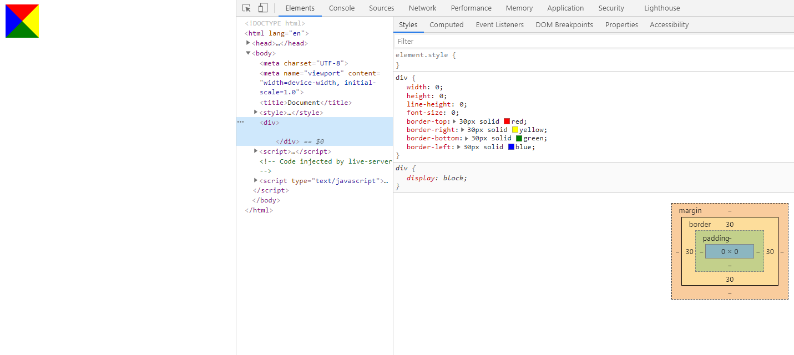
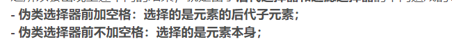

[TOC]


## CSS标准盒子模型和IE怪异盒子模型

+ 标准模式下：
  + width是content的宽度
  + 一个块的宽度是width+padding+border+margin
+ 怪异模式下：
  + width包含了content、padding、border的宽度
  + 一个块的宽度是width+margin


## CSS居中问题

### 1. 宽高固定的块级元素

1. `margin: 0 auto`实现元素的水平居中
2. 利用绝对定位，设置四个方向的值都为0，并将margin设置为auto，由于宽高固定，因此对应方向实现平分，可以实现水
   平和垂直方向上的居中。
3. 利用绝对定位，先将元素的左上角通过top:50%和left:50%定位到页面的中心，然后再通过margin负值来调整元素
   的中心点到页面的中心。

### 2. 宽高不固定的块级元素

1. 利用绝对定位，先将元素的左上角通过top:50%和left:50%定位到页面的中心，然后再通过translate来调整元素
   的中心点到页面的中心。
2. 使用flex布局，通过align-items:center和justify-content:center设置容器的垂直和水平方向上为居中对
   齐，然后它的子元素也可以实现垂直和水平的居中。

### 3. 行内和行内块元素

1. 水平居中：`text-align: center` 垂直居中：`vertical-align: middle`


## 外边距塌陷

### 1. 相邻块元素垂直外边距的合并

+ 当上面的元素有下外边距margin-bottom，下面的元素有上外边距margin-top，
+ 则他们之间的垂直间距不是margin-bottom和margin-top之和
+ 而是取两个值中的较大者（外边距合并也称外边距塌陷）

> 解决方法：只给一个盒子加margin值？

### 2. 嵌套块元素垂直外边距的合并

+ 对于两个嵌套的块元素，如果父元素没有上内边距及边框
+ 父元素和子元素的margin-top就会合并
+ 取两个值中的较大者

> 解决方法：
>
> 1. 可以为父元素添加上边框
> 2. 可以为父元素添加上内边距
> 3. 可以为父元素添加`overflow: hidden;`
> 4. 还有其他方法：比如浮动、固定、绝对定位等，这些盒子都不会有外边距塌陷的问题


## CSS3新特性

### 1. CSS3 选择器

新增了很多，但是感觉暂时用不上，可以去网上看多了解

### 2. CSS3 边框（Borders）

| 属性                                                         | 说明                                           | CSS  |
| :----------------------------------------------------------- | :--------------------------------------------- | :--- |
| [border-image](http://www.runoob.com/cssref/css3-pr-border-image.html) | 设置所有边框图像的速记属性。                   | 3    |
| [border-radius](http://www.runoob.com/cssref/css3-pr-border-radius.html) | 一个用于设置所有四个边框- *-半径属性的速记属性 | 3    |
| [box-shadow](http://www.runoob.com/cssref/css3-pr-box-shadow.html) | 附加一个或多个下拉框的阴影                     | 3    |

### 3. CSS3 背景

| 顺序                                                         | 描述                     | CSS  |
| :----------------------------------------------------------- | :----------------------- | :--- |
| [background-clip](http://www.runoob.com/cssref/css3-pr-background-clip.html) | 规定背景的绘制区域。     | 3    |
| [background-origin](http://www.runoob.com/cssref/css3-pr-background-origin.html) | 规定背景图片的定位区域。 | 3    |
| [background-size](http://www.runoob.com/cssref/css3-pr-background-size.html) | 规定背景图片的尺寸。     | 3    |

### 4. CSS3 渐变

+ 线性渐变

  （两个颜色节点，可以设置一个起点和一个方向、或者一个角度）[CSS3渐变](https://www.runoob.com/css3/css3-gradients.html)

+ 径向渐变

### 5. CSS3 文本效果

| 属性                                                         | 描述                                                    | CSS  |
| :----------------------------------------------------------- | :------------------------------------------------------ | :--- |
| [hanging-punctuation](http://www.runoob.com/cssref/css3-pr-hanging-punctuation.html) | 规定标点字符是否位于线框之外。                          | 3    |
| [punctuation-trim](http://www.runoob.com/cssref/css3-pr-punctuation-trim.html) | 规定是否对标点字符进行修剪。                            | 3    |
| text-align-last                                              | 设置如何对齐最后一行或紧挨着强制换行符之前的行。        | 3    |
| text-emphasis                                                | 向元素的文本应用重点标记以及重点标记的前景色。          | 3    |
| [text-justify](http://www.runoob.com/cssref/css3-pr-text-justify.html) | 规定当 text-align 设置为 "justify" 时所使用的对齐方法。 | 3    |
| [text-outline](http://www.runoob.com/cssref/css3-pr-text-outline.html) | 规定文本的轮廓。                                        | 3    |
| [text-overflow](http://www.runoob.com/cssref/css3-pr-text-overflow.html) | 规定当文本溢出包含元素时发生的事情。                    | 3    |
| [text-shadow](http://www.runoob.com/cssref/css3-pr-text-shadow.html) | 向文本添加阴影。                                        | 3    |
| [text-wrap](http://www.runoob.com/cssref/css3-pr-text-wrap.html) | 规定文本的换行规则。                                    | 3    |
| [word-break](http://www.runoob.com/cssref/css3-pr-word-break.html) | 规定非中日韩文本的换行规则。                            | 3    |
| [word-wrap](http://www.runoob.com/cssref/css3-pr-word-wrap.html) | 允许对长的不可分割的单词进行分割并换行到下一行。        | 3    |

### 6. CSS3 转换和变形

>  重点记住transform

| 属性                                                         | 描述                                 | CSS  |
| :----------------------------------------------------------- | :----------------------------------- | :--- |
| [transform](http://www.runoob.com/cssref/css3-pr-transform.html) | 向元素应用 2D 或 3D 转换。           | 3    |
| [transform-origin](http://www.runoob.com/cssref/css3-pr-transform-origin.html) | 允许你改变被转换元素的位置。         | 3    |
| [transform-style](http://www.runoob.com/cssref/css3-pr-transform-style.html) | 规定被嵌套元素如何在 3D 空间中显示。 | 3    |
| [perspective](http://www.runoob.com/cssref/css3-pr-perspective.html) | 规定 3D 元素的透视效果。             | 3    |
| [perspective-origin](http://www.runoob.com/cssref/css3-pr-perspective-origin.html) | 规定 3D 元素的底部位置。             | 3    |
| [backface-visibility](http://www.runoob.com/cssref/css3-pr-backface-visibility.html) | 定义元素在不面对屏幕时是否可见。     | 3    |

### 7. CSS3 过渡

| 属性                                                         | 描述                                         | CSS  |
| :----------------------------------------------------------- | :------------------------------------------- | :--- |
| [transition](http://www.runoob.com/cssref/css3-pr-transition.html) | 简写属性，用于在一个属性中设置四个过渡属性。 | 3    |
| [transition-property](http://www.runoob.com/cssref/css3-pr-transition-property.html) | 规定应用过渡的 CSS 属性的名称。              | 3    |
| [transition-duration](http://www.runoob.com/cssref/css3-pr-transition-duration.html) | 定义过渡效果花费的时间。默认是 0。           | 3    |
| [transition-timing-function](http://www.runoob.com/cssref/css3-pr-transition-timing-function.html) | 规定过渡效果的时间曲线。默认是 "ease"。      | 3    |
| [transition-delay](http://www.runoob.com/cssref/css3-pr-transition-delay.html) | 规定过渡效果何时开始。默认是 0。             | 3    |

### 8. CSS3 动画

| 属性                                                         | 描述                                                     | CSS  |
| :----------------------------------------------------------- | :------------------------------------------------------- | :--- |
| [@keyframes](http://www.runoob.com/cssref/css3-pr-animation-keyframes.html) | 规定动画。                                               | 3    |
| [animation](http://www.runoob.com/cssref/css3-pr-animation.html) | 所有动画属性的简写属性，除了 animation-play-state 属性。 | 3    |
| [animation-name](http://www.runoob.com/cssref/css3-pr-animation-name.html) | 规定 @keyframes 动画的名称。                             | 3    |
| [animation-duration](http://www.runoob.com/cssref/css3-pr-animation-duration.html) | 规定动画完成一个周期所花费的秒或毫秒。默认是 0。         | 3    |
| [animation-timing-function](http://www.runoob.com/cssref/css3-pr-animation-timing-function.html) | 规定动画的速度曲线。默认是 "ease"。                      | 3    |
| [animation-delay](http://www.runoob.com/cssref/css3-pr-animation-delay.html) | 规定动画何时开始。默认是 0。                             | 3    |
| [animation-iteration-count](http://www.runoob.com/cssref/css3-pr-animation-iteration-count.html) | 规定动画被播放的次数。默认是 1。                         | 3    |
| [animation-direction](http://www.runoob.com/cssref/css3-pr-animation-direction.html) | 规定动画是否在下一周期逆向地播放。默认是 "normal"。      | 3    |
| [animation-play-state](http://www.runoob.com/cssref/css3-pr-animation-play-state.html) | 规定动画是否正在运行或暂停。默认是 "running"。           | 3    |

### 9. CSS3 盒模型

| 属性                                                         | 描述                                         | CSS  |
| ------------------------------------------------------------ | -------------------------------------------- | ---- |
| [resize](https://www.runoob.com/cssref/css3-pr-resize.html)  | 指定一个元素是否是由用户调整大小的。         | 3    |
| [box-sizing](https://www.runoob.com/cssref/css3-pr-box-sizing.html) | 允许你以某种方式定义某些元素，以适应指定区域 | 3    |
| [outline](https://www.runoob.com/cssref/pr-outline.html)     | 简写属性在一个声明中设置所有的轮廓属性       | 3    |
| [outline-offset](https://www.runoob.com/cssref/css3-pr-outline-offset.html) | 设置轮廓框架在 border 边缘外的偏移           | 3    |

### 10. CSS3 伸缩布局盒模型（flex）

| 属性                                                         | 描述                                                         |
| :----------------------------------------------------------- | :----------------------------------------------------------- |
| [display](http://www.runoob.com/cssref/pr-class-display.html) | 指定 HTML 元素盒子类型。                                     |
| [flex-direction](http://www.runoob.com/cssref/css3-pr-flex-direction.html) | 指定了弹性容器中子元素的排列方式                             |
| [justify-content](http://www.runoob.com/cssref/css3-pr-justify-content.html) | 设置弹性盒子元素在主轴（横轴）方向上的对齐方式。             |
| [align-items](http://www.runoob.com/cssref/css3-pr-align-items.html) | 设置弹性盒子元素在侧轴（纵轴）方向上的对齐方式。             |
| [flex-wrap](http://www.runoob.com/cssref/css3-pr-flex-wrap.html) | 设置弹性盒子的子元素超出父容器时是否换行。                   |
| [align-content](http://www.runoob.com/cssref/css3-pr-align-content.html) | 修改 flex-wrap 属性的行为，类似 align-items, 但不是设置子元素对齐，而是设置行对齐 |
| [flex-flow](http://www.runoob.com/cssref/css3-pr-flex-flow.html) | flex-direction 和 flex-wrap 的简写                           |
| [order](http://www.runoob.com/cssref/css3-pr-order.html)     | 设置弹性盒子的子元素排列顺序。                               |
| [align-self](http://www.runoob.com/cssref/css3-pr-align-self.html) | 在弹性子元素上使用。覆盖容器的 align-items 属性。            |
| [flex](http://www.runoob.com/cssref/css3-pr-flex.html)       | 设置弹性盒子的子元素如何分配空间。                           |

### 11. CSS3多媒体查询

@media（看不下去了，有空看看）


## CSS布局的三种机制

### 1. 普通流（标准流）

块级元素、行内元素、行内块元素blabla

### 2. 浮动（float）

>  让盒子从普通流中浮动起来

#### 清除浮动

1. 父级伪元素

   ```css
   .clearfix:after {
   	content: "";
   	display: block;
   	height: 0;
   	clear: both;
   	visibility: hidden;
   }
   .clearfix {
   	*zoom: 1;/* IE6、7 专有 */
   }
   ```

2. 父类双伪元素

   ```css
   .clearfix:before,
   .clearfix:after {
   	content: "",
   	display: table;
   }
   .clearfix:after {
   	clear: both;
   }
   .clearfix {
   	*zoom: 1;
   }
   ```

3. jq里面有个clearfix的类，可以直接用

### 3. 定位（position）

> 将盒子定在某一个位置，自由的漂浮在其他盒子（包括标准流和浮动）的上面

**三种布局机制的上下顺序：**

标准流在最底层（海底）——浮动 的盒子在中间层（海面）——定位的盒子在最上层（天空）

 #### 1）边偏移

`top`、`bottom`、`left`、`right`

+ `top`和`bottom`不要同时使用
+ `left`和`right`不要同时使用

#### 2）定位模式（position）

+ static：静态定位

+ relative：相对定位

  > 相对定位是元素相对于它原来在标准流中的位置来说的

  + 相对于自己原来在标准流中位置来偏移的
  + 原来在标准流的区域继续占有，**后面的盒子仍然以标准流的方式对待它**

+ absolute：绝对定位

  > 绝对定位是以**带有定位**的父级元素来偏移位置的

  + 完全脱标准流——不保留原来的位置
  + 元素会寻找最近的已经定位（relative、absolute、fixed）的父元素（祖父）进行定位
  + 都没有的话，则以浏览器为准定位（Document文档）

+ fixed：固定定位

  > 固定定位是绝对定位的一种特殊形式，只认浏览器的**可视窗口**

  + 完全脱标准流——不保留原来的位置
  + 不随滚动条滚动

#### 3）堆叠顺序（z-index）

+ 使用定位布局的时候，可能会出现盒子重叠的情况
+ 应用`z-index`层叠等级属性可以调整盒子的堆叠顺序
+ 特性如下：
  1. 属性值：正整数、负整数或0。默认值是0，数值越大，盒子越靠上
  2. 如果属性值相同，则按照书写顺序，后来居上
  3. 数字后面不能加单位
  4. **注意**：只能应用于相对定位、绝对定位和固定定位的元素，其他标准流、浮动和静态定位无效。

#### 4）定位改变display属性

+ absolute和fixed会默认转换display为行内块（不完全一样，这两个定位脱标）
+ 浮动float也会默认转换为行内块（类似，不完全一样，浮动脱标）

+ **注意：**给盒子加了absolute、fixed或者浮动float，都不会发生外边距塌陷问题

>  不管是**外边距塌陷**还是**默认转换行内块**，都没相对定位relative啥事（可能是因为他还占有标准流位置？）


## 元素显示和隐藏

### 1. display显示

| 值           | 描述                                                 |
| :----------- | :--------------------------------------------------- |
| none         | 此元素不会被显示。（不占位置）                       |
| block        | 此元素将显示为块级元素，此元素前后会带有换行符。     |
| inline       | 默认。此元素会被显示为内联元素，元素前后没有换行符。 |
| inline-block | 行内块元素。（CSS2.1 新增的值）                      |
| inherit      | 规定应该从父元素继承 overflow 属性的值。             |

### 2. visibility显示

```css
visibility: visible;	/* 对象可视 */
visibility: hidden;		/* 对象隐藏 */
```

+ 特点：隐藏之后，继续保留原有位置。（和display的区别）

### 3. overflow溢出

| 值      | 描述                                                     |
| :------ | :------------------------------------------------------- |
| visible | 默认值。内容不会被修剪，会呈现在元素框之外。             |
| hidden  | 内容会被修剪，并且其余内容是不可见的。                   |
| scroll  | 内容会被修剪，但是浏览器会显示滚动条以便查看其余的内容。 |
| auto    | 如果内容被修剪，则浏览器会显示滚动条以便查看其余的内容。 |
| inherit | 规定应该从父元素继承 overflow 属性的值。                 |


## 用户界面样式

### 1. 鼠标样式

| 属性值      | 描述           |
| ----------- | -------------- |
| default     | 小白 默认      |
| pointer     | 小手           |
| move        | 移动           |
| text        | 文本           |
| not-allowed | 禁止           |
| wait        | 等待（转圈圈） |

还有什么放大镜缩小镜的等等


### 2. 轮廓线outline

可以按顺序设置如下属性：

- outline-color
- outline-style
- outline-width

| 值              | 描述                                                         |
| :-------------- | :----------------------------------------------------------- |
| *outline-color* | 规定边框的颜色。参阅：[outline-color](https://www.w3school.com.cn/cssref/pr_outline-color.asp) 中可能的值。 |
| *outline-style* | 规定边框的样式。参阅：[outline-style](https://www.w3school.com.cn/cssref/pr_outline-style.asp) 中可能的值。 |
| *outline-width* | 规定边框的宽度。参阅：[outline-width](https://www.w3school.com.cn/cssref/pr_outline-width.asp) 中可能的值。 |
| inherit         | 规定应该从父元素继承 outline 属性的设置。                    |

> 一般都是去掉轮廓线，`outline: 0;`或者`outline: none;`


### 3. 放置拖拽文本域resize

本文域默认可以拖拽大小，实际开发中一般不允许拖拽，会容易造成页面布局混乱

`<textarea style="resize: none;"></textarea>`


### 4. 溢出的文字省略号显示

#### 1）white-space

+ white-space设置或检索对象内文本显示方式，通常用于强制一行显示内容

```css
white-space: normal; /*默认处理方式*/
white-space: nowrap; /*强制在同一行內显示所有文本，直到文本结束或者遭遇br标签对象才换行。*/
```

#### 2）text-overflow文字溢出

+ 设置或检索是否使用一个省略标记（...）标示对象内文本的溢出

```css
text-overflow: clip; /*不显示省略标记（...），而是简单的裁切*/
text-overflow: ellipsis; /*当对象内文本溢出时显示省略标记（...）*/
```

#### 3）总结三部曲

```css
/*1. 先强制一行内显示文本*/
white-space: nowrap;
/*2. 超出的部分隐藏*/
overflow: hidden;
/*3. 文字用省略号替代超出的部分*/
text-overflow: ellipsis;
```


## CSS三角形

```css
div{
    width: 0;
    height: 0;
    line-height: 0;
    font-size: 0;
    border-top: 30px solid red;
    border-right: 30px solid yellow;
    border-bottom: 30px solid green;
    border-left: 30px solid blue;
}
```

效果如图：



1. 用css边框模拟出三角效果
2. 宽度高度为0
3. 我们4个边框都要写，只保留需要的边框颜色，其余的不能省略，都改为transparent透明
4. 为了照顾兼容性，加上`font-size: 0; line-height: 0;`


## 伪类和伪元素

### 1. 伪类

**伪类**用于当已有元素处于的某个状态时，为其添加对应的样式，这个状态是根据用户行为而动态变化的。比如说，当用户悬停在指定的元素时，我们可以通过:hover 来描述这个元素的状态。**虽然它和普通的 css 类相似，可以为已有的元素添加样式**，但是它只有处于 dom 树无法描述的状态下才能为元素添加样式，所以将其称为伪类。


> : 冒号前加空格和不加空格有区别！




### 2. 伪元素

**伪元素**用于**创建一些不在文档树中的元素，并为其添加样式**。比如说，我们可以通过:before 来在一个元素前增加一些文本，并为这些文本添加样式。虽然用户可以看到这些文本，但是这些文本实际上不在文档树中。


## Flex弹性布局

+ flex是一种弹性布局方式，设为flex布局后，子元素的float、clear和vertical-align属性将失效
+ 设为`display: flex`的元素是容器，该元素的子元素称为项目。


### 容器的属性：

1. flex-direction：决定项目的方向，默认横向排列（direction：方向）

    | 属性值         | 描述                     |
    | -------------- | ------------------------ |
    | row            | 默认值，横向排列         |
    | row-reverse    | 横向排列，但与row相反    |
    | column         | 垂直排列                 |
    | column-reserve | 垂直排列，但与column相反 |

 2. flex-wrap：规定flex容器是单行或者多行（wrap：包）

    | 属性值       | 描述                                                 |
    | ------------ | ---------------------------------------------------- |
    | nowrap       | 元素不换行，例如，两个div设置宽为100%，但实际却是50% |
    | wrap         | 元素换行，一个div宽为100%，第二个div就换行了         |
    | wrap-reverse | 元素换行，但与wrap方向相反                           |

 3. flex-flow：flex-direction和flex-wrap的简写，默认为`row nowrap`

 4. justify-content：项目在主轴上的对齐方式（主轴默认方向是row，横向）

    

    | 属性值        | 描述                                                         |
    | ------------- | ------------------------------------------------------------ |
    | flex-start    | 默认值，左对齐                                               |
    | flex-end      | 右对齐                                                       |
    | center        | 居中                                                         |
    | space-between | 两端对齐，项目之间的间隔都相等。                             |
    | space-around  | 每个项目两侧的间隔相等。所以，项目之间的间隔比项目与边框的间隔大一倍。 |

 5. align-items：项目在交叉轴上如何对齐

    

    | 属性       | 描述                                                         |
    | ---------- | ------------------------------------------------------------ |
    | stretch    | （默认值）：如果项目未设置高度或设为auto，将占满整个容器的高度。 |
    | center     | 交叉轴的中点对齐。                                           |
    | flex-start | 交叉轴的起点对齐。                                           |
    | flex-end   | 交叉轴的终点对齐。                                           |
    | baseline   | 项目的第一行文字的基线对齐。                                 |

 6. align-content：多根主轴线的对齐方式，如果项目只有一根轴线，该属性不起作用。（也就是flex-wrap的值为nowrap不起作用

    

    | 属性          | 描述                                                         |
    | ------------- | ------------------------------------------------------------ |
    | stretch       | 默认值，轴线占满整个交叉轴                                   |
    | center        | 与交叉轴的中点对齐                                           |
    | flex-start    | 与交叉轴的起点对齐。                                         |
    | flex-end      | 与交叉轴的终点对齐。                                         |
    | space-between | 与交叉轴两端对齐，轴线之间的间隔平均分布                     |
    | space-around  | 每根轴线两侧的间隔都相等。所以，轴线之间的间隔比轴线与边框的间隔大一倍。 |

### 项目的属性：

1. order：定义项目的排列顺序，数值越小，排列越靠前，默认为0。（负值有效）
2. flex-grow：定义项目的放大比例，默认为0。
   + 0：有剩余空间也不放大
   + 1：有剩余空间的话等分剩余空间
   + 1之中有一个为2：该项目占据的剩余空间比其他1占的空间多一倍。
3. flex-shrink：定义项目的缩小比例，默认为1。即如果空间不足，该项目将缩小。
4. flex-basis：定义了在分配多余空间之前，项目占据的主轴空间。浏览器根据这个属性，计算主轴是否有多余空间。它的默认值为`auto`，即项目的本来大小。
5. flex：`flex-grow`, `flex-shrink` 和 `flex-basis`的简写，默认值为`0 1 auto`。后两个属性可选。
   + auto：`1 1 auto`
   + none：`0 0 auto`
6. align-self：允许单个项目有与其他项目不一样的对齐方式，可覆盖`align-items`属性


