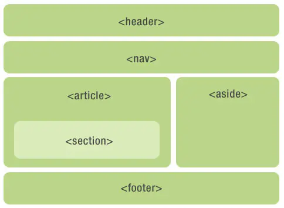
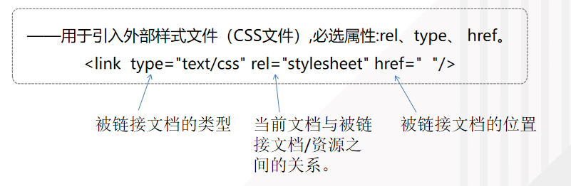

## 目录

<!-- TOC -->

- [目录](#%E7%9B%AE%E5%BD%95)
- [HTML5的新特性](#html5%E7%9A%84%E6%96%B0%E7%89%B9%E6%80%A7)
  - [语义化标签](#%E8%AF%AD%E4%B9%89%E5%8C%96%E6%A0%87%E7%AD%BE)
  - [增强型表单](#%E5%A2%9E%E5%BC%BA%E5%9E%8B%E8%A1%A8%E5%8D%95)
  - [新增video和audio标签](#%E6%96%B0%E5%A2%9Evideo%E5%92%8Caudio%E6%A0%87%E7%AD%BE)
  - [添加了canvas画布和svg，渲染矢量图片](#%E6%B7%BB%E5%8A%A0%E4%BA%86canvas%E7%94%BB%E5%B8%83%E5%92%8Csvg%E6%B8%B2%E6%9F%93%E7%9F%A2%E9%87%8F%E5%9B%BE%E7%89%87)
  - [地理定位](#%E5%9C%B0%E7%90%86%E5%AE%9A%E4%BD%8D)
  - [拖放API](#%E6%8B%96%E6%94%BEapi)
  - [Web Workers](#web-workers)
  - [Web 存储](#web-%E5%AD%98%E5%82%A8)
  - [应用程序缓存](#%E5%BA%94%E7%94%A8%E7%A8%8B%E5%BA%8F%E7%BC%93%E5%AD%98)
  - [服务器发送事件SSE](#%E6%9C%8D%E5%8A%A1%E5%99%A8%E5%8F%91%E9%80%81%E4%BA%8B%E4%BB%B6sse)
- [HTML文档结构](#html%E6%96%87%E6%A1%A3%E7%BB%93%E6%9E%84)
  - [文档类型声明](#%E6%96%87%E6%A1%A3%E7%B1%BB%E5%9E%8B%E5%A3%B0%E6%98%8E)
  - [html标签对](#html%E6%A0%87%E7%AD%BE%E5%AF%B9)
    - [head标签对](#head%E6%A0%87%E7%AD%BE%E5%AF%B9)
    - [body标签对](#body%E6%A0%87%E7%AD%BE%E5%AF%B9)
- [浏览器的标准模式和怪异模式](#%E6%B5%8F%E8%A7%88%E5%99%A8%E7%9A%84%E6%A0%87%E5%87%86%E6%A8%A1%E5%BC%8F%E5%92%8C%E6%80%AA%E5%BC%82%E6%A8%A1%E5%BC%8F)
  - [标准模式strict mode](#%E6%A0%87%E5%87%86%E6%A8%A1%E5%BC%8Fstrict-mode)
  - [怪异模式quirks mode](#%E6%80%AA%E5%BC%82%E6%A8%A1%E5%BC%8Fquirks-mode)
  - [标准模式和怪异模式的区别](#%E6%A0%87%E5%87%86%E6%A8%A1%E5%BC%8F%E5%92%8C%E6%80%AA%E5%BC%82%E6%A8%A1%E5%BC%8F%E7%9A%84%E5%8C%BA%E5%88%AB)
    - [width不同](#width%E4%B8%8D%E5%90%8C)
    - [内联元素的尺寸](#%E5%86%85%E8%81%94%E5%85%83%E7%B4%A0%E7%9A%84%E5%B0%BA%E5%AF%B8)
    - [块级元素水平居中](#%E5%9D%97%E7%BA%A7%E5%85%83%E7%B4%A0%E6%B0%B4%E5%B9%B3%E5%B1%85%E4%B8%AD)
    - [图片的padding](#%E5%9B%BE%E7%89%87%E7%9A%84padding)
    - [元素溢出的处理](#%E5%85%83%E7%B4%A0%E6%BA%A2%E5%87%BA%E7%9A%84%E5%A4%84%E7%90%86)
    - [元素的百分比高度](#%E5%85%83%E7%B4%A0%E7%9A%84%E7%99%BE%E5%88%86%E6%AF%94%E9%AB%98%E5%BA%A6)
- [响应式Web设计——Viewport](#%E5%93%8D%E5%BA%94%E5%BC%8Fweb%E8%AE%BE%E8%AE%A1viewport)
- [HTML5语义化标签及优点](#html5%E8%AF%AD%E4%B9%89%E5%8C%96%E6%A0%87%E7%AD%BE%E5%8F%8A%E4%BC%98%E7%82%B9)
  - [几个常用的](#%E5%87%A0%E4%B8%AA%E5%B8%B8%E7%94%A8%E7%9A%84)
  - [语义化标签的优点](#%E8%AF%AD%E4%B9%89%E5%8C%96%E6%A0%87%E7%AD%BE%E7%9A%84%E4%BC%98%E7%82%B9)

<!-- /TOC -->


## HTML5的新特性

>  HTML：Hyper Text Markup Language，超文本标记语言

### 语义化标签

`<header><article><footer><nav><aside><section>`



### 增强型表单

+ **新的 form 属性：**
  + autocomplete
    + form 域自动完成功能，值为`on`/`off`
+ novalidate
  
  + 提交表单时不应该验证 form 或 input 域，值为`true`
  
+ **新的 input 属性：**
  
  > input的type属性：（规定input元素的类型）
  >
  > > text
  > >
  > > button
  > >
  > > checkbox：多选按钮
  > >
  > > file：文件上传
  > >
  > > hidden：隐藏字段，对于用户不可见，一般会存储一个默认值，值可以由js进行修改，但是提交的时候会一起上传
  > >
  > > image：定义图片形式的提交按钮
  > >
  > > password
  > >
  > > radio：单选按钮
  > >
  > > reset：重置按钮，会清空表单中的所有数据
  > >
  > > submit：提交按钮用于向服务器发送表单数据，数据会发送到表单的`action`属性中指定的页面
  > >
  > > > HTML5新增的type类型：
  > > >
  > > > color：选择颜色，可以从拾色器中选取颜色
  > > >
  > > > 日期和时间选择器：date、month、week、time、datatime等等
  > > >
  > > > email：提交表单时，会自动地对email字段的值进行验证
  > > >
  > > > number：包含数字值的输入字段，可设置数字长度的限制
  > > >
  > > > range：某个范围的滑块
  > > >
  > > > search：用于搜索字段，外观和text一样
  > > >
  > > > tel：用于电话号码（感觉外观和text也一样？只是语义的差别吧）
  > > >
  > > > url：URL地址的输入字段，会在提交表单时对url字段的值自动进行验证（）
  > > >
  > > > + 一个完整的URL包括：协议部分、网址、文件地址部分
  > > >   + 协议部分：以//分隔符，有HTTP、FTP、File、HTTPS等协议，在地址栏输入网址时，协议部分不用输入的，浏览器会自动补上默认的HTTP协议
  > > >   + 网址：例如www.baidu.com、www.taobao.com等
  > > >     + 去掉www的前缀的部分叫域名
  > > >     + 域名的最右边的是顶级域名，常见的比如：.com表示商业机构，.org表示非盈利性组织，.gov表示政府机构，.edu表示教育及科研机构
  > > >     + 用来表示国际顶级域名的比如：.cn表示中国，.us表示美国，.jp表示日本。
  > > >   + 文件地址部分：
  > > >     + 从域名后第一个/到最后一个/为止，是虚拟目录部分，
  > > >     + 从最后一个/开始到?为止，是文件名
  
  + autocomplete
  
    + input域自动完成功能，值为`on`/`off`
  
  + autofocus
  
    + 自动地获得焦点，值为`autofocus`
  
  + form
  
    + form 属性规定输入域所属的一个或多个表单（就是只要input标签的这个属性的值为某个form的id值，那这个input标签就是绑定这个form表单的）
  
  + 表单重写属性： (formaction, formenctype, formmethod, formnovalidate, formtarget)
  
    + 适用`sumbit`和`image`类型的`input`标签
  
  + height 和 width
  
    + 只适用于image类型的input标签（就是用图片做按钮的那种）
  
  + list
  
    + list 属性规定输入域的 datalist。datalist 是输入域的选项列表。
  
      ```html
      Webpage: <input type="url" list="url_list" name="link" />
      <datalist id="url_list">
      <option label="W3Schools" value="http://www.w3school.com.cn" />
      <option label="Google" value="http://www.google.com" />
      <option label="Microsoft" value="http://www.microsoft.com" />
      </datalist>
      ```
  
  + min, max 和 step
    
    + 适用于以下类型的input标签：number、range
  + multiple
    + 规定输入域可选择多个值，适用于以下类型的标签：
    + file
  + pattern (regexp)
    
    + 用于验证input域的模式（正则表达式）
  + placeholder
  + required

### 新增video和audio标签

### 添加了canvas画布和svg，渲染矢量图片

+ **canvas：画线、画圆、渐变、添加图像到画布（通过js绘制2D图形）**
  + 依赖分辨率
  + 不支持事件处理器
  + 弱的文本渲染能力
  + 能够以 .png 或 .jpg 格式保存结果图像
  + 最适合图像密集型的游戏，其中的许多对象会被频繁重绘
+ **svg：可缩放矢量图形，使用XML格式定义图像**
  + 不依赖分辨率
  + 支持事件处理器
  + 最适合带有大型渲染区域的应用程序（比如谷歌地图）
  + 复杂度高会减慢渲染速度（任何过度使用 DOM 的应用都不快）
  + 不适合游戏应用

### 地理定位

​	navigator对象里面有geolocation对象，其中有getCurrentPosition方法，可以获取地理的定位

### 拖放API

拖（Drag）和放（drop），需要设置

+ 可拖动属性`draggable="true"`、
+ 拖放触发事件的属性`ondrop="drop(event)"`、`ondragstart="drag(event)"`、`ondragover="allowDrop(event)"`

### Web Workers

当在HTML页面中执行脚本时，页面的状态时不可响应的，直到脚本已完成

Web Worker是运行在后台的JavaScript，独立于其他脚本，不会影响页面的性能。

1. 检测web worker支持

   ```javascript
   if(typeof(Worker)!=="undefined")
     {
     // Yes! Web worker support!
     // Some code.....
     }
   else
     {
     // Sorry! No Web Worker support..
     }
   ```

   

2. 创建web worker文件

   创建计数脚本，该脚本存储于“demo_workers.js”文件中

   ```javascript
   var i=0;
   
   function timedCount()
   {
       i=i+1;
       postMessage(i);	//postMessage()可以向HTML页面传回一段消息
       setTimeout("timedCount()",500);
   }
   
   timedCount();
   ```

   

3. 如果web worker支持，创建新的web worker对象，然后运行第二步中创建的js文件的代码。向web worker的实例添加一个`onmessage`事件监听器

   ```javascript
   if(typeof(w)=="undefined")
   {
   	w=new Worker("demo_workers.js");
   	w.onmessage=function(event){
       	document.getElementById("result").innerHTML=event.data;
       };
   }
   ```

   当web worker传递消息时（`postMessage()`方法可向HTML页面传回一段消息），会执行事件监听器中的代码。event.data中存有来自event.data的数据

4. 终止web worker

   当我们创建 web worker 对象后，它会继续监听消息（即使在外部脚本完成之后）直到其被终止为止。

   如需终止 web worker，并释放浏览器/计算机资源，请使用 terminate() 方法

   ```javascript
   w.terminate();
   ```

   

### Web 存储

在客户端存储数据的新方法：

+ localStorage——没有时间限制的数据存储
+ sessionStorage——针对一个session的数据存储，当用户关闭浏览器窗口后，数据会被删除。


### 应用程序缓存

通过创建cache manifest文件，可以轻松创建web应用的离线版本。


### 服务器发送事件SSE

网页自动获取来自服务器的更新。

EventSource 对象用于接收服务器发送事件通知。

```javascript
var source=new EventSource("demo_sse.php");
source.onmessage=function(event)
{
  document.getElementById("result").innerHTML+=event.data + "<br />";
};
```

- 创建一个新的 EventSource 对象，然后规定发送更新的页面的 URL（本例中是 "demo_sse.php"）
- 每接收到一次更新，就会发生 onmessage 事件
- 当 onmessage 事件发生时，把已接收的数据推入 id 为 "result" 的元素中


## HTML文档结构

### 文档类型声明

> 用来说明该文档是html类型

+ HTML5：`<!DOCTYPE html>`
+ HTML4.01（了解）：`<!DOCTYPE HTML PUBLIC "-//W3C//DTD HTML 4.01 Transitional//EN" "http://www.w3.org/TR/html4/loose.dtd">`

### html标签对

> 标识文档的开始和结束，该标签有两个属性dir和lang

+ dir属性文档内容从左到右还是从右到左，可省略
+ lang是指明文档使用的内容，zh-CN、en

> > 中间的部分是文档的头部head和主题body

#### head标签对

1. title标签：定义网页的标题

2. meta标签：一般用于定义页面的特殊信息，例如页面的关键字 ，页面描述等

   + charset属性，值有：ASCII、GB2312、Unicode、UTF-8（常用）

     `<meta charset="UTF-8">`

   + name属性：把content属性关联到这个名词

   + http-equiv属性：把content属性关联到HTML头部

   + content属性：定义与http-equiv或name属性相关的元信息，和这两个属性的其中一个同时使用。

3. link标签：用于引入外部样式文件（CSS文件）

   + type属性：text/css，被链接文档的类型

   

4. style标签：用于定义元素的CSS样式

5. script标签：用于定义页面的JavaScript代码，或引入外部JavaScript文件

   + type属性：test/javascript
   + defer属性：值是defer，对脚本执行进行延迟，直到页面加载为止。**只有IE支持该属性**
   + src属性：引入外部脚本的路径
   + async属性：值是async，**仅适用于外部脚本**。（HTML5新增的）
     + 脚本相对于页面的其余部分异步地执行（当页面继续进行解析时，脚本将被执行）
     + 如果不使用 async 且 defer="defer"：脚本将在页面完成解析时执行
     + 如果既不使用 async 也不使用 defer：在浏览器继续解析页面之前，立即读取并执行脚本

#### body标签对

页面主体的内容，包括h1、h2、h3、p、img等等


## 浏览器的标准模式和怪异模式

### 标准模式strict mode

+ 标准模式（严格模式），浏览器按照W3C标准解析执行代码

### 怪异模式quirks mode

+ 怪异模式（混杂模式），使用浏览器自己的方式解析执行代码

### 标准模式和怪异模式的区别

#### width不同

+ 标准模式：width是内容content的宽度，而盒子的宽度是width+padding+border+margin
+ 怪异模式：width是content+padding+border的宽度，而盒子的宽度是width+margin

#### 内联元素的尺寸

+ 标准模式：给span等行内 元素设置width和height不生效
+ 怪异模式：给行内元素设置则会生效

#### 块级元素水平居中

+ 标准模式：`margin: 0 auto;`可以使元素水平居中
+ 怪异模式：t`ext-align: center`（这是标准模式对行内元素和行内块实现水平居中的方法）

#### 图片的padding

+ 标准模式：可以设置img的padding
+ 怪异模式：img的padding值失效

#### 元素溢出的处理

+ 标准模式：当内容溢出元素框时，overflow默认为visible，即内容不会被修剪，会呈现在元素框之外。
+ 怪异模式：溢出会被当做扩展box来对待，溢出不会裁减，元素框自动调整大小，能够包含溢出内容。（盒子自己变大）

#### 元素的百分比高度

+ 标准模式：
  1. 父不设置高度条件下，父随子变化，由子的内容决定高度（此时子元素高度设置百分比无效）
  2. 父设置了高度条件，子随父变化，继承父高度百分比（此时子元素高度设置百分比有效）
  3. 而对于宽度来说，**父元素设置为100%，即是默认为整个屏幕的宽度**，子元素再设置百分比，也是有效的！（百分比被正确使用）
+ 怪异模式：
  + 不管是宽度还是高度，父元素设置为100%，就默认为当前显示屏的宽度和高度，是有效的！（百分比被正确使用）


## 响应式Web设计——Viewport

> viewport是用户页面的可视区域

```html
<meta name="viewport" content="width=device-width, initial-scale=1.0">
```

+ width：控制viewport的大小，可以指定的一个值，如600，或者特殊的值，如device-width（设备的宽度）
+ height：和width相对应，device-height就是设备的高度
+ initial-scale：初始缩放比例，即是当页面第一次load的时候缩放比例
+ maximum-scale：允许用户缩放到的最大比例
+ minimum-scale：允许用户缩放到的最小比例
+ user-scalable：用户是否可以手动缩放（yes or no）


## HTML5语义化标签及优点

### 几个常用的

- < header >：网页头部，通常包括网站标志、主导航、全站链接以及搜索框。
- < footer >：网页尾部
- < nav >：标记导航，仅对文档中重要的链接群使用
- < main >：页面主要内容，一个页面只能使用一次。如果是web应用，则包围其主要功能
- < article >：定义外部的内容，其中的内容独立于文档的其余部分
- < section >：定义文档中的节（section、区段）
- < aside >：定义其所处内容之外的内容。如侧栏、文章的一组链接、广告、友情链接、相关产品列表等
- < address >：作者、相关人士或组织的联系信息（电子邮件地址、指向联系信息页的链接）

### 语义化标签的优点

+ HTML结构清晰
+ 代码可读性好
+ 无障碍阅读
+ 搜索引擎可根据标签的语言确定上下文和权重问题（SEO？）
+ 移动设备能更完美的展示页面
+ 便于团队维护开发


