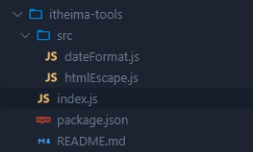

## 目录
<!-- TOC -->

- [目录](#%E7%9B%AE%E5%BD%95)
- [什么是Node.js](#%E4%BB%80%E4%B9%88%E6%98%AFnodejs)
- [Node.js可以做什么](#nodejs%E5%8F%AF%E4%BB%A5%E5%81%9A%E4%BB%80%E4%B9%88)
    - [终端快捷键](#%E7%BB%88%E7%AB%AF%E5%BF%AB%E6%8D%B7%E9%94%AE)
- [Node.js模块](#nodejs%E6%A8%A1%E5%9D%97)
    - [fs文件系统模块](#fs%E6%96%87%E4%BB%B6%E7%B3%BB%E7%BB%9F%E6%A8%A1%E5%9D%97)
    - [path路径模块](#path%E8%B7%AF%E5%BE%84%E6%A8%A1%E5%9D%97)
    - [http模块](#http%E6%A8%A1%E5%9D%97)
        - [创建web服务器的基本步骤](#%E5%88%9B%E5%BB%BAweb%E6%9C%8D%E5%8A%A1%E5%99%A8%E7%9A%84%E5%9F%BA%E6%9C%AC%E6%AD%A5%E9%AA%A4)
- [Node.js中的模块化](#nodejs%E4%B8%AD%E7%9A%84%E6%A8%A1%E5%9D%97%E5%8C%96)
    - [模块的三大分类](#%E6%A8%A1%E5%9D%97%E7%9A%84%E4%B8%89%E5%A4%A7%E5%88%86%E7%B1%BB)
    - [require方法](#require%E6%96%B9%E6%B3%95)
    - [module对象](#module%E5%AF%B9%E8%B1%A1)
    - [module.exports对象和exports对象](#moduleexports%E5%AF%B9%E8%B1%A1%E5%92%8Cexports%E5%AF%B9%E8%B1%A1)
    - [CommonJS模块化规范](#commonjs%E6%A8%A1%E5%9D%97%E5%8C%96%E8%A7%84%E8%8C%83)
- [NPM与包](#npm%E4%B8%8E%E5%8C%85)
    - [package.json](#packagejson)
    - [devDependencies节点](#devdependencies%E8%8A%82%E7%82%B9)
    - [nrm](#nrm)
    - [包的分类](#%E5%8C%85%E7%9A%84%E5%88%86%E7%B1%BB)
    - [开发属于自己的包](#%E5%BC%80%E5%8F%91%E5%B1%9E%E4%BA%8E%E8%87%AA%E5%B7%B1%E7%9A%84%E5%8C%85)
- [模块的加载机制](#%E6%A8%A1%E5%9D%97%E7%9A%84%E5%8A%A0%E8%BD%BD%E6%9C%BA%E5%88%B6)
    - [优先从缓存中加载](#%E4%BC%98%E5%85%88%E4%BB%8E%E7%BC%93%E5%AD%98%E4%B8%AD%E5%8A%A0%E8%BD%BD)
    - [内置模块的加载机制](#%E5%86%85%E7%BD%AE%E6%A8%A1%E5%9D%97%E7%9A%84%E5%8A%A0%E8%BD%BD%E6%9C%BA%E5%88%B6)
    - [自定义模块的加载机制](#%E8%87%AA%E5%AE%9A%E4%B9%89%E6%A8%A1%E5%9D%97%E7%9A%84%E5%8A%A0%E8%BD%BD%E6%9C%BA%E5%88%B6)
    - [第三方模块的加载机制](#%E7%AC%AC%E4%B8%89%E6%96%B9%E6%A8%A1%E5%9D%97%E7%9A%84%E5%8A%A0%E8%BD%BD%E6%9C%BA%E5%88%B6)
    - [目录作为模块](#%E7%9B%AE%E5%BD%95%E4%BD%9C%E4%B8%BA%E6%A8%A1%E5%9D%97)
- [什么是Express](#%E4%BB%80%E4%B9%88%E6%98%AFexpress)
- [Express可以做什么](#express%E5%8F%AF%E4%BB%A5%E5%81%9A%E4%BB%80%E4%B9%88)
- [使用Express](#%E4%BD%BF%E7%94%A8express)
    - [创建基本的web服务器](#%E5%88%9B%E5%BB%BA%E5%9F%BA%E6%9C%AC%E7%9A%84web%E6%9C%8D%E5%8A%A1%E5%99%A8)
    - [监听GET请求](#%E7%9B%91%E5%90%ACget%E8%AF%B7%E6%B1%82)
    - [获取路由地址参数](#%E8%8E%B7%E5%8F%96%E8%B7%AF%E7%94%B1%E5%9C%B0%E5%9D%80%E5%8F%82%E6%95%B0)
    - [托管静态服务资源](#%E6%89%98%E7%AE%A1%E9%9D%99%E6%80%81%E6%9C%8D%E5%8A%A1%E8%B5%84%E6%BA%90)
- [Epress 路由](#epress-%E8%B7%AF%E7%94%B1)
    - [模块化路由](#%E6%A8%A1%E5%9D%97%E5%8C%96%E8%B7%AF%E7%94%B1)
- [Express中间件](#express%E4%B8%AD%E9%97%B4%E4%BB%B6)
    - [中间件的格式](#%E4%B8%AD%E9%97%B4%E4%BB%B6%E7%9A%84%E6%A0%BC%E5%BC%8F)
        - [next函数数](#next%E5%87%BD%E6%95%B0%E6%95%B0)
    - [中间件的作用](#%E4%B8%AD%E9%97%B4%E4%BB%B6%E7%9A%84%E4%BD%9C%E7%94%A8)
    - [全局和局部中间件](#%E5%85%A8%E5%B1%80%E5%92%8C%E5%B1%80%E9%83%A8%E4%B8%AD%E9%97%B4%E4%BB%B6)
        - [全局中间件](#%E5%85%A8%E5%B1%80%E4%B8%AD%E9%97%B4%E4%BB%B6)
        - [局部中间件](#%E5%B1%80%E9%83%A8%E4%B8%AD%E9%97%B4%E4%BB%B6)
    - [中间件的分类](#%E4%B8%AD%E9%97%B4%E4%BB%B6%E7%9A%84%E5%88%86%E7%B1%BB)
        - [应用级别的中间件](#%E5%BA%94%E7%94%A8%E7%BA%A7%E5%88%AB%E7%9A%84%E4%B8%AD%E9%97%B4%E4%BB%B6)
        - [路由级别的中间件](#%E8%B7%AF%E7%94%B1%E7%BA%A7%E5%88%AB%E7%9A%84%E4%B8%AD%E9%97%B4%E4%BB%B6)
        - [错误级别的中间件](#%E9%94%99%E8%AF%AF%E7%BA%A7%E5%88%AB%E7%9A%84%E4%B8%AD%E9%97%B4%E4%BB%B6)
        - [Express内置的中间件](#express%E5%86%85%E7%BD%AE%E7%9A%84%E4%B8%AD%E9%97%B4%E4%BB%B6)
        - [第三方的中间件](#%E7%AC%AC%E4%B8%89%E6%96%B9%E7%9A%84%E4%B8%AD%E9%97%B4%E4%BB%B6)
- [基于Express写接口](#%E5%9F%BA%E4%BA%8Eexpress%E5%86%99%E6%8E%A5%E5%8F%A3)
    - [创建API路由模块](#%E5%88%9B%E5%BB%BAapi%E8%B7%AF%E7%94%B1%E6%A8%A1%E5%9D%97)
    - [编写GET接口](#%E7%BC%96%E5%86%99get%E6%8E%A5%E5%8F%A3)
    - [编写POST接口](#%E7%BC%96%E5%86%99post%E6%8E%A5%E5%8F%A3)

<!-- /TOC -->


## 什么是Node.js

> Node.js是一个基于Chrome V8引擎的JavaScript运行环境

​		简单的来说就是一个运行环境，（就像js可以在浏览器中的V8引擎解析运行，这是前端的运行环境。）在该运行环境中，js就可以做后端开发。


## Node.js可以做什么

1. 基于Express框架（http://www.expressjs.com.cn/），可以快速构建Web应用
2. 基于Electron框架（https://electronjs.org/），可以构建跨平台的桌面应用
3. 基于restrify框架（http://restify.com/），可以快速构建API接口项目
4. 读写和操作数据库、创建实用的命令行工具辅助前端开发、etc


### 终端快捷键

1. 使用↑键，可以快速定位到上一次执行的命令
2. 使用tab键，能够快速补全路径
3. 使用esc键，能够快速清空当前已输入的命令


## Node.js模块

### fs文件系统模块

> fs模块是Node.js官方提供的、用来操作文件的模块

+ `fs.readFile(path[, options], callback)`

  + 参数1：必选参数，string，表示文件的路径

  + 参数2：可选参数，表示以什么编码格式来读取文件

  + 参数3：必选参数，文件读取完成后（不管成功还是失败），通过回调函数拿到读取的结果

    ```js
    const fs = require('fs');
    
    fs.readFile('文件路径','utf8',(err, dataStr) => {
    	console.log(err); // 如果读取错误，err的值为错误对象，否则为null
    	console.log(dataStr); //如果读取成功，dataStr为文件的内容，否则为undefined
    });
    ```

  + 判断文件是否读取成功

    ```js
    const fs = require('fs');
    
    fs.readFile('文件路径','utf8',(err, result) => {
    	if (err) {
    		return console.log('文件读取失败！' + err.message);
    	}
    	
    	console.log('文件读取成功！内容是：' + result);
    });
    ```

+ `fs.writeFile(file, data[, options], callback)`

+ __dirname
  
  + `__dirname`表示当前文件所处的目录，代替文件路径的相对路径和绝对路径，移植性高


### path路径模块

> path模块是Node.js官方提供的、用来处理路径的模块。

+ `path.join([...paths])`
  + ...paths <string> 路径片段的序列（多个字符串逗号分隔）
  + 返回值：<string>
  + 注意：涉及到路径拼接的操作，**都要使用path.join()方法进行处理**，不要直接使用+进行字符串的拼接
+ `path.basename([path[, ext]])`
  + path <string> 必选参数，表示一个路径的字符串
  + ext <string> 可选参数，表示文件扩展名
  + 返回：<string> 表示路径中的最后一部分（如果写了ext参数则只返回文件名字，不带扩展名）
+ `path.extname(path)`
  + 返回路径最后一部分的扩展名（包括.）


### http模块

> http模块是Node.js官方提供的，用来创建web服务器的模块。通过http模块提供的`http.createServer()`方法，就能方便的把一台普通的电脑，变成一台Web服务器，从而对外提供Web资源服务。

#### 创建web服务器的基本步骤

1. 导入http模块

   `const http = require('http');`

2. 创建web服务器实例

   `const server = http.createServer();`

3. 为服务器实例**绑定request**事件

   ```js
   // 参数一：绑定的request事件 参数二：客户端向服务器发起请求时调用的函数
   server.on('request', (req, res) => {
       console.log('Someone visit our web server.');
   });
   ```

   + req 是请求对象，它包含了与客户端相关的数据和属性。例如：
     + req.url 是客户端请求的 URL 地址
     + req.method 是客户端的 method 请求类型
   + res 是响应对象，它包含了与服务器相关的数据和属性，例如：
     + `res.end(str)` 是向客户端发送指定的内容，并结束这次请求的处理过程
     + `res.setHeader('Content-Type', 'text/html; charest=utf-8')` 设置Content-Type，解决中文乱码问题

4. 监听客户端的请求，写好web服务的端口号和启动服务器的函数

   ```js
   // 参数一：端口号 参数二：启动服务器时调用的函数
   server.listen('8080', () => {
       console.log('serve running at http://127.0.0.1:8080');
   });
   ```


## Node.js中的模块化

### 模块的三大分类

1. 内置模块
2. 用户自定义模块（js文件，需要写路径）
3. 第三方模块

### `require`方法

使用`require()`方法，可以加载需要的内置模块、用户自定义模块、第三方模块进行使用。

**注意**：使用`require()`方法加载其他模块时，会执行被加载模块中的代码

### `module`对象

>  在每个.js自定义模块中都有一个module对象，它里面存储了和当前模块有关的信息

### `module.exports`对象和`exports`对象

> 可以将模块内的成员共享出去，供外界使用

+ 默认为空对象
+ 使用`require`导入一个自定义模块的时候，得到的值就是`module.exports`
+ 默认情况下，`exports`和`module.exports`指向同一个对象，最终共享的结果，以`module.exports`为准

### CommonJS模块化规范

> CommonJS规定了模块的特性和各模块之间如何相互依赖

CommonJS规定：

1. 每个模块内部，module变量代表当前模块
2. module变量是一个对象，它的exports属性是对外的接口。
3. 加载某个模块，其实是加载该模块的module.exports属性。require()方法用于加载模块。


## NPM与包

> 包是基于内置模块封装出来的第三方模块

[npm包官方网站](www.npmjs.com)：可查找所有第三方包的文档

+ node_modules文件夹：存放所有已安装到项目中的包。require()导入第三方包时，就是从这个目录中查找并加载包。
+ package-lock.json配置文件：记录node_modules目录下的每一个包的下载信息，例如包的名字、版本号、下载地址等。


### package.json

因为第三方包的体积过大，不方便团队成员之间共享项目源代码，所以共享时需要剔除node_modules。

在项目根目录中，创建一个叫做package.json的配置文件，即可用来记录项目中安装了哪些包。

> 注意：在今后的项目开发中，一定要把node_modules文件夹，添加到.gitignore忽略文件中


+ 快速创建package.json：`npm init -y`
  + 上述命令只能在英文的目录下成功运行（不要使用中文，不能出现空格）
  + 创建package.json后，以后执行：npm install 包，npm包管理工具会自动把包的名称和版本号，记录到package.json中。
+ 执行`npm i`时
  + npm包管理工具会先读取package.json中的 dependencies 节点，读取到记录的所有依赖包和版本号之后，npm包管理工具会把这些包一次性下载到项目中

### devDependencies节点

>  如果某些包只在项目开发阶段会用到，在项目上线之后不会用到，则建议把这些包记录到devDependencies节点中。
>
> 与之相应的，如果某些包在开发和项目上线之后都需要用到，则建议把这些包记录到dependencies节点中。

+ 把包记录到devDependencies节点：`npm i 包名 -D`


### nrm

为了更方便的切换下包的镜像源，可以安装nrm小工具，利用nrm提供的终端命令，可以快速查看和切换下包的镜像源。

1. 通过npm包管理器，将nrm安装为全局可用的工具

   `npm i nrm -g`

2. 查看所有可用的镜像源

   `nrm ls`

3. 将下包的镜像源切换为taobao镜像

   `nrm use taobao`


### 包的分类

+ 项目包
  + 开发依赖包：devDependencies
  + 核心依赖包：dependencies
+ 全局包
  + 只有工具性质的包，才有全局安装的必要性，因为它们提供了好用的终端命令。
  + 全局包被安装到D:\nodejs\node_global\node_modules（我的电脑，这个不用管，装包的时候终端会告诉你的）


有哪些全局包呢：

1. nrm：管理镜像的小工具
2. i5ting_toc：把md文档转为html页面的小工具


### 开发属于自己的包

包的目录：

 

把根据不同的功能进行模块化，用js文件存放并放在src目录下，并用`module.exports`向外暴露成员，在index中引入暴露的模块

```js
//index.js包的入口文件

const date = require('./src/dataFormat');
const escape = require('./src/htmlEscape');

//用展开符展开所有属性，向外暴露需要的成员
module.exports = {
	...date,
	...escape
}
```

## 模块的加载机制

一张图：


### 优先从缓存中加载

+ 模块在第一次加载后会被缓存，这也意味着多次调用`require()`不会导致模块的代码被执行多次。从而提高模块的加载效率。

### 内置模块的加载机制

+ 内置模块的加载优先级最高

### 自定义模块的加载机制

+ 使用require()加载自定义模块时，必须指定以./或../开头的路径标识符。在加载自定义模块时，如果没有指定./或../这样的路径标识符，则node会把它当作内置模块或第三方模块进行加载
+ 同时，在require自定义模块时，如果省略了文件的扩展名，则Node.js会按顺序分别尝试加载以下的文件：
  + 按照确切的文件名进行加载（因为有可能有没有扩展名的文件）
  + 补全.js扩展名进行加载
  + 补全.json扩展名进行加载
  + 补全.node扩展名进行加载
  + 加载失败，终端报错

### 第三方模块的加载机制

+ 如果传递给require()的模块标识符不是一个内置模块，也没有以./或者../开头，则Node.js会从当前模块的父目录开始，尝试从/node_modules文件夹中加载第三方模块
+ 如果没有找到对应的第三方模块，则移动再上一层父目录中进行加载，直到文件系统的根目录。

### 目录作为模块

+ 当把目录作为模块标识符，传递给require()进行加载的时候，有三种加载方式：
  1. 在被加载的目录下查找一个叫做package.json的文件，并寻找main属性，作为require()加载的入口
  2. 如果目录里咩有package.json文件，或者main入口不存在或者无法解析，则Node.js将会试图加载目录下的index.js文件
  3. 如果以上两步都失败了，则Node.js会在终端打印错误消息，报告模块的缺失：Error: Cannot find module 'xxx'


## 什么是Express

> Express是基于Node.js平台，快速、开放、极简的Web开发框架

+ 本质：就是一个npm的第三方包，提供了快速创建Web服务器的便捷方法


## Express可以做什么

对于前端程序员来说，最常见的两种服务器，分别是：

+ Web网站服务器：专门对外提供Web网页资源的服务器
+ API接口服务器：专门对外提供API接口的服务器

使用Express，我们可以方便、快速的创建Web网站的服务器或者API接口的服务器


## 使用Express

### 创建基本的web服务器

首先安装第三方包：npm i express

```js
const express = require('express');

const app = express();

app.listen(80, ()=>{
	console.log('express serve running at http://127.0.0.1');
})
```


### 监听GET请求

用send方法给客户端发送内容

```js
app.get('客户端请求的URL地址',(req,res)=>{
	// 用send方法向客户端发送JSON对象
	res.send({name: 'zs', age: 20});
})
```


### 获取路由地址参数

+ req.query，可以访问到客户端通过查询字符串的形式（比如`?name=zs&age=20`），发送到服务器的参数
  + `req.query`默认是一个空对象

  + 客户端通过查询字符串的形式（比如`?name=zs&age=20`），发送到服务器的参数，可以通过`req.query.name`访问到（它会自动解析到`req.query`这个对象中）

  + ```js
    app.get('/csdn',function(req,res){
        var name=req.query.name;
        res.send(name)
    });
    
    127.0.0.1:3000/csdn?name=参数   //var name=req.query.name; 所以name就是=后的参数
    ```

+ req.params，可以获取到比较优雅的路由地址参数

  + 可以有多个动态参数

  + ```js
    app.get('/csdn/:id',function(req,res){
        var id=req.params.id;
        res.send(id)
    });
    
    127.0.0.1:3000/csdn/参数   //var id=req.params.id; 所以'参数'就是传递给:id，所以id就是'参数'
    ```


### 托管静态服务资源

`express.static()`可以方便地创建一个静态资源服务器，例如：

```js
app.use(express.static('public'));
```

这样，就可以访问public目录中的所有文件了：

http://localhost:3000/images/bg.jpg

http://localhost:3000/css/style.css

http://localhost:3000/index.html

+ 可以创建多个，但是如果访问index.html这种多个文件夹都有同样文件的情况下，他会按顺序查找到第一个先并加载。

**注意**：Express在指定的静态目录中查找文件，并对外提供资源的访问路径。因此，存放静态文件的目录名（public）是不会出现在URL中。

+ 挂载路径前缀：**（我试了不行！！！）**

  ```js
  app.use('public', express.static('public'));
  ```

  这样，就可以访问public目录中的所有文件了：

  http://localhost:3000/public/images/bg.jpg

  http://localhost:3000/public/css/style.css

  http://localhost:3000/public/index.html


## Epress 路由

> 在Express中，路由指的是客户端的请求与服务器处理函数之间的映射关系

Express中的路由分三部分组成，分别是请求的类型、请求的URL地址、处理函数，格式如下：

```js
app.get('/', (req, res) => {
	//...处理并响应这次请求
})

app.post('/', (req, res) => {
	//...处理并响应这次请求
})
```

给一个完整的具体例子：

```js
const express = require('express');
const app = express();

//挂载路由
app.get('/',(req, res)=>{
	res.send('hellow word');
});
app.post('/',(req, res)=>{
	res.send('Hellow World');
});

app.listen(80, ()=>{
	console.log('http://127.0.0.1:80');
})
```


### 模块化路由

> 为了方便对路由进行模块化管理，Express不建议将路由直接挂载到app上，而是推荐将路由抽离为单独的模块。

1. 创建路由模块对应的js文件
2. 调用express.Router()函数创建路由对象
3. 向路由对象上挂载具体的路由
4. 使用module.exports向外共享路由对象
5. 使用app.use()函数注册路由模块

```js
// router.js
const express = require('express');
const router = express.Router();

router.get('/user/list', (req, res) => {
    res.send('Get user list.');
});

router.post('/user/add', (req, res) => {
    res.send('Add new user');
});

module.exports = router;
```

```js
// app.js
const express = require('express');
const app = express();

// 1. 导入路由模块
const router = require('./router');
// 2. 使用app.use() 注册路由模块
app.use(router);

app.listen(80, () => {
    console.log('http://127.0.0.1');
});
```


## Express中间件

> 当一个请求到达Express的服务器之后，可以连续调用多个中间件，从而对请求进行预处理。

### 中间件的格式

```js
var express = require('express');
var app = express();

app.get('/', function(req, res, next) => {
        next();
});

app.listen(3000);
```

中间件函数的形参列表中，**必须包含next参数**，而路由处理函数中只包含req和res。

#### next函数数

> next函数是实现多个中间件连续调用的关键，它表示把流转关系转交给下一个中间件或路由。


### 中间件的作用

> 多个中间件之间，共享同一份req和res，基于这样的特性，我们可以在上游的中间件中，统一为req或res对象添加自定义的属性和方法，供下游的中间件或路由进行使用。


### 全局和局部中间件

#### 全局中间件

```js
const express = require('express');
const app = express();

app.use((req, res, next) => {
    console.log('这是一个全局中间件');
    next();
})

// 1. 导入路由模块
const router = require('./router');
// 2. 使用app.use() 注册路由模块
app.use(router);


app.listen(80, () => {
    console.log('http://127.0.0.1');
});
```

**注意：一定要在路由之前注册中间件**，他们是按顺序调用的

#### 局部中间件

+ 一个局部中间件

```js
const mw1 = (req, res, next) => {
    console.log('调用了局部中间件');
    next();
}

router.get('/user/list', mw1, (req, res) => {
    console.log('打开list了');
    res.send('Get user list.');
});
```

+ 多个局部中间件

```js
const mw1 = (req, res, next) => {
    console.log('调用了局部中间件1');
    next();
}
const mw2 = (req, res, next) => {
    console.log('调用了局部中间件2');
    next();
}

//也可以写成[mw1, mw2]一个数组作为第二个参数
router.get('/user/list', mw1, mw2, (req, res) => {
    console.log('打开list了');
    res.send('Get user list.');
});
```

**注意：一定要在路由之前注册中间件**，他们是按顺序调用的


### 中间件的分类

#### 应用级别的中间件

通过`app.use()`、`app.get()`或`app.post()`，**绑定到app实例上**的中间件，叫做应用级别的中间件。

#### 路由级别的中间件

**绑定到`express.Router()`实例**上的中间件，叫做路由级别的中间件，用法和应用级别的中间件没有任何区别

#### 错误级别的中间件

> 专门用来捕获整个项目中发生的异常错误，从而防止项目异常崩溃的问题。

+ 格式：错误级别中间件的function处理函数中，必须有4个形参，形参顺序从前到后，分别是(err, req, res, next)。

```js
app.get('/', (req, res) => {
	throw new Error('服务器内部发生了错误！');		// throw：抛出。抛出一个自定义错误
	res.send('Home Page.');		// 遇到错误后不会再往下执行，也就是不会执行这里
})

app.use((err, req, res, next) => {
	console.log('发生了错误' + err.message);		//在服务器打印错误消息
	res.send('Error!' + err.message);			//向客户端响应错误相关的内容
})
```

注意：错误级别的中间件，**必须注册在所有路由之后！**这样路由遇到错误的之后才能在后面找到错误级别的中间件。

#### Express内置的中间件

1. express.static：快速托管静态资源的内置中间件，例如：HTML文件、图片、CSS样式等（无兼容性）

2. express.json：解析JSON格式的请求体数据（有兼容性，仅在4.16.0+ 版本中可用）

   + 在服务器，可以使用req.body这个属性，来接收客户端发送过来的请求体数据。
   + 默认情况下，如果不配置解析表单数据的中间件，则req.body默认等于undefined
   + **通过express.json()这个中间件，解析表单中的JSON格式的数据**

   ```js
   // 除了错误级别的中间件，其他的中间件，必须在路由之前进行配置
   app.use(express.json());
   
   app.post('/user', (req, res) => {
   	console.log(req.body);
       res.send('ok');
   })
   ```

3. express.unlencoded：解析URL-encoded格式的请求体数据（有兼容性，仅在4.16.0+ 版本中可用）

   > 先知道有这样一个中间件，有空去看看

#### 第三方的中间件

> 和npm包类似


## 基于Express写接口

### 创建API路由模块

+ apiRouter.js

```js
const express = require('express');
const router = express.Router();

// 在这里写挂载路由，包括路由中间件啥的
// router.get('/', (req, res)=>{
//	  blabla....
// });

module.exports = router
```

+ app.js 

```js
const express = require('express');
const app = express();

const router = require('./apiRouter');
app.use('/api',router);		// 第一个参数 /api 表明访问路由的时候要在前面加 /api 前缀

app.listen('80', () => {
	console.log('express server running at http://127.0.0.1');
})
```

### 编写GET接口

+ apiRouter.js

```js
const express = require('express');
const router = express.Router();

// 在这里写挂载路由，包括路由中间件啥的
router.get('/get', (req, res) => {
	const query = req.query;//客户端的查询字符串
	res.send({
		status: 0,
		msg: 'GET请求成功',
		data: query
	})
})

module.exports = router;
```

+ app.js不变

### 编写POST接口

+ apiRouter.js

```js
const express = require('express');
const router = express.Router();

// 在这里写挂载路由，包括路由中间件啥的
router.get('/get', (req, res) => {
//	获取客户端通过查询字符串发送到服务器的数据
	const query = req.query;//客户端的查询字符串
	res.send({
		status: 0,
		msg: 'GET请求成功',
		data: query
	})
})
router.post('/post', (req, res) => {
//	获取客户端通过请求体发送到服务器的 URL-encoded 数据
	const body = req.body;
	res.send({
		status: 0,
		msg:'POST请求成功！',
		data: body
	})
})


module.exports = router;
```

+ app.js（配置中间件 `app.use(express.urlencoded({ extended: false })`）

```js
const express = require('express');
const app = express();

app.use(express.urlencoded({ extended: false }));

const router = require('./apiRouter');
app.use('/api',router);		// 第一个参数 /api 表明访问路由的时候要在前面加 /api 前缀

app.listen('80', () => {
	console.log('express server running at http://127.0.0.1');
})
```


