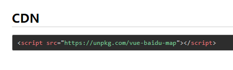

## 目录

<!-- TOC -->

- [目录](#%E7%9B%AE%E5%BD%95)
- [学习总计划](#%E5%AD%A6%E4%B9%A0%E6%80%BB%E8%AE%A1%E5%88%92)
- [目前进度](#%E7%9B%AE%E5%89%8D%E8%BF%9B%E5%BA%A6)
- [面试笔试遇到的问题（快速解决并熟背）](#%E9%9D%A2%E8%AF%95%E7%AC%94%E8%AF%95%E9%81%87%E5%88%B0%E7%9A%84%E9%97%AE%E9%A2%98%E5%BF%AB%E9%80%9F%E8%A7%A3%E5%86%B3%E5%B9%B6%E7%86%9F%E8%83%8C)
- [面试常见问题：](#%E9%9D%A2%E8%AF%95%E5%B8%B8%E8%A7%81%E9%97%AE%E9%A2%98)
    - [你是怎么学习前端的](#%E4%BD%A0%E6%98%AF%E6%80%8E%E4%B9%88%E5%AD%A6%E4%B9%A0%E5%89%8D%E7%AB%AF%E7%9A%84)
    - [印象最深刻的项目](#%E5%8D%B0%E8%B1%A1%E6%9C%80%E6%B7%B1%E5%88%BB%E7%9A%84%E9%A1%B9%E7%9B%AE)
        - [该项目是干什么的](#%E8%AF%A5%E9%A1%B9%E7%9B%AE%E6%98%AF%E5%B9%B2%E4%BB%80%E4%B9%88%E7%9A%84)
        - [该项目中做的难点](#%E8%AF%A5%E9%A1%B9%E7%9B%AE%E4%B8%AD%E5%81%9A%E7%9A%84%E9%9A%BE%E7%82%B9)
        - [使用到的技术点](#%E4%BD%BF%E7%94%A8%E5%88%B0%E7%9A%84%E6%8A%80%E6%9C%AF%E7%82%B9)
        - [性能优化](#%E6%80%A7%E8%83%BD%E4%BC%98%E5%8C%96)

<!-- /TOC -->


## 学习总计划

1. 系统学习时间：6h
3. 刷leetcode算法一题到两题：2h


## 目前进度

+ [HTML5](./HTML5.md) 
  + 进度：70%
  + canvas需要关注
  + 多看看HTML5的考点
+ [CSS3](./CSS3.md)
  + 进度：50%
  + CSS非常重要，特别是布局！按照思维导图一个个攻破！
+ [JavaScript](.\JavaScript.md)
  + 进度：40%
  + Ajax列入JavaScript中学习
  + 正则表达式列入其中
+ [ES6](./ES6.md) 
  + 进度：20%
  + 主要面试要问的那几样，理解的基础上背熟
+ [Node.js](./Nodejs.md)
  + 进度：100%
    + 只是基础学习是100%，需要刷
    + 一些面试题看看
  + 对于node.js后台的理解：
    1. 静态资源就类似是放前端页面的东西，开启静态资源，就类似于路由一样（如果路由和静态资源同时都有`index.html`，哪个在前面就先返回哪个给客户端），客户端访问某个页面时，就在托管的静态资源中查找并返回给客户端并渲染显示等等blabla
    2. node.js的router.js路由文件一般都是处理接口请求，和前端的页面交互
+ [Vue](./Vue.md) 
  + 进度：5%
+ [git和github](./git.md)
  + git——本地仓库的git常用操作（熟练）
  + github——远程库的提交拉取合并等（了解）
    + 这个有被问到过，需要学
+ [计算机网络](./计算机网络.md)
  + 进度：80%
  + `http`：看完一遍《图解http了》
  + 计网主要熟悉应用层的HTTP请求和传输层的TCP握手机制这两层
  + 其中**HTTP最重要** 
+ [浏览器](./浏览器.md)
  + 进度：50%
  + 一个非常重要的点：前端跨域的解决方法
  + [从输入URL到页面加载的过程？如何由一道题完善自己的前端知识体系！](https://segmentfault.com/a/1190000013662126) 
    + 浏览器的多进程和内核的多线程
+ [数据结构与算法](./数据结构与算法.md)
  + 进度：5%
    + 只是简单了解了一下各种内排序


## 面试笔试遇到的问题（快速解决并熟背）

- [x] flex弹性布局的使用

- [ ] table布局

- [ ] git操作，包括如何撤销git提交，git新建一个分支，处理冲突后的git操作

- [ ] 快速排序的原理及代码实现 

  https://blog.csdn.net/weixin_40836227/article/details/100047555  

  http://www.ruanyifeng.com/blog/2011/04/quicksort_in_javascript.html

- [ ] 跨域Ajax（和xhr有关）函数的封装

- [x] bfc是啥？

- [x] vue的watch怎么监听对象的某个属性

- [x] MVVM

- [ ] **js实现多继承**

- [ ] CSS多列等高

- [ ] Vue-router

- [ ] proxy

- [ ] vue3.0的新特性

- [x] vue常见指令

- [x] vue生命周期（除了要讲的出来还要讲讲每个周期的特点，我觉得我记住了） https://segmentfault.com/a/1190000011381906 

- [ ] vuex https://segmentfault.com/a/1190000019077663 

- [x] 元素设置为透明的几种方法

- [ ] Promise.all手写实现代码

- [x] 立即执行函数和闭包

- [x] rem、px、em的区别

- [x] HTML5几个语义化的标签及优点

- [ ] box-sizing有哪些值？区别是什么？

- [ ] CSS3动画animation和transition的区别？

- [x] get和post请求的区别

- [ ] CORS

- [ ] 简述HTTP控制访问CORS的理解

- [x] 节流和防抖的代码

- [ ] WebSocket

- [x] 数组去重的方法记个五种或以上

- [ ] MVC，MVP 和 MVVM的区别


## 面试常见问题：

### 你是怎么学习前端的

一开始是通过网上的一些视频和文章入门，后来发现他们讲的东西只是一个入门而已。
于是就买了前端的各种书籍来看，同时也会留意各种博文和公众号，留意前端方面的一些变化。
遇到不懂的或者是新的知识，就会列入清单去学习，通过MDN或者书籍去查找资料，努力去理解这块知识等等。
同时也慢慢的形成一块知识网，努力把自己所学的东西就能联系起来。但现在学的还不够，这块知识网也是很多缺漏什么的。


### 印象最深刻的项目

#### 该项目是干什么的

我们负责的项目是我家云SaaS系统。
主要是为企业搭建信息化所需要的所有网络基础设施及软件、硬件运作平台，并负责所有前期的实施、后期的维护等一系列服务。
我们将应用软件统一部署在自己的服务器上，企业可以根据实际需求购买所需的应用软件服务，并在服务时间内根据客户的需求提供云解决方案。

> 如果不问具体就不往下说了：
>
> 其中包括了物业web端、管家app端、我家app端，分别使用的对象有整个企业、企业下的各物业、物业下的商户

#### 该项目中做的难点

实习过程中，突然有一个任务要求，显示企业下的物业楼栋位置，而当时我是没有接触过地图的，而且要求一周上线。

当时找到了vue-baidu-map这个基于vue2.x的百度地图组件，在问过导师该组件安全性的情况下我是使用了这个组件去开发的。它也提供了文档，根据文档确定能满足业务需求后就决定使用这个组件，并结合百度地图的API文档进行开发。

其中印象比较深刻的是有个需求要根据所有楼栋的位置去自动适配地图的缩放大小等级，我当时的想法是去计算上下左右最边缘的经纬度再去计算合适的地图缩放等级，后来发现百度地图有提供相关的API了，就利用了这个API（`getViewport`）去做适配

任务开发完成之后我觉得其实开发难度不是很大，我觉得难在如何短时间内去开发完成自己没接触过的东西。


#### 使用到的技术点


#### 性能优化

1. 引入 CDN 资源，减少服务器带宽压力

   

2. 按需加载第三方资源，如element-ui和vue-baidu-map的部分组件

   ```js
   import {BaiduMap,BmInfoWindow} from 'vue-baidu-map';
   export default {
       components:{
           BaiduMap,
           BmInfoWindow
       }
   }
   ```

   ```js
   import { Button, Select } from 'element-ui';
   Vue.use(Button);
   Vue.use(Select);
   ```

3. 按需加载js文件（动态加载一个js文件，在加载成功之后执行回调）

   具体代码实现在 [JavaScript.md](JavaScript.md) 中有

   > + 以下的点都是自己没接触的，但是是项目中的性能优化（高性能的原因）
   >
   >  [解决vue首屏加载慢，白屏的问题](https://blog.csdn.net/wang729506596/article/details/82874330?utm_medium=distribute.pc_relevant.none-task-blog-BlogCommendFromMachineLearnPai2-1.compare&depth_1-utm_source=distribute.pc_relevant.none-task-blog-BlogCommendFromMachineLearnPai2-1.compare) 
   >
   >  [Vue 首屏加载速度优化-这篇就够了](https://blog.csdn.net/weixin_42604828/article/details/93324751?utm_medium=distribute.pc_relevant.none-task-blog-BlogCommendFromMachineLearnPai2-2.compare&depth_1-utm_source=distribute.pc_relevant.none-task-blog-BlogCommendFromMachineLearnPai2-2.compare) 

4. 路由懒加载

5. 开启gzip压缩

6. 使用vue的服务端渲染ssr

   ssr优点是seo优化，以及加快首屏加载 

   关于ssr可以参考文档 [Nuxt.js](https://zh.nuxtjs.org/guide)

7. 项目依赖优化


