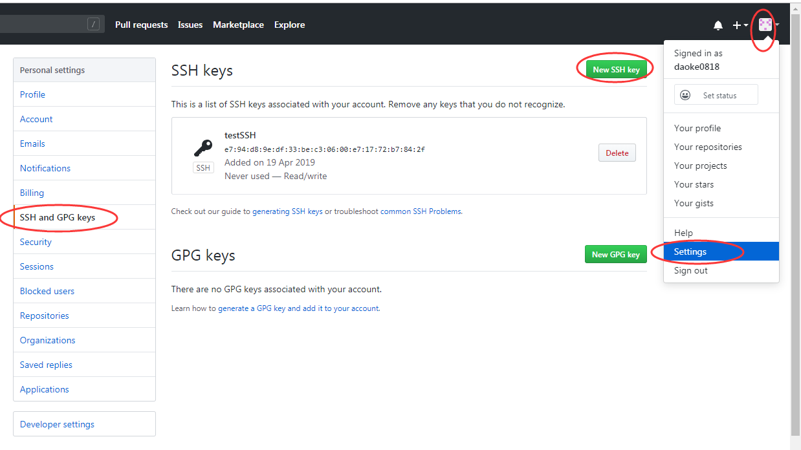
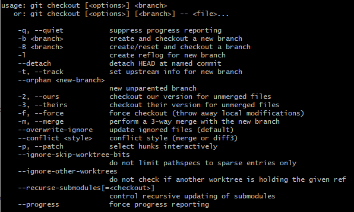
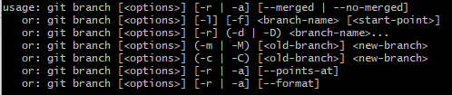

## 目录

<!-- TOC -->

- [目录](#目录)
- [简单的学习](#简单的学习)
- [重新全面学习git](#重新全面学习git)
  - [1. 查看git文件状态：status](#1-查看git文件状态status)
  - [2. git配置：config](#2-git配置config)
  - [3. 分支管理：branch、checkout](#3-分支管理branchcheckout)

<!-- /TOC -->


## 简单的学习

1. 创建git仓库：

   `git init`

2. 添加文件、提交文件：

   `git add <file>` or `git add .`（这个是添加全部修改的文件）

   `git commit -m "message"`

3. 查看commit提交历史（最近到最远的提交日志）

   `git log`

4. 回退到上一个版本

   `git reset --hard HEAD^`

5. 回退到上上一个版本

   `git reset --hard HEAD^^`

6. 回退到指定某一个commit版本

   `git reset --hard <commitId>`

7. 查看命令历史（当回退版本后又想恢复到新版本时

   `git reflog`

8. 查看状态（add是把要提交的修改文件放到暂存区，commit可以一次性把暂存区的所有修改提交到分支）

   `git status`

9. 撤销文件修改，有两种情况（不是撤销commit）

   + 文件修改保存后还没有被放到暂存区，撤销后就回到版本库一模一样的状态
   + 文件修改保存后已经添加到暂存区，又作了修改，现在，撤销修改就回到添加暂存区后的状态

   `git checkout -- <file>`（-- 和file之间有空格）

   小结：

   ​	场景1：当你改乱了工作区某个文件的内容，想直接丢弃工作区的修改时，直接用命令：

   `git checkout -- file`。

   ​	场景2：当你不但改乱了工作区某个文件的内容，还添加到了暂存区时，想丢弃修改，分两步：

   第一步用命令：`git reset HEAD <file>`回退到场景1（就是修改文件并保存但是没有添加到暂存区的场景），再按场景1操作。

   ​	场景3：：已经提交了不合适的修改到版本库时，想要撤销本次提交，要用版本退回的一系列操作（前提是没有推送到远程库）

10. 添加远程库

    1. 查看用户主目录（系统盘的Administrator）下有没有.ssh目录，如果有，再看里面是否有id_rsa和id_rsa.pub这两个文件，如果没有则需创建：

       `ssh-keygen -t rsa -C "yourEmail@qq.com"`

       然后一路回车，就会自动创建这两个文件，分别是密钥对的私钥和公钥

    2. 在GitHub中添加公钥的内容

       

    3. 先在github上建一个空仓库，注意不要勾选readme初始化

    4. 运行下面命令，让本地库与远程库关联起来

       `git remote add origin git@github.com:github账户名/仓库名.git` 

    5. 关联成功后用如下命令把本地内容推动到远程库，其中-u是指定后面的仓库名和分支名为默认，以后直接用`git push`即可

    6. 如果远程库已经存在readme文件，这时会报错，提醒你需要pull下来，命令如下

       `git pull origin master`

       这时又会报错：` fatal: refusing to merge unrelated histories`

       说这两个库的git历史记录不相干而无法合并，这时我们可以在后面加上一个参数即可：

       `  git pull origin master --allow-unrelated-histories `

11. 从远程库克隆

    `git clone 仓库地址 `


其他的暂时不学了，实习的时候有用到合并分支，现在暂时用不到，git就学到这里，方便自己学习就行。

------


## 重新全面学习git

### 1. 查看git文件状态：status

- 通常我们需要查看一个文件的状态

  ```
  git status
  ```


### 2. git配置：config


+ 列出当前配置

  ```
  git config --list
  ```

+ 列出Repository配置

  ```
  git config --local --list
  ```

+ 列出全局配置

  ```
  git config --global --list
  ```

+ 列出系统配置

  ```
  git config --system --list
  ```

+ 配置用户名

  ```
  git config --global user.name "your name"
  ```

+ 配置用户邮箱

  ```
  git config --global user.email "youremail@excample.com"
  ```


### 3. 分支管理：branch、checkout


+ 查看本地分支

  ```
  git branch
  ```

+ 查看远程分支

  ```
  git branch --remote
  ```

+ 查看本地和远程分支

  ```
  git branch --all
  ```

+ 从当前分支，切换到其他已有分支

  ```
  git checkout <branch-name>
  //举个例子
  git checkout feature/test
  ```

+ 创建并切换到新分支

  ```
  git checkout -b <branch-name>
  //举个例子
  git checkout -b feature/test
  ```

  > `git checkout`的全部指令：




+ 删除分支

  ```
  git branch --delete <branch-name>
  //举个例子
  git branch --delete feature/test
  ```

  > `git branch`的全部指令：

  

  

  

+ 当前分支与指定分支合并

  ```
  git merge <branch-name>
  // 举个例子👇
  git merge feature/test
  ```

+ 查看哪些分支已经合并到当前分支

  ```
  git branch --merged
  ```

+ 查看哪些分支没有合并到当前分支

  ```
  git branch --no-merged
  ```

+ 查看各个分支最后一个提交对象的信息

  ```
  git branch --verbose
  ```

+ 删除远程分支

  ```
  git push origin --delete <branch-name>
  ```

+ 重命名分支

  ```
  git branch --move <oldbranch-name> <newbranch-name>
  ```

+ 拉取远程分支并创建本地分支

  ```
  git checkout -b 本地分支名x origin/远程分支名x
  
  // 另外一种方式,也可以完成这个操作。
  git fetch origin <branch-name>:<local-branch-name>
  // fetch这个指令的话,后续会梳理
  ```

  

### 4. fetch指令？


### 5. 花式撤销：reset


+ 撤销**工作区**修改（就是在工作区修改了某个文件并保存了，然后突然不想要修改的内容了，放弃更改的代码）

  ```
  git checkout -- <file>
  ```

+ 暂存区文件撤销（不覆盖工作区，也就是撤销了暂存区，但是工作区的文件还在并被保存，即回到`git add <file>`操作前的状态）

  ```
  git reset HEAD <file>
  ```

+ 版本回退（每提交一次到本地仓库都是一个版本）

  ```
  //丢弃最新提交（未提交的内容会被擦掉），回到上一个版本
  git reset --hard HEAD^                   
  //丢弃最新提交（未提交的内容不会被擦掉），回到上一个版本
  git reset --soft HEAD^
  // 回退到某一个commit id（可通过reflog或log查看id，同样未提交的内容会被删掉）
  git reset --hard <commitId>
  ```

+ 总结：

  ​	场景1：当你改乱了工作区某个文件的内容，想直接丢弃工作区的修改时，直接用命令：

  `git checkout -- file`。

  ​	场景2：当你不但改乱了工作区某个文件的内容，还添加到了暂存区时，想丢弃修改，分两步：

  第一步用命令：`git reset HEAD <file>`回退到场景1（就是修改文件并保存但是没有添加到暂存区的场景），再按场景1操作。

  ​	场景3：：已经提交了不合适的修改到版本库时，想要撤销本次提交，要用版本退回的一系列操作（前提是没有推送到远程库）


### 6. 状态查询：reflog、log

+ 查看状态

  ```
  git status
  ```

+ 查看历史操作记录

  ```
  git reflog
  ```

+ 查看日志

  ```
  git log
  ```


### 7. 文档查询：help

+ 展示Git命令大纲

  ```
  git help
  ```

+ 展示Git命令大纲全部列表

  ```
  git help -a
  ```


### 8. 文件暂存：stash


+ 查看stash列表

  ```
  git stash list
  ```

+ 暂存代码

  ```
  git stash save "备注"
  ```

+ 恢复某条stash的代码

  ```
  git stash pop stash@{ID}
  //如果是恢复stash@{0}的话可省略
  ```

+ 删除某个stash暂存

  ```
  git stash drop stash@{ID}
  ```


+ 删除全部stash

  ```
  git stash clear
  ```

  

### 9. 差异比较：diff


Creating a new branch is quick.!!!


