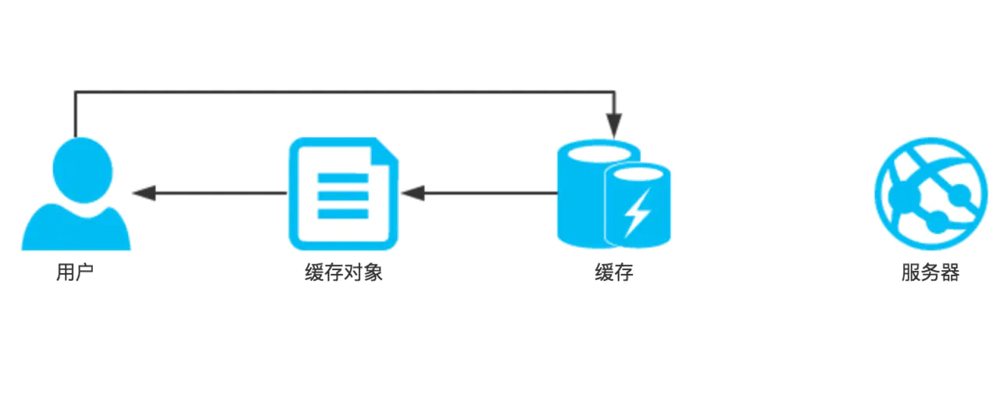
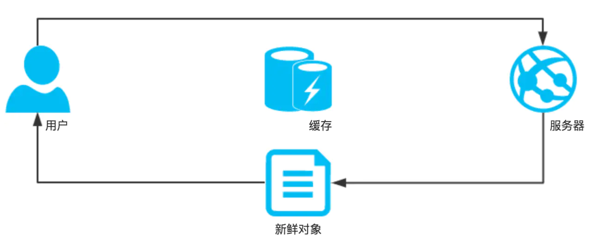

[TOC]

 [从输入URL到页面加载的过程？如何由一道题完善自己的前端知识体系！](https://segmentfault.com/a/1190000013662126) 

## HTTP缓存

### 1. 为什么需要缓存

+ 冗余的数据传输（总是传相同的东西）
+ 带宽瓶颈（客户端的宽带比服务器的宽带要宽，访问速度就慢）
+ 瞬间拥塞（有爆炸性新闻）
+ 距离时延（客户端和服务器太远了）

### 2. 缓存的命中和未命中

> 对于下面的缓存副本，在CVTE面试的时候，面试官告诉我，缓存副本是存放在浏览器的，所以下面说的缓存服务器，应该表述是有问题的！（需要深入学习一下缓存）

- 可以用已有的副本为某些到达缓存的请求提供服务,这被称之为缓存命中（就是有可以用的缓存副本）

  

- 其他一些到达缓存的请求可能会由于没有副本可用,而被转发给原始服务器,这被称之为缓存未命中（没有缓存副本，要向服务器要）




### 3. 新鲜度检测规则

#### 1）强缓存

HTTP通过缓存将服务器文档的副本保留一段时间。在这段时间里,都认为文档时新鲜的,缓存可以在不联系服务器的情况下,直接提供该文档。我们称之为**强缓存命中**,此时浏览器会返回200状态码(from cache)


但一旦以缓存副本停留的时间太长,超过了文档的新鲜度限值,就认为文档过期了。


#### 2）协商缓存

在提供文档之前，缓存都要再次与服务器进行再验证，查看文档是否发生变化，我们称之为**协商缓存**。


+ 验证命中：如果服务器对象没有被修改,服务器会向客户端发送一个小的HTTP `304 Not Modeified`响应
+ 验证未命中：如果服务器对象与以缓存副本不同,服务器向客户端送一条普通的带有完整内容的HTTP `200 ok` 响应
+ 对象被删除：如果服务器对象已经被删除了,服务器就回送一个404 Not Found 响应,缓存也会将其副本删除


### 4. 强缓存原理

> 浏览器第二次发送请求相同资源时，拿出过期日期和当前时间进行比较，如果在过期日期之前，则**强缓存命中**；

> 如果缓存文档过期，缓存就必须与服务器进行核对，询问文档是否过期，如果被修改过，就要获取一份新鲜（带有新的`Expries`）的副本。

#### 1）强缓存首部字段

+ `Cache-Control`（通用首部字段）：控制缓存的行为

  + `max-age`值定义了文档的最大使用期——从第一次生成文档到文档不再新鲜,无法使用为止,最大的合法生存时间(以秒为单位)

  + `must-revalidate`: 如果你配置了`max-age`信息，当缓存资源仍然新鲜（小于max-age）时使用缓存，否则需要对资源进行验证。

    > 所以`must-revalidate`可以和max-age组合使用`Cache-Control: must-revalidate, max-age=60`

+ `Expries`（实体首部字段）：实体主体过期的日期时间
  
  + 指定一个绝对的过期日期，由于我们可以去更改客户端的时间，这样就可以改变缓存命中的结果，因此优先使用`Cache-Control`

#### 2）`Cache-Control`其他指令

> + 缓存请求指令（浏览器）
>
> | 指令             | 参数   | 说明                         |
> | ---------------- | ------ | ---------------------------- |
> | no-cache         | 无     | 强制向源服务器再次验证       |
> | no-store         | 无     | 不缓存请求或响应的任何内容   |
> | max-age=[秒]     | 必需   | 响应的最大使用期值           |
> | max-stale(=[秒]) | 可省略 | 接受已过期的响应             |
> | min-fresh=[秒]   | 必需？ | 期待在指定时间内的响应仍有效 |
> | no-transform     | 无     | 代理不可更改媒体的类型       |
> | only-if-cached   | 无     | 从缓存获取资源               |
> | cache-extension  | -      | 新指令标记(token)            |

> + 缓存响应指令（服务器）
>   + `public`和`private`
>     + `public`：可以缓存，但是public不是必须的，因为有明确的缓存信息（例如max-Age）已经表示响应是可以缓存的
>     + `private`：表明该响应只为单个用户缓存，浏览器可以缓存，中间缓存不能（比如CDN）

> + 最佳`Cache-Control`策略：
>
> 

### 5. 协商缓存原理

> 缓存需要询问原始服务器是否发生变化，这种情况被称为**协商缓存**
>
> + 如果再验证，显示内容发生了变化，缓存会获取一份新的文档副本，并将其存储在旧文档的位置上，然后将文档发送给客户端
> + 如果再验证，内容没有发生变化，缓存只需要获取新的首部，包括一个新的过期日期，并对缓存的首部进行更新。

#### 1）用条件方法进行再验证

HTTP的条件方法可以高校的实现再验证，对于缓存再验证最有用的2个首部字段是：

+ `If-Modified-Since: <date>`

  给一个指定日期，如果从指定日期之后（可以与服务器的响应首部字段`Last-Modified`比较），文件被修改了，就执行请求的方法。

+ `If-None-Match: <tags>`

  服务器可以为文档提供特殊的标签`ETag`，这些标签就像序列号一样。如果已缓存标签与服务器文档中的标签有所不同，就执行请求的方法

#### 2）`If-Modified-Since/Last-Modified`（弱验证）

1. 客户端第一次向服务器发送请求，服务器将最后的修改日期（`Last-Modified`）附加到所提供的文档上去。
2. 当再一次请求资源时间，**如果没有命中强缓存**，再执行验证时，会包含一个`If-Modified-Since`首部，其中携带有已缓存副本最后修改的日期
3. 如果内容被修改，服务器返回新的文档，返回200状态码和最新的修改日期；如果没有修改，会返回一个304状态码

#### 4）`If-None-Match/ETag`（强验证）

​	有些情况下用最后修改日期进行验证是不行的：

+ 有些文档有可能会被周期性的重写(比如: 从一个后台进程中写入),但实际上包含的数据常常是一样分,尽管内容没有变化,但修改日期会发生变化
+ 有些文档可能被修改了,但所做修改并不重要.不需要让世界范围内的缓存都重装数据（比如填写注释）
+ 有些服务器无法准确判定其页面的最后修改日期

​	因此又有了实体标签`ETag`（版本标识符），`ETag`通常是服务器随机生成并返回的哈希值，客户端在下一次请求的时候`If-None-Match`带上该值并发送给服务端，如果`ETag`值不变，则表示资源未发生变化，服务器将返回`304 Not Modified`响应。


### 6. 更新和废弃缓存

​	浏览器发出的所有HTTP请求会首先路由到浏览器缓存,已确认是否缓存可用于请求的有效响应。如果有匹配的响应,则从缓存中读取响应,这样就避免了网路延迟和传送产生的流量费用。

+ **但如果想更新和废弃缓存的响应那要怎么办呢？**

  例如我们有一个css样式表缓存长达24小时,但是我们需要立即更新他,我们如何通知已过时的CSS缓存副本的所有访问者更新其缓存。在不更改资源网址的情况下,是做不到的。

+ **可以在资源内容发生变化时，更改它的网址，强制用户下载新响应**。通常情况下，可以通过在文件名中嵌入版本号来实现

+ 举个栗子：

  

  1. HTML被标记为`no-cache`,这意味着浏览器再每次请求时都始终重新验证文档,并在内容变化时获取最新版本。此外在HTML标记内,在CSS和javascript中嵌入指纹（就是下面的2和3）,如果这些文件的内容发生变化,网页的HTML也会随之改变,并会下载HTML响应的新副本。
  2. 允许浏览器和中间缓存(例如CDN)缓存CSS,并将CSS设置为1年后到期,因为再文件名中嵌入了文件的指纹,CSS更新时网址也会随之变化
  3. JavaScript同样设置为1年后到期,但标记为`private`,这或许是因为它包含的某些用户私人数据是CDN不应缓存的。
  4. 图像缓存时不包含版本或唯一指纹,并设置为一天后到期

  


## 浏览器的渲染机制

### 1. 两种内核浏览器的渲染过程

+ **webkit渲染过程**


+ **Gecko渲染过程**


+ 文字版渲染过程：
  1. HTML解析文件，生成DOM Tree；解析CSS文件生成CSSOM Tree
  2. 将DOM Tree和CSSOM Tree结合，生成Render Tree（渲染树）
  3. 根据Render Tree渲染绘制，将像素渲染到屏幕上（其中涉及回流和重绘）
+ 分析：
  1. DOM解析和CSS解析是两个并行的进程，所以CSS加载不会阻塞DOM的解析
  2. Render Tree是依赖于DOM Tree和CSSOM Tree的，所以他必须等到CSSOM Tree构建完成，也就是CSS资源加载完成（或者CSS资源加载失败）后，才能开始渲染。因此，CSS加载是会阻塞DOM的渲染的。
  4. CSS后面如果有js文件，要等CSS加载完之后js文件才会被解析执行，即**CSS加载会阻塞后面js语句的执行** 


### 2. 回流和重绘


> 当网页生成的时候，至少会渲染一次。在用户访问的过程中，还会不断重新渲染。重新渲染会重复上图中的回流（生成布局）+重绘（绘制）或者只有重绘。

+ 重绘：当render tree中的一些元素需要更新属性，而这些属性只是影响元素的**外观、风格**，而不会影响布局的，比如background-color
+ 回流：当render tree中的一部分（或全部）因为元素的**规模尺寸、布局、隐藏**等改变而需要重新构建

**回流必定会发生重绘，重绘不一定会引发回流。**

#### 1）常见引起回流属性和方法

任何会改变元素几何信息（元素的位置和尺寸大小）的操作，都会触发回流。

1. 添加或者删除可见的DOM元素
2. 元素尺寸改变——margin、padding、border、width、height
3. 内容变化，比如用户在input框中输入文字
4. 浏览器窗口尺寸改变——resize事件发生时
5. 计算offsetWidth和offerHeight属性
6. 设置style属性的值

#### 2）常见引起重绘属性和方法


#### 3）代码例子

下面这个例子中，触发了几次回流和重绘

```js
var s = document.body.style;
s.padding = "2px"; // 回流+重绘
s.border = "1px solid red"; // 再一次 回流+重绘
s.color = "blue"; // 再一次重绘
s.backgroundColor = "#ccc"; // 再一次 重绘
s.fontSize = "14px"; // 再一次 回流+重绘
// 添加node，再一次 回流+重绘
document.body.appendChild(document.createTextNode('abc!'));
```

#### 4）如何减少回流、重绘

+ 使用transform代替top

+ 使用visibility替换display: none，前者只会引起重绘（隐藏但占位），后者会引发回流（隐藏并且不占位）（改变了布局）

+ 不要把节点的属性值放在一个循环里当作循环里的变量

  ```js
  for(let i = 0; i < 1000; i++) {
      // 获取 offsetTop 会导致回流，因为需要去获取正确的值
      console.log(document.querySelector('.test').style.offsetTop)
  }
  ```

+ 不要使用table布局

+ CSS选择符从右往左匹配查找，避免节点层级过多

+ 将频繁重绘或者回流的节点设置为图层，图层能够阻止节点的渲染行为影响别的节点。比如对于video标签来说，浏览器会自动将该节点变为图层。


### 3. 提高CSS加载速度的方法

由浏览器的渲染过程可以知道，CSS加载会阻塞DOM的渲染，所以我们应该尽可能的提高CSS加载速度，有以下几种方法：

1. 使用CDN（因为CDN会根据你的网络状况，替你挑选最近的一个具有缓存内容的节点为你提供资源，因此可以减少加载时间）
2. 对CSS进行压缩（可以用很多打包工具，比如webpack、gulp等，也可以通过开启gzip压缩）
3. 合理的使用缓存（设置Cache-Control、Expires，以及ETag，不过要注意一个问题，就是文件更新后，为了避免缓存而带来的影响，其中一个解决防范是在文件名字后面加一个版本号）
4. 减少http请求数，将多个CSS文件合并


### 4. js异步解析的两种属性async和defer的作用和区别

接下来我们对比下 defer 和 async 属性的区别：


其中蓝色线代表JavaScript加载；红色线代表JavaScript执行；绿色线代表 HTML 解析。

#### 1）情况1`<script src="script.js"></script>`

立即加载并执行指定的脚本。

#### 2）情况2`<script async src="script.js"></script>` (异步加载后直接执行)

`aysnc`的script如果已经加载好，就会开始执行——无论此刻是 HTML 解析阶段还是 `DOMContentLoaded` 触发之后。

需要注意的是，这种方式加载的 JavaScript 依然**会阻塞 load 事件**。

换句话说，**`async`的script 可能在 `DOMContentLoaded` 触发之前或之后执行**，但一定在 load 触发之前执行。

#### 3）情况3 `<script defer src="script.js"></script>`(异步加载后延迟执行)

defer 属性表示延迟执行引入的 JavaScript，即这段 JavaScript 加载时 HTML 并未停止解析，**这两个过程是并行的**。

整个 document 解析完毕且 defer-script 也加载完成之后，会执行所有由 defer-script 加载的 JavaScript 代码，然后**触发 `DOMContentLoaded` 事件**。

defer 与相比普通 script，有两点区别：载入 JavaScript 文件时不阻塞 HTML 的解析，执行阶段被放到 HTML 标签解析完成之后。

> 在加载多个JS脚本的时候，async是无顺序的加载，而defer是有顺序的加载


## 页面加载的两个事件

### 1. `DOMContentLoaded`

> 当初始的 **HTML** 文档被完全加载和解析完成之后（即DOM加载完成），**`DOMContentLoaded`** 事件被触发，而无需等待样式表、图像和子框架的完全加载。

**注意：**`DOMContentLoaded` 事件必须等待其所属script之前的样式表加载解析完成才会触发。

```html
<link rel="stylesheet" href="css.php">
<script>
document.addEventListener('DOMContentLoaded',function(){
    console.log('3 seconds passed');
});
</script>
```

如果将link置于script之后，就会立即打印。

[DOMContentLoaded](https://developer.mozilla.org/zh-CN/docs/Web/Events/DOMContentLoaded)


### 2. `load`

> 当整个页面及所有依赖资源如样式表和图片都已完成加载时，将触发`load`事件。

+ 它与[`DOMContentLoaded`](https://developer.mozilla.org/zh-CN/docs/Web/API/Document/DOMContentLoaded_event)不同，后者只要页面DOM加载完成就触发，无需等待依赖资源的加载。

```js
window.addEventListener('load', (event) => {
  console.log('page is fully loaded');
});
```

```js
window.onload = (event) => {
  console.log('page is fully loaded');
};
```


## HTTP状态码

2xx：请求被正常处理了

| 状态码 | 状态码英文名称  | 中文描述                              |
| ------ | --------------- | ------------------------------------- |
| 200    | OK              | 请求成功                              |
| 202    | Accepted        | 服务器已经接受请求，但未处理完成      |
| 204    | No Content      | 请求成功，但未返回内容。              |
| 206    | Partial Content | 部分内容。服务器成功处理了部分GET请求 |

3xx：重定向

| 状态码 | 状态码英文名称    | 中文描述                                              |
| ------ | ----------------- | ----------------------------------------------------- |
| 301    | Moved Permanently | 永久重定向。请求的资源已被永久的移动到新URL。         |
| 302    | Found             | 临时重定向。请求的资源还在，但暂时需要另一个URL访问。 |
| 304    | Not Modified      | 缓存重定向，表示资源未修改，重定向已存在的缓存文件。  |

> 301和302的响应里，响应头使用Location字段，指明后续哟啊跳转的URL，浏览器会自动定向到新URL。

4xx：客户端错误

| 状态码 | 状态码英文名称 | 中文描述                               |
| ------ | -------------- | -------------------------------------- |
| 400    | Bad Request    | 客户端请求的语法错误，服务器无法理解。 |
| 403    | Forbidden      | 客户端的请求被拒绝                     |
| 404    | Not Found      | 请求的资源不存在或者未找到             |

5xx：服务器错误

| 状态码 | 状态码英文名称        | 中文描述                                                     |
| ------ | --------------------- | ------------------------------------------------------------ |
| 500    | Internal Server Error | 服务器内部错误，无法完成请求                                 |
| 501    | Not Implemented       | 服务器暂不支持客户端请求的功能                               |
| 502    | Bad Gateway           | 作为网关或者代理工作的服务器尝试执行请求时，从远程服务器接受到了一个无效的响应 |
| 503    | Service Unavailable   | 由于超载或系统维护，服务器暂时无法处理客户端的请求           |
| 504    | Gateway Time-out      | 充当网关或代理的服务器，未及时从远端服务器获取请求           |


## XSS攻击

> 跨站脚本攻击，是一种代码注入攻击。

### 1. 三类XSS

1. 反射型XSS

   反射型XSS也被称为非持久性XSS，是现在最容易出现的一种XSS漏洞。发出请求时，XSS代码出现在URL中，最后输入提交到服务器，服务器解析后在响应内容中出现这段XSS代码，最后浏览器解析执行。

2. DOM XSS

   DOM即文本对象模型，DOM通常代表在html、xhtml和xml中的对象，使用DOM可以允许程序和脚本动态的访问和更新文档的内容、结构和样式。它不需要服务器解析响应的直接参与，触发XSS靠的是浏览器端的DOM解析，可以认为完全是客户端的事情。

3. 存储型 XSS

   存储型XSS又被称为持久性XSS，它是最危险的一种跨站脚本，相比反射型XSS和DOM型XSS具有更高的隐蔽性，所以危害更大，因为它不需要用户手动触发。 允许用户存储数据的web程序都可能存在存储型XSS漏洞，当攻击者提交一段XSS代码后，被服务器端接收并存储，当所有浏览者访问某个页面时都会被XSS，其中最典型的例子就是留言板。

### 2. 造成的影响

+ 利用虚假输入表单骗取用户个人信息
+ 利用脚本窃取用户的Cookie值，被害者在不知情的情况下，帮助攻击者发送恶意请求。
+ 显示伪造的文章或图片

### 3. 防御

+ 在cookie中设置`HttpOnly`属性

  > 设置`HttpOnly`属性后，js脚本将无法读取到cookie信息

+ 过滤

  + 对输入格式的检查，如邮箱、电话号码、用户名等等（前端后台都应该检查过滤）

  + HtmlEncode，要对标签进行转换

    

  + JavaScriptEncode，对下列字符加上反斜杠

    


## CSRF攻击

> 跨站请求伪造，冒充用户发送请求，完成一些违背用户意愿的事情

### 1. 原理


+ 总的来说就是：
  + 浏览器在登陆正常网站并拿到cookie时，在还没有关闭正常网页的情况下，访问了危险网站。
  + 此时危险网站就会利用浏览器的cookie，背着浏览器去正常网站请求一些并不是他本身想发送的请求
  + （此时浏览器被蒙在鼓里，而正常网站并不知情）


### 2. 造成的影响

+ 利用已通过认证的用户权限更新设定信息等
+ 利用已通过认证的用户权限购买商品
+ 利用已通过的用户权限在留言板上发表言论


### 3. 与XSS的区别

+ 从本质上讲，XSS是代码注入问题，是内容没有过滤导致浏览器将攻击者的输入当代码执行。而CSRF是HTTP问题，因为浏览器在发送HTTP请求时候自动带上cookie。


### 4. 防御

+ 验证码，强制用户必须与应用进行交互，才能完成最终请求。效果好，但用户体验较差。
+ 使用post，限制get（get比post更容易被拿来做`csrf`攻击），效果一般（攻击者构造一个form就可以了）
+ `Referer`：请求来源限制，效果一般（因为服务器并不是什么时候都能取到`Referer`，而且低版本浏览器可以伪造`Referer`）
+ `token`：token验证的`CSRF`防御机制，公认最适合
  1. 后端随机产生一个token，把这个token保存到session状态中；同时后端也会把这个token交到前端页面。
  2. 前端页面提交请求时，把token加入到请求数据或者头信息中，一起传给后端；
  3. 后端验证前端传来的token与session是否一致，一致则合法，否则为非法请求。


## Cookie和Session

### 1. 什么是Cookie和Session

**Cookie**

> HTTP Cookie是服务器发送到用户浏览器并保存在本地的一小块数据，它会在浏览器下次向同一服务器再发送请求时被携带并发送到服务器上。

+ 通常，它用于告知服务器两个请求是否来自同一浏览器，如保持用户的登陆状态
+ Cookie使基于无状态的HTTP协议 记录稳定的状态信息成为了可能。

Cookie主要用于以下三个方面：

1. 会话状态管理（如用户登陆状态、购物车、游戏分数或其他需要记录的信息）
2. 个性化设置（如用户自定义设置、主题等）
3. 浏览器行为跟踪（如跟踪分析用户行为等）


**Session**

> Session对象存储特定用户会话所需的属性及配置信息。这样，当用户在应用程序的Web页之间跳转时，存储在Session对象中的变量将不会丢失，而是在整个用户会话中一直存在下去。

+ Session 代表着服务器和客户端一次会话的过程。
+ 当客户端关闭会话，或者 Session 超时失效时会话结束。


### 2. Cookie和Session有什么不同

+ 作用范围不同

  + Cookie保存在客户端（浏览器）
  + Session保存在服务端

+ 存储类型不同

  + Cookie保存的是字符串

  + Session保存的是对象

    > 一般情况下我们可以在Session中保持一些常用变量信息，比如UserId等

+ 存储大小不同

  + 单个Cookie保存的数据不能超过3K
  + Session可存储数据远高于Cookie

+ 有效期不同

  + Cookie可设置为长时间保持，比如默认登陆功能
  + Session一般有效时间较短，客户端关闭或者Session超时都会失效

+ 隐私策略不同

  + Cookie存储在客户端，容易遭到不法获取

    > 早期有人将用户的登录名和密码存储在Cookie中导致信息被窃取

  + Session存储在服务端，安全性相对比Cookie好一些
  
+ 路径参数

  + cookie可以设置路径参数，那么在同一个网站中不同路径下的cookie互相是访问不到的
  + session不能区分路径，同一个用户在访问一个网站期间，所有的session在任何一个地方都可以访问到


### 3. 为什么需要Cookie和Session，他们有什么关联？

+ HTTP无状态，服务器需要记录用户的状态时，就需要某种机制来识别具体的用户，这个机制就是Session。
  + 比如购物车，当点击下单按钮时，由于HTTP状态无协议，所以并不知道是哪个用户操作的，所以服务器要为特定的用户创建特定的Session，用于标识这个用户，并且跟踪用户，这样才知道购物车有几本书。
  + 这个Session是保存在服务器端的，有一个唯一的标识。**在服务端保存Session的方法有很多，内存、数据库、文件都有。**
+ 而Cookie就可以记录SessionID。
  + 第一次HTTP请求的时候，服务器就在服务端开辟一个空间存放Session，并且会有唯一的标识SessionID，并把这个标识存放在Cookie中发送给客户端，客户端会存储Cookie每次请求的时候都会带上Cookie并发送给服务器，而服务端会从Cookie中获取SessionID，再根据SessionID查找对应的Session信息。
  + 如果没有找到说明用户没有登录或者登录失效（需要重新登陆），如果找到 Session，证明用户已经登录可执行后面操作。


> Session的运行依赖SessionID，而SessionID是存放在Cookie的


### 4. 浏览器禁止Cookie的情况

既然服务器是根据Cookie中的信息判断用户是否登录，那么如果浏览器中禁止了Cookie，如果保障整个机制的正常运转？

1. 第一种方案：每次请求都携带一个SessionID的参数，可以在URL后面拼接，也可以post的方式提交

2. 第二种方案：Token机制

   > 关于token的一些有用的文章。。。：
   >
   > + [Token 认证的来龙去脉](https://juejin.im/post/6844903556424826894#heading-0)
   > + [基于Token的身份验证的原理_一土宁的博客-CSDN博客](https://blog.csdn.net/wnvalentin/article/details/89854980)
   > + [Token登录认证 - 简书](https://www.jianshu.com/p/a32634a5170c)
   >
   > token是鉴权，用户信息可以去数据库查，也可以登录生成token的时候，把用户信息与token作为健值存储在redis里，也就是上下文，（兵哥说的）


### 5. 分布式Session

在互联网公司为了可以支撑更大的流量，后端往往需要多台服务器共同来支撑前端用户请求，那如果用户在A服务器登陆了，第二次请求跑到服务器B就会出现登陆失效问题。

分布式Session一般有一下几种解决方案：

1. Nginx ip_hash策略，服务端使用Nginx代理，每个请求按访问IP的hash分配，这样来自同一IP固定访问一个后台服务器。
2. Session复制，任何一个服务器的Session发生变化（增删改），该节点会把这个Session的所有内容序列化，然后广播给所有其他节点。
3. 共享Session，服务端无状态话，将用户的Session等信息使用缓存中间件来统一管理，保障分发到每一个服务器的响应结果都一致。


## 浏览器缓存Web Storage

### 1. Storage类型

Storage类型的方法：

+ `clear():` 删除所有值；不在Fierfox中实现
+ `getItem(name):` 取得给定name
+ `key(index):`取得给定数值位置的名称
+ `removeItem(name):`删除给定name的名/值对
+ `setItem(name, value):`设置给定name的值


### 2. `sessionStorage`对象

> `sessionStorage`对象只会存储会话数据，这意味着数据只会存储到浏览器关闭。这跟浏览器关闭时会消失的会话cookie类似。

+ `sessionStorage`对象与服务器会话紧密相关，所以在运行本地文件时不能使用。

+ `sessionStorage`对象是Storage的实例，所以可以**使用Storage类型的方法**

+ 主要应用于存储只在会话期间有效的小块数据。

  > 如果需要跨会话持久存储数据，可以使用`localStorage`


### 3. `localStorage`对象

> `localStorage`对象是在客户端持久存储数据的机制。

+ 要访问同一个`localStorage`对象，页面必须来自同一个域（子域不可以）、在相同的端口上使用相同的协议。
+ `localStorage`是`Storage`的实例，所以可以像使用`essionStorage`一样使用`localStorage`
+ 存储在`localStorage`中的数据会保留到通过JavaScript删除或者用户清除浏览器缓存


### 4. storage事件

​		无论何时，[`Storage`](https://developer.mozilla.org/zh-CN/docs/Web/API/Storage) 对象发生变化时（即创建/更新/删除数据项时，重复设置相同的键值不会触发该事件，[`Storage.clear()`](https://developer.mozilla.org/zh-CN/docs/Web/API/Storage/clear) 方法至多触发一次该事件），storage 事件会触发。

​		**在同一个页面**内发生的改变不会起作用——在相同域名下的其他页面（如一个新标签或 iframe）发生的改变才会起作用。在其他域名下的页面**不能**访问相同的 Storage 对象。

这个事件的事件对象有4个属性：

+ domain：存储变化对应的域
+ key：被设置或删除的键
+ newValue：键被设置的新值，若键被删除则为null
+ oldValue：键变化之前的值

可以使用如下代码监听storage事件：

```js
window.addEventListener("storage",(event) => {
	alert(event.domain);
});
```

​		对于`sessionStorage`和`localStorage`上的任何更改都会触发storage事件


## 浏览器进程/线程模型

一个进程比作一个工厂，一个线程比作一个工人

一个工厂至少有一个工人或者多个工人

### 1. 多进程的浏览器

| 进程                                       | 作用                                        |
| ------------------------------------------ | ------------------------------------------- |
| Browser进程                                | 浏览器的主进程，只有一个                    |
| 第三方插件进程                             | 一个插件对应一个进程，使用才创建            |
| GPU进程                                    | 用于3D绘制，最多一个                        |
| Renderer进程（浏览器渲染进程、浏览器内核） | 一个Tab页面对应一个进程，**该进程是多线程** |

+ Browser进程的作用：
  + 负责浏览器界面显示，与用户交互。如前进、后退等。
  + 负责各个页面的管理，创建和销毁其他进程
  + 将Renderer进程得到的内存中的BItmap，绘制到用户界面上
  + 网络资源的管理，下载等

### 2. 多线程的浏览器内核

1. GUI渲染线程

   + 负责渲染浏览器界面。包括解析HTML、CSS，构建DOM树、RenderObject树，布局和绘制等（具体可以看浏览器渲染机制）
   + 当界面需要重绘或由于某种操作引发回流时，该线程就会执行
   + **GUI渲染线程与JS引擎线程是互斥的**，当JS引擎执行时GUI线程会被挂起，GUI更新会被保存在一个队列中，等JS引擎空闲时才会再被立即执行。

2. JS引擎线程

   + 也称为JS内核，负责处理Javascript脚本程序。（例如V8引擎）

   + JS引擎线程负责解析Javascript脚本，运行代码。

     > 我是认为JS引擎有一个`JS stack`，一开始运行js文件时就是在`JS stack`放入一个script，就是整个脚本放入执行栈（在开发者工具中应该是叫`Call Stack`）

   + JS引擎一直**等待着任务队列**中任务的到来，然后加以处理，一个Tab页（renderer进程）中无论什么时候都只有一个JS线程在运行JS程序（单线程就对了）

     > 我理解的任务队列就是放在事件触发线程

   + 同样注意，**GUI渲染线程与JS引擎线程是互斥的**，所以如果JS执行的时间过长，这样就会造成页面的渲染不连贯，导致页面渲染加载阻塞。

3. 事件触发线程：[参考该文章总结出来的（示例是动画的！）](https://jakearchibald.com/2015/tasks-microtasks-queues-and-schedules/)

   + 控制事件循环，就是管理任务队列`tasks`的线程。ES6以后还包括了`Microtasks`微任务（所以这样看来tasks可以看成宏任务）

   + > **这是我自己认为的**：当执行一个脚本的时候，其实是先有一个宏任务`Run Script`在任务队列中，`JS Stack`为空，然后任务队列就会给`Run Script`这个任务给JS引擎（即放入`JS Stack`）。

   + **执行`Run Script`的过程**中：

     + 碰到`setTimeout`等计时器，就放到定时触发器线程进行计时，等时间到了以后再放到`tasks`任务队列中；

     + 碰到`Promise`的话，then函数放到`Microtasks`微任务中

     + `MutationObserver`如果被触发的话，也是放在`Microtasks`中，并且如果再被触发，而前一个还在微任务中的话，**再被触发的不再放到微任务中**。（这个不知道为什么）

     + **如果这个时候`click`事件被触发**，`dispatch click`放入tasks宏任务中（该任务**有可能包含冒泡**，该任务会将目标元素的click的回调函数进入`JS stack`，执行完后会再把父元素的click的回调函数放入`JS Stack`继续执行）

       > 在node环境下，微任务还有一个`process.netTick`，宏任务还有一个`setImmediate`

   + 执行完当前`JS Stack`的`Run Script`后，去**按顺序执行当前所有的微任务**

     + 每执行一个微任务就是把微任务的函数放入`JS Stack`，让JS引擎去执行
     + 如果`Promise.then`函数后还有.then函数，那就会在第一个then函数执行完成后，会**再把第二个then放入微任务的最后面**（也就是在这一轮执行微任务中它会执行完，但是是在最后执行的，要排队）

   + 当`JS Stack`和`Microtasks`都为空的时候，说明执行完当前的宏任务`Run Script`，此时浏览器**可能会更新渲染**

   + 任务队列`tasks`（也就是宏任务）就会取下一个任务放入`JS Stack`，然后像执行`Run Script`那样再去执行新的宏任务。也就是`tasks->rendering->tasks`。

4. 定时触发器线程

   + `setTimeout`和`setInterval` 计时的线程，计时完毕之后再添加到任务队列tasks中（也就是上面的事件触发线程）

5. 异步`http`请求线程）

   + 在`XMLHttpRequest`连接后是通过浏览器新开一个线程请求

   + 当检测到状态变更时，如果设置有回调函数，异步线程就产生状态变更事件，将这个回调再放入任务队列`tasks`中。

     > `http`请求就是网络I/O啊？...


## GET和POST的区别

### 1. GET方法

> 查询字符串（名称/值对）是在GET请求的URL中发送的：

```
/test/demo_form.asp?name1=value1&name2=value2
```

有关GET请求的其他一些注释：

+ GET请求可被缓存
+ GET请求保留在浏览器历史记录
+ GET请求可被收藏为书签
+ GET请求不应在处理敏感数据时使用
+ GET请求有长度限制
+ GET请求只应当用于取回数据


### 2. POST方法

> 查询字符串（名称/值对）是在POST请求的HTTP消息主体中发送的：

```
POST /test/demo_form.asp HTTP/1.1
Host: w3schools.com
name1=value1&name2=value2
```

有关POST请求的其他一些注释：

+ POST请求不会被缓存
+ POST请求不会保留再浏览器历史记录中
+ POST不能被收藏为书签
+ POST请求对数据长度没有要求


### 3. 比较GET和POST

|                      | GET                                                          | POST                                                         |
| :------------------- | :----------------------------------------------------------- | :----------------------------------------------------------- |
| 后退按钮/刷新        | 无害                                                         | 数据会被重新提交（浏览器应该告知用户数据会被重新提交）。     |
| **书签**             | 可收藏为书签                                                 | 不可收藏为书签                                               |
| **缓存**             | 能被缓存                                                     | 不能缓存                                                     |
| 编码类型             | `application/x-www-form-urlencoded`                          | `application/x-www-form-urlencoded` 或 `multipart/form-data`。为二进制数据使用多重编码。 |
| **历史**             | 参数保留在浏览器历史中。                                     | 参数不会保存在浏览器历史中。                                 |
| **对数据长度的限制** | 是的。当发送数据时，GET 方法向 URL 添加数据；URL 的长度是受限制的（URL 的最大长度是 2048 个字符）。 | 无限制。                                                     |
| **对数据类型的限制** | 只允许 ASCII 字符。                                          | 没有限制。也允许二进制数据。                                 |
| **安全性**           | 与 POST 相比，GET 的安全性较差，因为所发送的数据是 URL 的一部分。在发送密码或其他敏感信息时绝不要使用 GET ！ | POST 比 GET 更安全，因为参数不会被保存在浏览器历史或 web 服务器日志中。 |
| **可见性**           | 数据在 URL 中对所有人都是可见的。                            | 数据不会显示在 URL 中。                                      |


